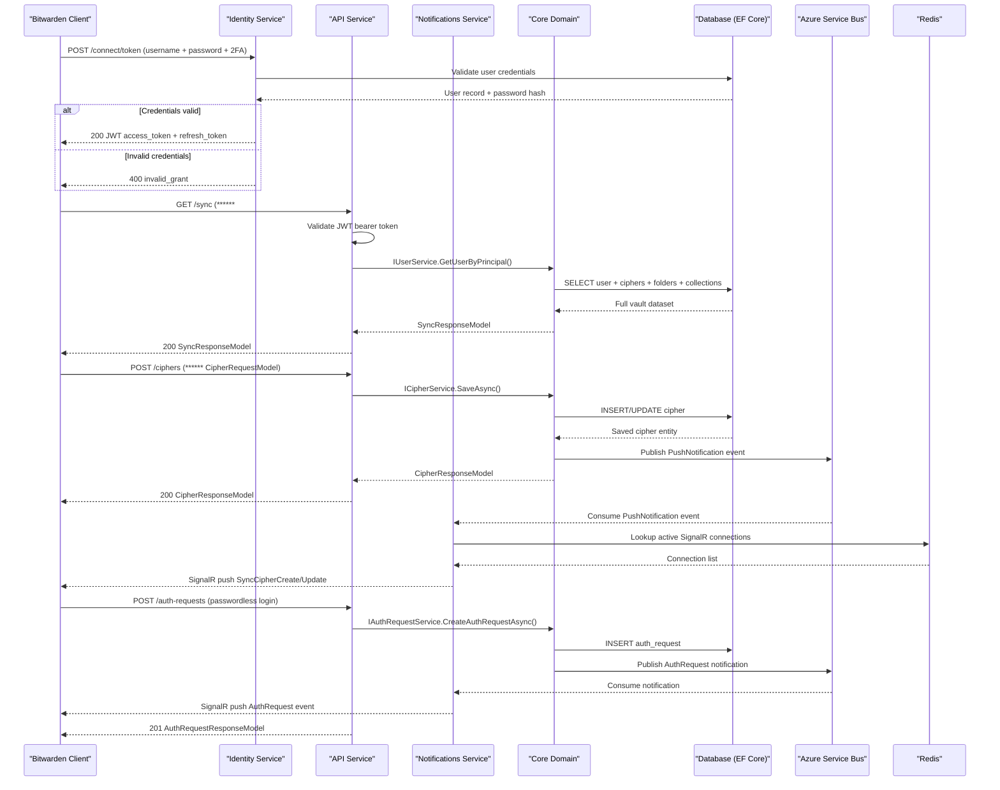

# API & Service Communication Contracts

Bitwarden Server exposes approximately 300+ REST API endpoints across eight independently deployable ASP.NET Core services, with synchronous REST communication for client interactions and asynchronous messaging (Azure Service Bus, AWS SQS, RabbitMQ) for internal event processing.

## Service Catalog

| Service | Port (Dev) | Category | Purpose |
|---------|-----------|---------|---------|
| Api | 4000 / 4001 (self-host) | API Layer | Primary REST API for vault, accounts, organizations, ciphers, sends, tools, and admin console |
| Identity | 33656 / 33657 (self-host) | API Layer | OpenID Connect / OAuth2 token issuance and SSO (Duende IdentityServer) |
| Admin | 62911 / 62912 (self-host) | Infrastructure | Internal Razor Pages admin portal for user/organization management |
| Billing | 44519 | Business | Billing and subscription management REST API (Stripe, Braintree, BitPay) |
| Notifications | 61840 / 61841 (self-host) | API Layer | Real-time WebSocket push hub (SignalR) and message relay to clients |
| Events | 46273 / 46274 (self-host) | Business | Audit event ingestion and query API |
| EventsProcessor | 54103 | Infrastructure | Background worker that drains the events message queue |
| Icons | 50024 | Business | Favicon/icon proxy service for websites |

## API Endpoints Inventory

> Note: With 300+ endpoints across 75+ controllers, representative endpoints per group are shown below.

| Service | Method | Path | Request Type | Response Type |
|---------|--------|------|-------------|---------------|
| Api | POST | /accounts/password-hint | PasswordHintRequestModel | 200 |
| Api | POST | /accounts/email-token | EmailTokenRequestModel | 200 |
| Api | POST | /accounts/email | EmailRequestModel | 200 |
| Api | GET | /accounts/profile | — | ProfileResponseModel |
| Api | PUT | /accounts/profile | UpdateProfileRequestModel | ProfileResponseModel |
| Api | PUT | /accounts/avatar | UpdateAvatarRequestModel | ProfileResponseModel |
| Api | GET | /accounts/organizations | — | ListResponseModel |
| Api | POST | /accounts/password | PasswordRequestModel | 200 |
| Api | POST | /accounts/keys | KeysRequestModel | 200 |
| Api | GET | /accounts/keys | — | KeysResponseModel |
| Api | GET | /ciphers/{id} | — | CipherResponseModel |
| Api | POST | /ciphers | CipherRequestModel | CipherResponseModel |
| Api | PUT | /ciphers/{id} | CipherRequestModel | CipherResponseModel |
| Api | DELETE | /ciphers/{id} | — | 200 |
| Api | PUT | /ciphers/{id}/share | CipherShareRequestModel | CipherResponseModel |
| Api | PUT | /ciphers/{id}/collections | CipherCollectionsRequestModel | 200 |
| Api | GET | /ciphers/organization-details | — | ListResponseModel |
| Api | GET | /sync | — | SyncResponseModel |
| Api | POST | /folders | FolderRequestModel | FolderResponseModel |
| Api | GET | /folders | — | ListResponseModel |
| Api | PUT | /folders/{id} | FolderRequestModel | FolderResponseModel |
| Api | DELETE | /folders/{id} | — | 200 |
| Api | POST | /sends | SendRequestModel | SendResponseModel |
| Api | PUT | /sends/{id} | SendRequestModel | SendResponseModel |
| Api | DELETE | /sends/{id} | — | 200 |
| Api | GET | /two-factor | — | ListResponseModel |
| Api | PUT | /two-factor/authenticator | UpdateTwoFactorAuthenticatorRequestModel | TwoFactorAuthenticatorResponseModel |
| Api | PUT | /two-factor/yubikey | UpdateTwoFactorYubicoOtpRequestModel | TwoFactorYubiKeyResponseModel |
| Api | POST | /organizations | OrganizationCreateRequestModel | OrganizationResponseModel |
| Api | PUT | /organizations/{id} | OrganizationUpdateRequestModel | OrganizationResponseModel |
| Api | POST | /organizations/{id}/users/invite | OrganizationUserInviteRequestModel | 200 |
| Api | GET | /organizations/{id}/collections | — | ListResponseModel |
| Api | POST | /organizations/{id}/collections | CollectionRequestModel | CollectionResponseModel |
| Api | GET | /organizations/{id}/groups | — | ListResponseModel |
| Api | POST | /organizations/{id}/groups | GroupRequestModel | GroupResponseModel |
| Api | GET | /organizations/{id}/policies | — | ListResponseModel |
| Api | PUT | /organizations/{id}/policies/{type} | PolicyRequestModel | PolicyResponseModel |
| Api | POST | /auth-requests | AuthRequestCreateRequestModel | AuthRequestResponseModel |
| Api | GET | /auth-requests/{id} | — | AuthRequestResponseModel |
| Api | PUT | /auth-requests/{id} | AuthRequestUpdateRequestModel | AuthRequestResponseModel |
| Api | GET | /devices | — | ListResponseModel |
| Api | DELETE | /devices/{id} | — | 200 |
| Api | POST | /emergency-access/invite | EmergencyAccessInviteRequestModel | 200 |
| Api | GET | /emergency-access/trusted | — | ListResponseModel |
| Api | GET | /hibp/breach | — | ListResponseModel |
| Api | POST | /installations | InstallationRequestModel | InstallationResponseModel |
| Api | POST | /notifications | CreateNotificationRequestModel | NotificationResponseModel |
| Api | GET | /security-tasks | — | ListResponseModel |
| Api | POST | /reports/breach | BreachAccountRequestModel | ListResponseModel |
| Billing | POST | /billing/stripe/webhook | Stripe event payload | 200 |
| Billing | GET | /account/billing | — | BillingResponseModel |
| Billing | POST | /provider/{id}/billing | — | ProviderBillingResponseModel |
| Billing | POST | /organizations/{id}/billing/preview-invoice | PreviewInvoiceRequestModel | PreviewInvoiceResponseModel |
| Identity | POST | /connect/token | TokenRequest (OAuth2 form) | TokenResponseModel |
| Identity | GET | /connect/authorize | AuthorizationRequest | Redirect |
| Identity | POST | /connect/logout | — | Redirect |
| Identity | GET | /.well-known/openid-configuration | — | OpenID Discovery Document |
| Identity | GET | /accounts | — | AccountResponseModel |
| Notifications | GET | /notifications/hub | WebSocket upgrade | SignalR negotiation |
| Notifications | POST | /send | InternalNotificationRequestModel | 200 (internal) |
| Events | GET | /events | — | ListResponseModel |
| Events | POST | /collect | EventsRequestModel | 200 |
| Icons | GET | /{hostname}/icon.png | — | PNG image |
| Admin | GET | /users | — | Admin users listing page |
| Admin | POST | /users/{id}/delete | — | Redirect |
| Admin | GET | /organizations | — | Admin orgs listing page |

## Management & Observability Endpoints

| Service | Endpoint | Notes |
|---------|----------|-------|
| Api | GET /healthz | Basic liveness health check |
| Api | GET /healthz/extended | Extended health check with SQL Server connectivity |
| Api | GET /alive | Rate-limited endpoint (5 req/min) returning timestamp |
| Api | GET /specs/{version}/swagger.json | OpenAPI/Swagger JSON spec |
| Api | GET /swagger | Swagger UI (dev environments) |
| Identity | GET /healthz | Basic liveness |
| Billing | GET /healthz | Basic liveness |
| Notifications | GET /healthz | Basic liveness |
| Events | GET /healthz | Basic liveness |
| Icons | GET /healthz | Basic liveness |
| Admin | GET /healthz | Basic liveness |

## DTOs & Contracts

**Request/Response model conventions**: The project uses a consistent naming pattern: `*RequestModel` for inbound bodies and `*ResponseModel` for outbound payloads. Examples include `CipherRequestModel` / `CipherResponseModel`, `OrganizationCreateRequestModel` / `OrganizationResponseModel`, and `AuthRequestCreateRequestModel` / `AuthRequestResponseModel`. These are C# classes (not records), serialized using `System.Text.Json` by default with `Newtonsoft.Json` in use for some legacy paths.

**Service-level domain models** (owned by a single service) include `CipherResponseModel`, `FolderResponseModel`, `SyncResponseModel`, `ProfileResponseModel`, `SendResponseModel`, and `CollectionResponseModel`. The `SyncResponseModel` is the largest aggregated contract — it composes the full vault state (ciphers, folders, collections, organizations, profile, domains) in a single response.

**OpenAPI/Swagger**: Swashbuckle.AspNetCore is configured in the Api and Billing services via `AddSwaggerGen`. The generated spec is available at `/specs/{version}/swagger.json`. OpenAPI annotations (XML doc comments) are enabled via `DocumentationFile` in the project properties.

**Serialization**: `System.Text.Json` is the primary serializer; `Newtonsoft.Json` 13.0.3 is retained for specific JSON manipulation utilities. Request models use standard ASP.NET Core model binding.

## Communication Patterns

**Synchronous (REST)**: All client-facing services expose JSON REST APIs over HTTPS. The Identity service issues OAuth2/OIDC tokens consumed by all other services as JWT bearer tokens. There is no explicit API gateway — clients call each service directly by URL.

**Asynchronous (messaging)**: The Core library abstracts message publishing behind interfaces that can be backed by Azure Service Bus, Azure Storage Queues, or AWS SQS depending on configuration. The EventsProcessor service hosts a background worker that continuously reads the events queue and persists audit events to storage. Notifications are pushed to clients both synchronously (SignalR) and asynchronously (Azure Notification Hubs for mobile push).

**Resilience patterns**: No explicit circuit-breaker library (Polly) is configured. IP rate limiting via `AspNetCoreRateLimit` is applied at the Api service with both per-IP and per-endpoint sliding-window rules (e.g., POST/PUT/DELETE: 60 req/min, 5 req/s; GET: 200 req/min; `/hibp/breach`: 1 req/2s). Redis-backed distributed rate limiting is enabled when a Redis connection string is configured.

**Service discovery**: Services register with each other by URL. There is no dynamic service registry. Service URLs are configured via `appsettings.json` / environment variables and injected through `globalSettings`.

**Security posture**: All client-facing services require **JWT ****** issued by the Identity service (Duende IdentityServer). Authorization is enforced through ASP.NET Core's policy-based authorization with custom `IAuthorizationHandler` implementations (e.g., `BulkCollectionAuthorizationHandler`, `OrganizationRequirementHandler`). The Admin service uses cookie-based authentication with role restrictions. TLS is terminated at the reverse proxy (Nginx in self-hosted) or the cloud ingress; services communicate over HTTP internally. Rate limiting and per-endpoint throttle rules are enforced at the Api service.

## Service Technology Matrix

| Service | Web Framework | Data Access | Gateway | Health Check | Cache | Messaging |
|---------|--------------|-------------|---------|-------------|-------|-----------|
| Api | ASP.NET Core MVC | EF Core / Dapper | None (direct calls) | /healthz, /healthz/extended | Redis (rate limit) | Service Bus / SQS |
| Identity | ASP.NET Core + Duende OIDC | EF Core / Dapper | None | /healthz | None | Service Bus |
| Admin | ASP.NET Core Razor Pages | EF Core / Dapper | None | /healthz | None | None |
| Billing | ASP.NET Core MVC | EF Core / Dapper | None | /healthz | None | Service Bus |
| Notifications | ASP.NET Core + SignalR | EF Core | None | /healthz | Redis (SignalR backplane) | Service Bus / Azure Queues |
| Events | ASP.NET Core MVC | Cosmos / Table Storage | None | /healthz | None | Service Bus / SQS |
| EventsProcessor | Hosted Service | Cosmos / Table Storage | None | /healthz | None | Service Bus / SQS (consumer) |
| Icons | ASP.NET Core MVC | None | None | /healthz | Memory Cache | None |

## Service Communication Sequence

