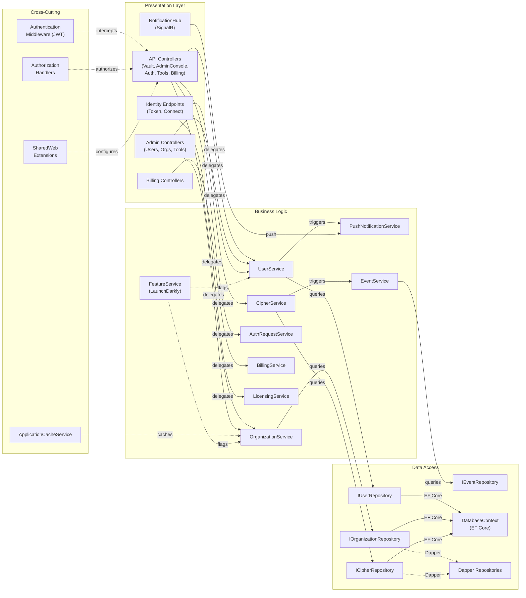

# Architecture Diagram

Bitwarden Server is a multi-service .NET 10 backend platform providing password management, identity, billing, notifications, and administration capabilities through a set of independently deployable ASP.NET Core web services.

## Application Architecture

```mermaid
flowchart TD
    subgraph Clients["Client Layer"]
        WebClient["Web / Desktop / Mobile Clients"]
        AdminUI["Admin Portal"]
    end

    subgraph Services["Application Services - ASP.NET Core (.NET 10)"]
        Api["API Service\n(ASP.NET Core Web API)"]
        Identity["Identity Service\n(OpenID Connect / OAuth2)"]
        Admin["Admin Service\n(Razor Pages)"]
        Billing["Billing Service\n(ASP.NET Core Web API)"]
        Notifications["Notifications Service\n(SignalR + ASP.NET Core)"]
        Events["Events Service\n(ASP.NET Core)"]
        EventsProcessor["Events Processor\n(Background Worker)"]
        Icons["Icons Service\n(ASP.NET Core)"]
    end

    subgraph Core["Core / Shared Libraries"]
        CoreLib["Core Library\n(Domain + Services)"]
        SharedWeb["SharedWeb\n(Middleware, Auth)"]
        CommCore["Commercial.Core\n(License Features)"]
    end

    subgraph DataAccess["Data Access Layer"]
        EF["Infrastructure.EntityFramework\n(EF Core 8)"]
        Dapper["Infrastructure.Dapper\n(Dapper SQL)"]
    end

    subgraph Storage["Data Storage"]
        MSSQL[("SQL Server")]
        PostgreSQL[("PostgreSQL")]
        MySQL[("MySQL")]
        SQLite[("SQLite")]
        Cosmos[("Azure Cosmos DB")]
        AzureTable[("Azure Table Storage")]
    end

    subgraph Messaging["Messaging & Cache"]
        ServiceBus["Azure Service Bus"]
        SQS["AWS SQS"]
        Redis[("Redis Cache")]
        SignalR["SignalR Hub"]
    end

    subgraph External["External Services"]
        Stripe["Stripe / Braintree\n(Payments)"]
        SMTP["SMTP / MailKit\n(Email)"]
        SES["AWS SES\n(Email)"]
        FIDO2["FIDO2 / WebAuthn"]
        Duo["Duo MFA"]
        LaunchDarkly["LaunchDarkly\n(Feature Flags)"]
        AzureNotifHub["Azure Notification Hubs\n(Push)"]
        AzureBlob["Azure Blob Storage\n(Attachments)"]
    end

    WebClient -->|"HTTPS REST"| Api
    WebClient -->|"HTTPS OpenID Connect"| Identity
    AdminUI -->|"HTTPS"| Admin
    WebClient -->|"WebSocket"| Notifications

    Api --> SharedWeb
    Api --> CoreLib
    Api --> CommCore
    Identity --> SharedWeb
    Identity --> CoreLib
    Admin --> CoreLib
    Billing --> CommCore
    Billing --> CoreLib
    Notifications --> CoreLib
    Events --> CoreLib
    EventsProcessor -->|"processes queue"| Events

    CoreLib --> EF
    CoreLib --> Dapper
    EF --> MSSQL
    EF --> PostgreSQL
    EF --> MySQL
    EF --> SQLite
    CoreLib --> Cosmos
    CoreLib --> AzureTable

    Notifications -->|"pub/sub"| Redis
    Notifications --> SignalR
    CoreLib -->|"queue messages"| ServiceBus
    CoreLib -->|"queue messages"| SQS

    CoreLib -->|"payments"| Stripe
    CoreLib -->|"email"| SMTP
    CoreLib -->|"email"| SES
    Api -->|"2FA"| Duo
    Api -->|"passkeys"| FIDO2
    CoreLib -->|"feature flags"| LaunchDarkly
    Notifications -->|"push"| AzureNotifHub
    CoreLib -->|"file storage"| AzureBlob
```

### Technology Stack Summary

| Layer | Technology | Version | Purpose |
|-------|-----------|---------|---------|
| Presentation | ASP.NET Core Web API | .NET 10 | REST API endpoints (Api, Billing, Events) |
| Presentation | ASP.NET Core Razor Pages | .NET 10 | Admin portal |
| Identity | OpenIddict / ASP.NET Identity | .NET 10 | OAuth2/OIDC token issuance |
| Real-time | ASP.NET Core SignalR | 10.0.8 | WebSocket push notifications |
| Business Logic | .NET Class Libraries | .NET 10 | Domain services (Core, Commercial.Core) |
| Data Access (ORM) | Entity Framework Core | 8.0.8 | Multi-database ORM (SQL Server, PostgreSQL, MySQL, SQLite) |
| Data Access (Micro-ORM) | Dapper | 2.x | High-performance SQL queries |
| Caching | StackExchange.Redis | latest | SignalR backplane, distributed cache |
| Messaging | Azure Service Bus | 7.20.1 | Async event processing |
| Messaging | AWS SQS | 4.0.2.5 | Alternative message queue |
| Feature Flags | LaunchDarkly | latest | Runtime feature toggling |
| Payments | Stripe / Braintree | latest | Subscription billing |
| Email | MailKit / AWS SES | 4.16.0 / 4.0.2.5 | Transactional email |

### Data Storage & External Services

Bitwarden Server supports multiple relational databases (SQL Server, PostgreSQL, MySQL, SQLite) via Entity Framework Core with parallel Dapper implementations for performance-critical queries. Azure Cosmos DB and Azure Table Storage are used for event logging and auxiliary data. Redis provides the SignalR backplane for horizontal scaling. Azure Blob Storage holds user attachment files. External integrations include Stripe and Braintree for billing, AWS SES and MailKit for email, LaunchDarkly for feature flags, Duo for MFA, FIDO2/WebAuthn for passkey authentication, and Azure Notification Hubs for mobile push.

### Key Architectural Decisions

- **Multi-database support**: EF Core is configured for SQL Server, PostgreSQL, MySQL, and SQLite via separate migration projects, allowing self-hosted deployments to choose their preferred database engine.
- **Dual data access pattern**: A Dapper-based infrastructure layer runs alongside the EF Core layer, enabling developers to use raw SQL for high-performance queries while still benefiting from the ORM for standard CRUD.
- **Microservices decomposition**: The backend is split into independently deployable services (Api, Identity, Admin, Billing, Notifications, Events, Icons), each sharing the Core domain library, allowing individual scaling and deployment.

## Component Relationships

### Component Inventory

| Component | Layer | Type | Responsibility |
|-----------|-------|------|----------------|
| API Controllers (Vault, Auth, Tools, etc.) | Presentation | ASP.NET Core Controllers | Handle REST requests for vault items, authentication, and tools |
| Admin Controllers | Presentation | Razor Pages / Controllers | Administrative operations on users, organizations, and tools |
| Billing Controllers | Presentation | ASP.NET Core Controllers | Billing and subscription management endpoints |
| NotificationHub | Presentation | SignalR Hub | Real-time push notifications to clients |
| Identity Endpoints | Presentation | Minimal API / Controllers | OAuth2/OIDC token issuance and account connect flows |
| UserService | Business Logic | Domain Service | User lifecycle management, authentication helpers |
| OrganizationService | Business Logic | Domain Service | Organization provisioning, member management, policies |
| CipherService | Business Logic | Domain Service | Vault item (cipher) CRUD, sharing, access control |
| AuthRequestService | Business Logic | Domain Service | Passwordless auth request orchestration |
| FeatureService | Business Logic | Service | LaunchDarkly-backed feature flag evaluation |
| PushNotificationService | Business Logic | Service | Dispatches notifications via SignalR, Azure Notification Hubs, Relay |
| EventService | Business Logic | Service | Audit event recording and querying |
| BillingService | Business Logic | Domain Service | Stripe/Braintree subscription and invoice management |
| LicensingService | Business Logic | Domain Service | License validation for self-hosted deployments |
| IUserRepository | Data Access | Repository Interface | User persistence abstraction |
| IOrganizationRepository | Data Access | Repository Interface | Organization persistence abstraction |
| ICipherRepository | Data Access | Repository Interface | Vault item persistence abstraction |
| IEventRepository | Data Access | Repository Interface | Audit event persistence abstraction |
| DatabaseContext (EF Core) | Data Access | DbContext | EF Core unit-of-work for all entity sets |
| Dapper Repositories | Data Access | Repository Impl. | Raw-SQL repository implementations for performance paths |
| Authentication Middleware | Cross-Cutting | Middleware | JWT bearer token validation on all secured routes |
| Authorization Handlers | Cross-Cutting | ASP.NET Core AuthZ | Resource-based authorization (collections, orgs, policies) |
| ApplicationCacheService | Cross-Cutting | Cache Abstraction | In-memory / Service Bus-invalidated org/user cache |
| SharedWeb Extensions | Cross-Cutting | DI Extension Methods | Shared middleware, auth, and service registration helpers |
