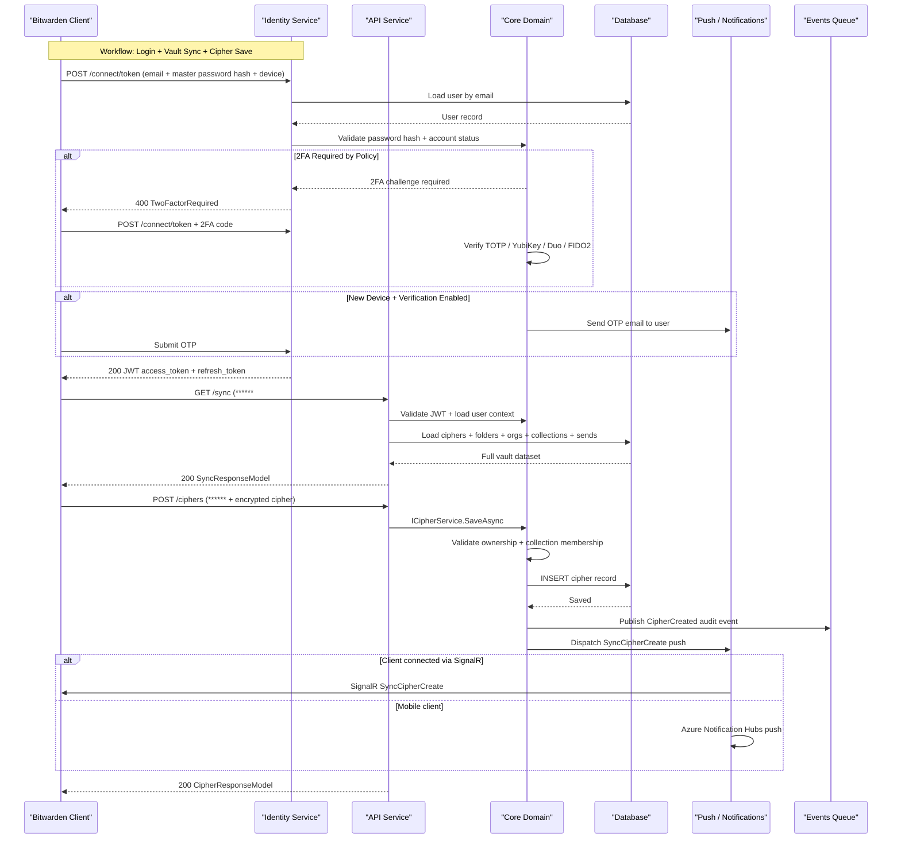

# Core Business Workflows

Bitwarden Server is a cloud-native password management platform that allows individuals and organizations to securely store, share, and access encrypted credentials, secure notes, and sensitive data across all their devices.

## Domain Entities

| Entity | Service / Bounded Context | Description | Key Relationships |
|--------|--------------------------|-------------|-------------------|
| User | Identity / Core | An individual Bitwarden account holder with encrypted vault | Owns Ciphers, Folders, Sends; joins Organizations via OrganizationUser |
| Cipher | Vault | An encrypted vault item (login, card, note, identity) owned by a user or organization | Belongs to User or Organization; organized in Collections and Folders |
| Folder | Vault | Client-side organizational container for a user's ciphers | Belongs to User; referenced by Cipher |
| Collection | AdminConsole | Server-side grouping of shared ciphers within an organization | Belongs to Organization; grants access to OrganizationUsers and Groups |
| Organization | AdminConsole | An enterprise account enabling shared vault, policies, and billing | Has many OrganizationUsers, Collections, Groups, Policies |
| OrganizationUser | AdminConsole | Membership record linking a User to an Organization with a role and status | Links User ↔ Organization; can have Collection and Group access |
| Group | AdminConsole | Named set of OrganizationUsers for bulk access control | Belongs to Organization; has CollectionGroup access grants |
| Policy | AdminConsole | Enterprise security policy applied to an organization (e.g., 2FA required, master password strength) | Belongs to Organization; enforced at login and invitation time |
| Send | Tools | An encrypted, time-limited file or text shared via a public link | Belongs to User or Organization; stored in blob storage |
| AuthRequest | Auth | A passwordless login request created on one device to approve on another | Belongs to User; expires after configurable window |
| EmergencyAccess | Auth | A trusted contact relationship allowing account takeover in emergencies | Links Grantor User ↔ Grantee User |
| WebAuthnCredential | Auth | A FIDO2/WebAuthn passkey credential for passwordless authentication | Belongs to User |
| SsoConfig | Auth | SAML2 / OIDC SSO configuration for an organization | Belongs to Organization |
| Secret | SecretsManager | An encrypted secret (API key, database password, etc.) in Secrets Manager | Belongs to Organization Project; governed by AccessPolicy |
| Project | SecretsManager | A logical grouping of secrets within an organization | Belongs to Organization; has AccessPolicy grants |
| ServiceAccount | SecretsManager | A machine identity that can access specific secrets via API key | Belongs to Organization; has AccessPolicy grants |
| Provider | Billing | An MSP/Partner entity managing multiple client organizations | Has ProviderUsers and ProviderOrganizations |
| Transaction | Billing | A billing transaction record tied to Stripe or Braintree | Belongs to User or Organization |
| Device | Core | A registered device (browser extension, mobile app, desktop) with push token | Belongs to User |
| Notification | Notifications | An in-app notification sent to a user | Belongs to User; has NotificationStatus per user |

## Service-to-Domain Mapping

| Service | Domain Context | Owned Entities | External Dependencies |
|---------|---------------|----------------|----------------------|
| Api | Vault, AdminConsole, Auth, Tools, Notifications | Cipher, Folder, Collection, OrganizationUser, Group, Policy, Send, AuthRequest, Device, EmergencyAccess, Notification | Identity (JWT validation), Notifications (push), Events (audit) |
| Identity | Authentication / Identity | Grant (OIDC), SsoConfig, SsoUser, ApiKey | Core domain (user/org validation), SSO providers (SAML2, OIDC) |
| Admin | Operations / Internal Tools | User, Organization, Transaction (admin read/write) | All other services (via shared DB) |
| Billing | Billing / Subscriptions | Transaction, TaxRate, ProviderPlan, ProviderInvoiceItem, OrganizationSponsorship | Stripe, Braintree, BitPay |
| Notifications | Real-time Messaging | Notification, NotificationStatus | Redis (SignalR backplane), Azure Notification Hubs |
| Events | Audit Log | Event | Azure Cosmos DB / Table Storage |
| EventsProcessor | Audit Log (async ingestion) | Event (writer) | Service Bus / SQS |
| Icons | Media / Proxy | None (stateless) | External website URLs |
| SecretsManager (Commercial) | Secrets Management | Secret, SecretVersion, Project, ServiceAccount, AccessPolicy | Vault domain (org/user) |

## Primary Workflows

### Workflow 1: User Registration and Vault Setup

A new user creates a Bitwarden account. The client generates a master key (never sent to the server), derives a master password hash, and encrypts a randomly generated symmetric vault key with the master key. The server receives: email, master password hash (server-side), encrypted vault key, public/private key pair.

1. Client submits POST `/accounts/register/finish` with email, master password hash, encrypted key, and public/private key pair.
2. `UserService.CreateUserAsync` validates: email not already taken, password meets minimum entropy requirements, no organization domain-claim conflicts.
3. User record is persisted with `Key` (encrypted vault key) stored via `DataProtectionConverter` (ASP.NET Core Data Protection).
4. If an organization has claimed the email domain (`OrganizationDomain`), the user is automatically linked to that organization.
5. Welcome email is dispatched via `IMailService`.
6. Push notification is sent to register the new user on applicable devices.

### Workflow 2: Authentication (Login with MFA)

A user logs in through the Identity service's OAuth2 token endpoint.

1. Client submits POST `/connect/token` with `grant_type=password`, email, master password hash, and device info.
2. Duende IdentityServer's resource owner password validator calls `UserService` to validate credentials:
   - Looks up user by email (`IUserRepository.GetByEmailAsync`)
   - Verifies master password hash against stored hash
   - Checks account status (not disabled, email verified if required)
3. If organization policy requires 2FA and user has no 2FA enabled, login is rejected with `TwoFactorRequired`.
4. If user has 2FA configured, a second request is required with the OTP code:
   - TOTP (Otp.NET), YubiKey (`YubicoDotNetClient`), Duo, FIDO2/WebAuthn, or email OTP
5. If `EnableNewDeviceVerification=true` and device is new, an OTP email is sent before access is granted.
6. On success, Duende IdentityServer issues a JWT access token and refresh token.
7. `DeviceService` upserts the device record with push token.
8. An audit event is written to the Events service.

### Workflow 3: Vault Sync (Client Pull)

After login, clients pull their full vault state via a single sync call.

1. Client submits GET `/sync` with JWT bearer token.
2. `SyncController` calls repositories in parallel to fetch:
   - User profile and subscription status
   - All personal ciphers and folders
   - All organization memberships and their collections/groups/policies
   - All shared ciphers accessible to the user across organizations
   - Sends owned by the user
   - Domains and equivalent domains
3. A `SyncResponseModel` is assembled and returned as a single JSON payload.
4. `AccountRevisionDate` is returned; clients use this to determine if a differential sync is needed on subsequent polls.

### Workflow 4: Cipher Save and Share

A user saves or shares an encrypted vault item.

1. Client submits POST/PUT `/ciphers` with an encrypted `CipherRequestModel`.
2. `CipherService.SaveAsync` validates:
   - User owns the cipher (for updates)
   - If shared to org: user is a member of the organization
   - Collections belong to the organization
   - Attachment size limits are not exceeded
3. Cipher is persisted via `ICipherRepository`.
4. `AccountRevisionDate` is updated for all affected users (owner and collection members).
5. `IPushNotificationService` dispatches `SyncCipherCreate`/`SyncCipherUpdate` push notifications:
   - SignalR push to connected browser/desktop clients
   - Azure Notification Hubs for mobile clients
6. An audit event (`CipherCreated`/`CipherUpdated`) is published to the Events queue.

### Workflow 5: Organization User Invitation and Onboarding

An organization admin invites a new member.

1. Admin submits POST `/organizations/{id}/users/invite` with email addresses and role.
2. `OrganizationService.InviteUsersAsync` validates:
   - Inviting user has permission to invite at the specified role
   - Organization has available seats (or triggers auto-scaling if configured)
   - No policy violations (e.g., Single Org policy would affect existing users)
   - Rate limit: 5 invitations/minute, 300/day per organization
3. `OrganizationUser` records are created with status `Invited`.
4. Invitation emails are sent to each invitee.
5. Invitee clicks email link, logs in or registers, and accepts via PUT `/organizations/{id}/users/{userId}/accept`.
6. `AcceptOrgUserCommand` validates the invitation token and updates status to `Accepted`.
7. Admin confirms membership via POST `/organizations/{id}/users/{userId}/confirm`.
8. On confirmation, status transitions to `Confirmed`; the user's public key is used to encrypt the organization key for them.
9. Push notifications are sent to all organization members to trigger a vault sync.

### Workflow 6: Passwordless Login (AuthRequest)

A user approves a login on a second device.

1. New device creates POST `/auth-requests` with device identifier and public key.
2. `AuthRequestService.CreateAuthRequestAsync` persists the request and dispatches a push notification to the user's other devices via `IPushNotificationService`.
3. User's existing device receives the SignalR push and shows approval prompt.
4. User approves: existing device submits PUT `/auth-requests/{id}` with the encrypted user key (encrypted with the requesting device's public key).
5. `UpdateAuthRequestAsync` validates the request has not expired, marks it approved, encrypts the user key for the requesting device, and triggers a final push.
6. Requesting device polls GET `/auth-requests/{id}/response` to receive the encrypted key and complete login.

### Workflow 7: Organization Policy Enforcement

Policies are enforced automatically on various triggers.

1. When a policy is enabled (e.g., Two-Step Login Required), `PolicyService` identifies all non-compliant `OrganizationUser` records.
2. Non-compliant users are either removed from the organization or placed in a revoked state depending on policy type.
3. `IRevokeNonCompliantOrganizationUserCommand` executes revocation and sends notification emails.
4. Policy checks run at: login time (token issuance in Identity service), cipher save, organization invitation, and user update.

## Cross-Service Data Flows

**Vault Sync Aggregation (Api service)**: The Api service performs all data aggregation in-process using shared repository abstractions. The `SyncController` calls `UserRepository`, `CipherRepository`, `CollectionRepository`, `OrganizationUserRepository`, `FolderRepository`, and `SendRepository` in a single request scope and merges the results into `SyncResponseModel`. This is an in-process aggregation (not a cross-network gateway pattern) since all services share the Core library.

**Audit Event Flow (async)**: Every significant action in the Api, Identity, Admin, and Billing services calls `IEventService.LogAsync`. Depending on configuration, events are published to Azure Service Bus, AWS SQS, or directly to Cosmos DB. The `EventsProcessor` background service drains the queue and writes to the configured event store (Cosmos DB or Azure Table Storage). This is eventual-consistency — events may be delayed but are never lost in transit as long as the queue is available.

**Push Notification Flow (cross-service, async)**: The Api and Identity services call `IPushNotificationService`. For connected web/desktop clients, this routes through the Notifications service via Azure Service Bus (`NotificationHubPool`), which maintains the SignalR backplane on Redis. Mobile clients receive pushes through Azure Notification Hubs. There is no circuit-breaker on push delivery — failed pushes are logged but do not block the primary operation (cipher save, auth approval, etc.).

**Organization Ability Cache (cross-request)**: The `IApplicationCacheService` pre-loads `OrganizationAbility` objects (plan features, 2FA enforcement, policy settings) into Redis at startup and on-demand. Cache invalidation is triggered via Azure Service Bus topic messages (`applicationCacheTopicName`). If Redis or Service Bus is unavailable, the service falls back to in-memory caching, which may cause stale data across multiple instances until restart.

## Business Workflow Sequence

## Business Rules & Decision Logic

### Validation Rules

- **Password strength**: Master password must meet minimum length and entropy requirements (configurable per organization via policy).
- **Email uniqueness**: User email must be globally unique across all accounts.
- **Cipher ownership**: A user can only save/delete their own personal ciphers, or organization ciphers they have explicit access to via Collection grants.
- **Collection membership**: Sharing a cipher to an organization requires the cipher to be assigned to at least one collection; the user must have `Manage` or `Edit` access to all target collections.
- **Organization seat limits**: Inviting a user checks available seats; exceeding the seat count triggers auto-scaling if enabled, or returns a `BadRequest` error.
- **Send expiry**: Sends have a maximum allowed deletion date; files cannot exceed the organization's or user's storage quota.
- **Attachment size**: File attachments are validated against `MaxFileSize` and the subscribing user's/org's remaining storage quota.
- **Rate limits**: API endpoints enforce per-IP sliding-window rate limits (see configuration inventory); organization invitation endpoints enforce 5/minute, 300/day limits.

### State Transitions

- **OrganizationUser status**: `Invited` → `Accepted` → `Confirmed` (→ `Revoked` by policy enforcement)
- **AuthRequest lifecycle**: Created → `Approved`/`Rejected` → Expired (by `DeleteExpiredAsync` cleanup job)
- **Send lifecycle**: Active → Expired (by `DeletedDate`) or Deleted (by user or admin)
- **Cipher lifecycle**: Active → Soft-deleted (trashed, `DeletedDate` set) → Permanently deleted (by purge or `DeleteDeletedAsync` cleanup)
- **EmergencyAccess**: `Invited` → `Accepted` → `RecoveryInitiated` → `RecoveryApproved`

### Decision Logic

- **Premium features gating**: Features such as advanced 2FA, emergency access, and file attachments require the user to have a premium subscription (`IHasPremiumAccessQuery`).
- **Organization policy enforcement**: Policies (Two-Step Login, Single Organization, Master Password Strength, etc.) are checked at login, invitation, and user update. Non-compliant users are revoked.
- **License validation** (self-hosted): `ILicensingService` validates the self-hosted license certificate at startup and on API calls. Expired licenses disable commercial features.
- **Feature flags**: `IFeatureService.IsEnabled(key)` is evaluated in critical code paths (LaunchDarkly in production, file-based `flags.json` in dev) to enable/disable experimental or gradual-rollout features without deployment.
- **SSO enforcement**: If an organization enables the `EnforceSSO` policy, direct master-password logins are blocked for members — they must authenticate through the configured SAML2/OIDC provider.

### Cross-Cutting Concerns

- **Transactions**: EF Core DbContext change tracking provides unit-of-work per request. Explicit `TransactionScope` or `BeginTransactionAsync` is used in multi-step operations (e.g., cipher bulk operations, organization user confirmation).
- **Audit trail**: `IEventService.LogAsync` is called after every significant operation (login, cipher save/delete, organization user change, policy update). Events are persisted asynchronously via the Events queue to avoid blocking the primary operation.
- **Authorization**: ASP.NET Core's policy-based authorization with custom `IAuthorizationHandler` implementations enforces resource-level access control (e.g., `BulkCollectionAuthorizationHandler`, `OrganizationRequirementHandler`). Role checks use `OrganizationUserType` (Owner, Admin, Manager, User, Custom).
- **Error handling**: Domain exceptions (`BadRequestException`, `NotFoundException`, `UnauthorizedException`) are thrown in service layer and mapped to HTTP status codes by the global exception filter. No saga or compensation pattern is implemented — failures in side-effect operations (push, events) are logged but do not roll back the primary persistence.
