# Data Architecture & Persistence Layer

Bitwarden Server persists approximately 50 entity types through a single shared `DatabaseContext` (EF Core 8), backed by SQL Server, PostgreSQL, MySQL, or SQLite depending on deployment profile, with Dapper parallel implementations for performance-critical read paths. Azure Cosmos DB and Azure Table Storage are used by the Events service for audit log data.

## Database Configuration

| Service / Module | DB Type | Profile | Driver / Provider | Migration Tool | Notes |
|-----------------|---------|---------|------------------|----------------|-------|
| All relational services | SQL Server | `cloud`, `mssql` | `Microsoft.Data.SqlClient` 7.0 / EF SqlServer 8.0.8 | dbup-sqlserver (MsSqlMigratorUtility) | Primary cloud deployment DB |
| All relational services | PostgreSQL | `postgres`, `ef` | `Npgsql.EFCore.PostgreSQL` 8.0.4 | EF Core migrations (PostgresMigrations project) | Self-hosted option; case-insensitive ICU collation for Email/Identifier |
| All relational services | MySQL 8.0 | `mysql` | `Pomelo.EFCore.MySql` 8.0.2 | EF Core migrations (MySqlMigrations project) | Self-hosted option |
| All relational services | SQLite | `sqlite` | `Microsoft.EFCore.Sqlite` 8.0.8 | EF Core migrations (SqliteMigrations project) | Local development / integration tests |
| Events / EventsProcessor | Azure Cosmos DB | cloud | `Microsoft.Azure.Cosmos` 3.52.0 | None (schema-less) | Audit log storage |
| Events / EventsProcessor | Azure Table Storage | storage | `Azure.Data.Tables` 12.11.0 | None (schema-less) | Alternative audit log storage |
| Notifications | Redis | all | `StackExchangeRedis` | None | SignalR backplane; not a durable store |
| Api (rate limiting) | Redis (or in-memory) | all | `StackExchangeRedis` / in-process | None | IP rate limit counters |

Schema management for SQL Server uses dbup-sqlserver for forward-only SQL script migrations. EF Core Code First migrations manage PostgreSQL, MySQL, and SQLite schemas. No automatic DDL generation (`migrate` not `create`) is used in any environment.

## Data Ownership per Service

| Service | Owned Entities / Tables | ORM Framework | Caching | Notes |
|---------|------------------------|--------------|---------|-------|
| Api (Vault) | Cipher, Folder, Send, Collection, CollectionCipher, SecurityTask | EF Core + Dapper | ApplicationCacheService (Redis/in-memory) | User-owned vault items; all encrypted at rest |
| Api (AdminConsole) | Organization, OrganizationUser, Group, GroupUser, Policy, CollectionUser, CollectionGroup, OrganizationApiKey, OrganizationConnection, OrganizationDomain, OrganizationInviteLink, OrganizationIntegration | EF Core + Dapper | ApplicationCacheService | Org abilities cached; invalidated via Service Bus |
| Identity | Grant (OIDC), SsoConfig, SsoUser, ApiKey | EF Core | None | Grant table stores Duende IdentityServer persisted grants |
| Auth | AuthRequest, EmergencyAccess, WebAuthnCredential | EF Core | None | Short-lived passwordless auth requests |
| Billing | Transaction, TaxRate, SubscriptionDiscount, OrganizationSponsorship, ProviderPlan, ProviderInvoiceItem, ClientOrganizationMigrationRecord, OrganizationPlanMigrationCohort, OrganizationPlanMigrationCohortAssignment | EF Core + Dapper | None | Billing records mirror Stripe/Braintree data |
| Notifications | Notification, NotificationStatus | EF Core | Redis (SignalR backplane) | Push notification records |
| Events / EventsProcessor | Event | Cosmos DB / Table Storage | None | Append-only audit log; no EF Core |
| SecretsManager (Commercial) | Secret, SecretVersion, Project, ServiceAccount, AccessPolicy (+ subtypes) | EF Core | None | Secrets Manager feature gated by license |
| Admin | User, Organization (read/write) | EF Core + Dapper | None | Admin portal shares the same DB context |
| Provider (Commercial) | Provider, ProviderUser, ProviderOrganization | EF Core + Dapper | ApplicationCacheService | MSP/Provider billing hierarchy |

## Entity Model

```mermaid
erDiagram
    User ||--o{ Cipher : "owns"
    User ||--o{ Folder : "owns"
    User ||--o{ Send : "owns"
    User ||--o{ Device : "registers"
    User ||--o{ OrganizationUser : "joins via"
    User ||--o{ EmergencyAccess : "grants"
    User ||--o{ SsoUser : "has"
    User ||--o{ WebAuthnCredential : "registers"
    User ||--o{ AuthRequest : "initiates"

    Organization ||--o{ OrganizationUser : "has"
    Organization ||--o{ Collection : "owns"
    Organization ||--o{ Group : "owns"
    Organization ||--o{ Policy : "defines"
    Organization ||--o{ Cipher : "shares"
    Organization ||--o{ OrganizationApiKey : "has"
    Organization ||--o{ OrganizationDomain : "claims"
    Organization ||--o{ OrganizationSponsorship : "sponsors"
    Organization ||--o{ OrganizationConnection : "connects"
    Organization ||--o{ SsoConfig : "configures"

    Collection ||--o{ CollectionCipher : "contains"
    Collection ||--o{ CollectionUser : "grants access"
    Collection ||--o{ CollectionGroup : "grants access"

    Group ||--o{ GroupUser : "includes"
    Group ||--o{ CollectionGroup : "accesses"

    OrganizationUser ||--o{ CollectionUser : "accesses"
    OrganizationUser ||--o{ GroupUser : "belongs to"

    Provider ||--o{ ProviderUser : "has"
    Provider ||--o{ ProviderOrganization : "manages"
    Provider ||--o{ ProviderPlan : "has"

    Secret ||--o{ SecretVersion : "versioned by"
    Secret ||--o{ AccessPolicy : "governed by"
    Project ||--o{ AccessPolicy : "governed by"
    ServiceAccount ||--o{ AccessPolicy : "governed by"
    ServiceAccount ||--o{ ApiKey : "has"

    User {
        guid Id PK
        string Email UK
        string Name
        string MasterPassword
        string Key
        string PublicKey
        string PrivateKey
        bool Premium
        datetime AccountRevisionDate
        string TwoFactorProviders
        string GatewayCustomerId
    }
    Organization {
        guid Id PK
        string Name
        string Identifier UK
        string GatewayCustomerId
        int PlanType
        bool Enabled
        bool UseSso
        bool UseSecretsManager
    }
    Cipher {
        guid Id PK
        guid UserId FK
        guid OrganizationId FK
        int Type
        string Data
        string Key
        string Attachments
        datetime DeletedDate
    }
    Collection {
        guid Id PK
        guid OrganizationId FK
        string Name
        string ExternalId
    }
    OrganizationUser {
        guid Id PK
        guid OrganizationId FK
        guid UserId FK
        int Status
        int Type
        string ExternalId
    }
    Group {
        guid Id PK
        guid OrganizationId FK
        string Name
        string ExternalId
    }
    Secret {
        guid Id PK
        guid OrganizationId FK
        string Key
        string Value
        string Note
        datetime DeletedDate
    }
    Provider {
        guid Id PK
        string Name
        int Status
        int Type
        bool Enabled
    }
    AuthRequest {
        guid Id PK
        guid UserId FK
        int Type
        string RequestDeviceIdentifier
        string Key
        bool Approved
        datetime ExpirationDate
    }
    Send {
        guid Id PK
        guid UserId FK
        guid OrganizationId FK
        int Type
        string Data
        string Key
        datetime ExpirationDate
        datetime DeletionDate
    }
    Device {
        guid Id PK
        guid UserId FK
        string Name
        int Type
        string Identifier
        string PushToken
    }
    Event {
        guid Id PK
        int Type
        guid UserId FK
        guid OrganizationId FK
        datetime Date
        string IpAddress
    }
```

## Key Repository Methods

| Service | Repository | Notable Custom Methods | Purpose |
|---------|-----------|----------------------|---------|
| Vault | `ICipherRepository` | `GetByIdAsync(id, userId)`, `GetManyByUserIdAsync`, `CreateAsync(cipher, collectionIds)`, `DeleteDeletedAsync(DateTime)`, `GetManyOrganizationDetailsByOrganizationIdAsync` | Vault item retrieval with user-level permission checks; bulk operations |
| Core | `IUserRepository` | `GetByEmailAsync`, `GetBySsoUserAsync`, `GetByGatewayCustomerIdAsync`, `UpdateUserKeyAndEncryptedDataAsync`, `GetManyByEmailsAsync`, `GetPremiumAccessByIdsAsync` | User lookup by various keys; key rotation bulk update |
| AdminConsole | `IOrganizationRepository` | `GetByIdentifierAsync`, `GetAbilitiesAsync`, `SearchAsync`, `GetManyByUserIdAsync`, `GetByLicenseKeyAsync` | Org lookup; abilities projection for caching |
| AdminConsole | `IOrganizationUserRepository` | `GetManyDetailsByOrganizationIdAsync`, `GetCountByOrganizationIdAsync`, `UpdateGroupsAsync`, `GetManyByOrganizationAsync` | Member management; group membership bulk updates |
| AdminConsole | `ICollectionRepository` | `GetManyByOrganizationIdAsync`, `CreateAsync(collection, groups, users)`, `ReplaceAsync(collection, groups, users)` | Collection CRUD with access grants |
| Auth | `IAuthRequestRepository` | `GetManyByUserIdAsync`, `DeleteExpiredAsync`, `GetManyAdminApprovalRequestsByManyOrganizationsAsync` | Passwordless auth; expiry cleanup |
| Billing | `ITransactionRepository` | `GetManyByUserIdAsync`, `GetManyByOrganizationIdAsync` | Transaction history |
| SecretsManager | `ISecretRepository` | `GetByIdAsync`, `GetManyByIds`, `GetManyByOrganizationIdAsync`, `SoftDeleteManyByIdAsync`, `RestoreManyByIdAsync` | SM secrets with soft-delete and versioning |
| Notifications | `INotificationRepository` | `GetByUserIdAndStatusAsync`, `GetCountByUserIdStatusCreatedAsync` | Per-user notification queries with status filtering |
| Events | `IEventRepository` | `GetManyByOrganizationAsync`, `GetManyByUserAsync`, `GetManyByCipherAsync`, `CreateManyAsync` | Time-range audit log queries; bulk insert |

## Caching Strategy

| Layer | Provider | Pattern | Scope | TTL / Eviction | Rationale |
|-------|----------|---------|-------|----------------|-----------|
| ApplicationCacheService | Redis (production) / In-memory (dev) | Cache-aside | Org abilities, Provider abilities | Service Bus invalidation message | Organization policy/features queried on every authenticated request; Redis avoids per-request DB hits |
| FusionCache | Redis L2 + In-memory L1 | Multi-layer cache-aside | Various hot-path lookups | Configurable per registration | L1 in-process cache eliminates Redis network latency for hottest reads; Redis L2 provides cross-instance consistency |
| SignalR Redis Backplane | Redis | Pub/sub (not a data cache) | Notification hub connections | N/A – event-driven | Required for horizontal scaling of Notifications service; routes hub messages across server instances |
| IP Rate Limit counters | Redis (or in-memory fallback) | Write-through sliding window | Per-IP, per-endpoint | Sliding window (1s, 1m, 1h, 1d) | Distributed rate limiting survives pod restarts when Redis is available; falls back to in-process on Redis failure |
| EF Core Entity Framework Cache table | SQL DB (`Cache` table) | Distributed cache store | ASP.NET Data Protection keys | Per-entry expiry | Stores ASP.NET Core Data Protection keys in the relational DB for multi-instance key sharing |

The `IApplicationCacheService` is the primary cache abstraction. The `InMemoryApplicationCacheService` and `InMemoryServiceBusApplicationCacheService` implementations swap behavior depending on whether Service Bus is configured. Cache invalidation is event-driven via Service Bus topic messages (`applicationCacheTopicName`), ensuring consistency across multiple running instances.

## Data Ownership Boundaries

All relational services share a **single `DatabaseContext`** (logical schema-per-feature within one physical database). There is no physical database-per-service separation. Each feature area (Vault, AdminConsole, Auth, Billing, SecretsManager, Notifications) owns its tables by convention, and direct cross-table joins are permitted within the same service context.

The Events service is the sole exception — it writes to Azure Cosmos DB or Azure Table Storage, completely decoupled from the relational store. Event data flows asynchronously via Azure Service Bus or AWS SQS through the EventsProcessor background worker.

**Cross-service data access**: Most cross-domain data access occurs via repository calls within the same process (since all ASP.NET Core services share the Core library and infrastructure). The `IApplicationCacheService` pre-loads organization abilities (features, plan limits) to avoid repeated joins. Sync responses (`SyncResponseModel`) are assembled by the Api service by querying multiple repositories (User, Cipher, Folder, Collection, Organization) in a single request scope, then composing the result in the application layer — there is no dedicated gateway aggregation service.

**CQRS observations**: No formal CQRS pattern is implemented. Read-heavy paths use Dapper with raw SQL for complex projections (e.g., `CipherDetails`, `OrganizationUserDetails`) while writes go through EF Core for change tracking. This is an informal read-model pattern rather than a formal event-sourced CQRS.

### Data Classification & Sensitivity

| Entity | Sensitive Fields | Classification | Controls in Place |
|--------|-----------------|----------------|-------------------|
| User | `Email`, `Name`, `MasterPassword`, `Key`, `PrivateKey`, `MasterPasswordHint` | PII | `MasterPassword` and `Key` encrypted with ASP.NET Core Data Protection (`DataProtectionConverter`); `Email` hashed for lookup via case-insensitive collation |
| Cipher | `Data`, `Key`, `Attachments` | PII (encrypted vault data) | All `Data` blobs are end-to-end encrypted by the client before storage; server stores only ciphertext |
| Send | `Data`, `Key` | PII (encrypted file/text) | Client-side E2E encryption; server stores only ciphertext |
| Secret (SecretsManager) | `Key`, `Value`, `Note` | Confidential | Values are E2E encrypted; server stores only ciphertext |
| Device | `PushToken` | PII | Stored in plaintext; used only for push notification routing |
| Transaction | `Amount`, `GatewayId`, `GatewayTransactionId` | PCI-adjacent | No raw card data stored; all payment data delegated to Stripe/Braintree; only gateway transaction IDs retained |
| Organization | `GatewayCustomerId`, `GatewaySubscriptionId` | PCI-adjacent | Gateway IDs stored; no card data retained on server |
| SsoUser | `ExternalId` | PII | Used for SSO identity correlation; no additional controls beyond DB access |
| OrganizationUser | `ExternalId`, `Email` (via User FK) | PII | Email accessible via User join; no field-level masking |
| WebAuthnCredential | `PublicKey`, `CredentialId` | Security credential | Public key only; no private key material stored server-side |
