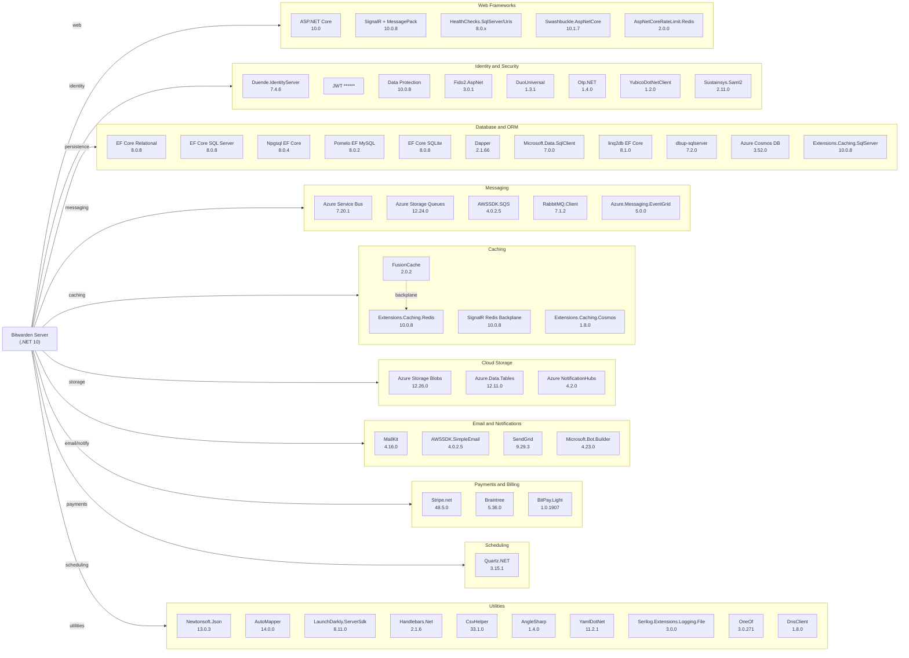

# Dependency Map

Bitwarden Server is a multi-service .NET 10 solution containing 57 projects. This map covers the ~85 unique external package dependencies declared across production projects, categorized by functional area.

## Dependencies

### Dependency Summary

| Category | Count | Key Libraries | Notes |
|----------|-------|---------------|-------|
| Web Frameworks | 5 | ASP.NET Core 10, SignalR 10.0.8, Swashbuckle 10.1.7 | Modern .NET 10 web stack; Swagger/OpenAPI built-in |
| Identity and Security | 8 | Duende IdentityServer 7.4.6, JWT ****** FIDO2 3.0.1 | Full MFA stack: FIDO2, TOTP, Duo, YubiKey, SAML2 |
| Database and ORM | 11 | EF Core 8.0.8, Dapper 2.1.66, SQL Server/Postgres/MySQL/SQLite | EF Core at 8.x while runtime targets .NET 10 |
| Messaging | 5 | Azure Service Bus 7.20.1, Azure Queues, AWS SQS, RabbitMQ 7.1.2 | Multi-cloud messaging; supports Azure and AWS |
| Caching | 4 | Redis (Extensions + SignalR backplane), FusionCache 2.0.2 | FusionCache used as L1/L2 cache abstraction |
| Cloud Storage | 3 | Azure Blobs 12.26.0, Azure Tables 12.11.0, Azure NotifHubs 4.2.0 | Azure-first cloud storage; push via Notification Hubs |
| Email and Notifications | 4 | MailKit 4.16.0, AWS SES, SendGrid 9.29.3, Bot Builder 4.23.0 | Three email providers; Bot SDK for chat integrations |
| Payments and Billing | 3 | Stripe.net 48.5.0, Braintree 5.36.0, BitPay.Light 1.0.1907 | Multi-payment-provider: card, crypto |
| Scheduling | 1 | Quartz.NET 3.15.1 | Job scheduling for background tasks |
| Utilities | 10 | Newtonsoft.Json 13.0.3, AutoMapper 14, LaunchDarkly 8.11.0 | Mixed utility bag; Newtonsoft alongside System.Text.Json |

### Version and Compatibility Risks

Entity Framework Core (8.0.8) targets `net8.0` while the runtime targets `.NET 10.0`, which works but means EF Core is two major versions behind; upgrading to EF Core 9 or 10 would better align the stack. Similarly, the Npgsql, Pomelo, and linq2db providers pin to 8.x. Sustainsys.Saml2 (2.11.0) targets `netcoreapp3.1`/`net6.0` and may have compatibility concerns on .NET 10. Serilog.Extensions.Logging.File (3.0.0) is a legacy package; Serilog's rolling-file functionality has since been absorbed into `Serilog.Sinks.File`. `YamlDotNet` (11.2.1) is several major versions behind the latest (16.x). Duende IdentityServer 7.x requires a commercial license for production use in larger deployments.

### Notable Observations

- **Dual JSON serialization**: Both `Newtonsoft.Json` (13.0.3) and the built-in `System.Text.Json` (.NET 10) are present. Maintaining two serializers increases bundle size and can cause subtle behavioral differences in JSON handling.
- **Multi-cloud messaging proliferation**: Azure Service Bus, Azure Storage Queues, AWS SQS, and RabbitMQ are all declared as dependencies, indicating the application supports multiple messaging backends depending on deployment configuration; this adds operational complexity.
- **EF Core version drift**: Entity Framework Core remains at 8.0.8 even though the solution targets .NET 10. Providers (Npgsql, Pomelo, linq2db) are also stuck at 8.x — an EF Core 10 migration would align versioning and unlock performance improvements.
- **FIDO2 and multi-MFA surface**: Seven distinct authentication/MFA libraries are present (FIDO2, Duo, TOTP/Otp.NET, YubiKey, SAML2, JWT, IdentityServer), indicating an intentionally broad security surface that must be kept up-to-date individually.

## Test Dependencies

| Framework | Version | Notes |
|-----------|---------|-------|
| xUnit | 2.6.6 | Primary unit test framework |
| xunit.runner.visualstudio | 2.5.6 | VS Test Explorer integration |
| Microsoft.NET.Test.Sdk | 18.0.1 | MSTest/xUnit host SDK |
| NSubstitute | latest (variable) | Mocking framework |
| AutoFixture.Xunit2 | latest (variable) | Auto test-data generation |
| AutoFixture.AutoNSubstitute | latest (variable) | AutoFixture + NSubstitute integration |
| Kralizek.AutoFixture.Extensions.MockHttp | 2.2.1 | HTTP mocking for AutoFixture |
| Microsoft.AspNetCore.Mvc.Testing | 10.0.8 | In-process integration test server |
| Microsoft.Extensions.TimeProvider.Testing | 10.6.0 | Deterministic time in tests |
| Bogus | 35.6.5 | Fake data generator (used in Seeder) |

Total test-scope dependencies: 10

The test infrastructure is well-structured around xUnit with AutoFixture for data generation and NSubstitute for mocking. Both unit tests and in-process integration tests (via `Microsoft.AspNetCore.Mvc.Testing`) are present. The versions of NSubstitute and AutoFixture packages use MSBuild variables defined in `Directory.Build.props`, which centralizes version management. No contract-testing library (e.g., Pact.NET) is detected.
