# Projects and dependencies analysis

This document provides a comprehensive overview of the projects and their dependencies in the context of upgrading to .NETCoreApp,Version=v10.0.

## Table of Contents

- [Executive Summary](#executive-Summary)
  - [Highlevel Metrics](#highlevel-metrics)
  - [Projects Compatibility](#projects-compatibility)
  - [Package Compatibility](#package-compatibility)
  - [API Compatibility](#api-compatibility)
  - [Binding Redirect Configuration](#binding-redirect-configuration)
- [Aggregate NuGet packages details](#aggregate-nuget-packages-details)
- [Top API Migration Challenges](#top-api-migration-challenges)
  - [Technologies and Features](#technologies-and-features)
  - [Most Frequent API Issues](#most-frequent-api-issues)
- [Projects Relationship Graph](#projects-relationship-graph)
- [Project Details](#project-details)

  - [AppHost\AppHost.csproj](#apphostapphostcsproj)
  - [bitwarden_license\src\Commercial.Core\Commercial.Core.csproj](#bitwarden_licensesrccommercialcorecommercialcorecsproj)
  - [bitwarden_license\src\Commercial.Infrastructure.EntityFramework\Commercial.Infrastructure.EntityFramework.csproj](#bitwarden_licensesrccommercialinfrastructureentityframeworkcommercialinfrastructureentityframeworkcsproj)
  - [bitwarden_license\src\Scim\Scim.csproj](#bitwarden_licensesrcscimscimcsproj)
  - [bitwarden_license\src\Sso\Sso.csproj](#bitwarden_licensesrcssossocsproj)
  - [bitwarden_license\test\Commercial.Core.Test\Commercial.Core.Test.csproj](#bitwarden_licensetestcommercialcoretestcommercialcoretestcsproj)
  - [bitwarden_license\test\Scim.IntegrationTest\Scim.IntegrationTest.csproj](#bitwarden_licensetestscimintegrationtestscimintegrationtestcsproj)
  - [bitwarden_license\test\Scim.Test\Scim.Test.csproj](#bitwarden_licensetestscimtestscimtestcsproj)
  - [bitwarden_license\test\Sso.IntegrationTest\Sso.IntegrationTest.csproj](#bitwarden_licensetestssointegrationtestssointegrationtestcsproj)
  - [bitwarden_license\test\SSO.Test\SSO.Test.csproj](#bitwarden_licensetestssotestssotestcsproj)
  - [perf\MicroBenchmarks\MicroBenchmarks.csproj](#perfmicrobenchmarksmicrobenchmarkscsproj)
  - [src\Admin\Admin.csproj](#srcadminadmincsproj)
  - [src\Api\Api.csproj](#srcapiapicsproj)
  - [src\Billing\Billing.csproj](#srcbillingbillingcsproj)
  - [src\Core\Core.csproj](#srccorecorecsproj)
  - [src\Events\Events.csproj](#srceventseventscsproj)
  - [src\EventsProcessor\EventsProcessor.csproj](#srceventsprocessoreventsprocessorcsproj)
  - [src\Icons\Icons.csproj](#srciconsiconscsproj)
  - [src\Identity\Identity.csproj](#srcidentityidentitycsproj)
  - [src\Infrastructure.Dapper\Infrastructure.Dapper.csproj](#srcinfrastructuredapperinfrastructuredappercsproj)
  - [src\Infrastructure.EntityFramework\Infrastructure.EntityFramework.csproj](#srcinfrastructureentityframeworkinfrastructureentityframeworkcsproj)
  - [src\Notifications\Notifications.csproj](#srcnotificationsnotificationscsproj)
  - [src\SharedWeb\SharedWeb.csproj](#srcsharedwebsharedwebcsproj)
  - [test\Admin.Test\Admin.Test.csproj](#testadmintestadmintestcsproj)
  - [test\Api.IntegrationTest\Api.IntegrationTest.csproj](#testapiintegrationtestapiintegrationtestcsproj)
  - [test\Api.Test\Api.Test.csproj](#testapitestapitestcsproj)
  - [test\Billing.Test\Billing.Test.csproj](#testbillingtestbillingtestcsproj)
  - [test\Common\Common.csproj](#testcommoncommoncsproj)
  - [test\Core.IntegrationTest\Core.IntegrationTest.csproj](#testcoreintegrationtestcoreintegrationtestcsproj)
  - [test\Core.Test\Core.Test.csproj](#testcoretestcoretestcsproj)
  - [test\Events.IntegrationTest\Events.IntegrationTest.csproj](#testeventsintegrationtesteventsintegrationtestcsproj)
  - [test\Events.Test\Events.Test.csproj](#testeventstesteventstestcsproj)
  - [test\EventsProcessor.Test\EventsProcessor.Test.csproj](#testeventsprocessortesteventsprocessortestcsproj)
  - [test\Icons.Test\Icons.Test.csproj](#testiconstesticonstestcsproj)
  - [test\Identity.IntegrationTest\Identity.IntegrationTest.csproj](#testidentityintegrationtestidentityintegrationtestcsproj)
  - [test\Identity.Test\Identity.Test.csproj](#testidentitytestidentitytestcsproj)
  - [test\Infrastructure.Dapper.Test\Infrastructure.Dapper.Test.csproj](#testinfrastructuredappertestinfrastructuredappertestcsproj)
  - [test\Infrastructure.EFIntegration.Test\Infrastructure.EFIntegration.Test.csproj](#testinfrastructureefintegrationtestinfrastructureefintegrationtestcsproj)
  - [test\Infrastructure.IntegrationTest\Infrastructure.IntegrationTest.csproj](#testinfrastructureintegrationtestinfrastructureintegrationtestcsproj)
  - [test\IntegrationTestCommon\IntegrationTestCommon.csproj](#testintegrationtestcommonintegrationtestcommoncsproj)
  - [test\Notifications.Test\Notifications.Test.csproj](#testnotificationstestnotificationstestcsproj)
  - [test\SeederApi.IntegrationTest\SeederApi.IntegrationTest.csproj](#testseederapiintegrationtestseederapiintegrationtestcsproj)
  - [test\Server.IntegrationTest\Server.IntegrationTest.csproj](#testserverintegrationtestserverintegrationtestcsproj)
  - [test\Setup.Test\Setup.Test.csproj](#testsetuptestsetuptestcsproj)
  - [test\SharedWeb.Test\SharedWeb.Test.csproj](#testsharedwebtestsharedwebtestcsproj)
  - [util\Migrator\Migrator.csproj](#utilmigratormigratorcsproj)
  - [util\MsSqlMigratorUtility\MsSqlMigratorUtility.csproj](#utilmssqlmigratorutilitymssqlmigratorutilitycsproj)
  - [util\MySqlMigrations\MySqlMigrations.csproj](#utilmysqlmigrationsmysqlmigrationscsproj)
  - [util\PostgresMigrations\PostgresMigrations.csproj](#utilpostgresmigrationspostgresmigrationscsproj)
  - [util\RustSdk\RustSdk.csproj](#utilrustsdkrustsdkcsproj)
  - [util\Seeder\Seeder.csproj](#utilseederseedercsproj)
  - [util\SeederApi\SeederApi.csproj](#utilseederapiseederapicsproj)
  - [util\SeederUtility\SeederUtility.csproj](#utilseederutilityseederutilitycsproj)
  - [util\Server\Server.csproj](#utilserverservercsproj)
  - [util\Setup\Setup.csproj](#utilsetupsetupcsproj)
  - [util\SqliteMigrations\SqliteMigrations.csproj](#utilsqlitemigrationssqlitemigrationscsproj)
  - [util\SqlServerEFScaffold\SqlServerEFScaffold.csproj](#utilsqlserverefscaffoldsqlserverefscaffoldcsproj)


## Executive Summary

### Highlevel Metrics

| Metric | Count | Status |
| :--- | :---: | :--- |
| Total Projects | 57 | 0 require upgrade |
| Total NuGet Packages | 115 | All compatible |
| Total Code Files | 4864 |  |
| Total Code Files with Incidents | 0 |  |
| Total Lines of Code | 1646116 |  |
| Total Number of Issues | 0 |  |
| Estimated LOC to modify | 0+ | at least 0.0% of codebase |

### Projects Compatibility

| Project | Target Framework | Difficulty | Package Issues | API Issues | Binding Issues | Est. LOC Impact | Description |
| :--- | :---: | :---: | :---: | :---: | :---: | :---: | :--- |
| [AppHost\AppHost.csproj](#apphostapphostcsproj) | net10.0 | ✅ None | 0 | 0 | 0 |  | DotNetCoreApp, Sdk Style = True |
| [bitwarden_license\src\Commercial.Core\Commercial.Core.csproj](#bitwarden_licensesrccommercialcorecommercialcorecsproj) | net10.0 | ✅ None | 0 | 0 | 0 |  | ClassLibrary, Sdk Style = True |
| [bitwarden_license\src\Commercial.Infrastructure.EntityFramework\Commercial.Infrastructure.EntityFramework.csproj](#bitwarden_licensesrccommercialinfrastructureentityframeworkcommercialinfrastructureentityframeworkcsproj) | net10.0 | ✅ None | 0 | 0 | 0 |  | ClassLibrary, Sdk Style = True |
| [bitwarden_license\src\Scim\Scim.csproj](#bitwarden_licensesrcscimscimcsproj) | net10.0 | ✅ None | 0 | 0 | 0 |  | AspNetCore, Sdk Style = True |
| [bitwarden_license\src\Sso\Sso.csproj](#bitwarden_licensesrcssossocsproj) | net10.0 | ✅ None | 0 | 0 | 0 |  | AspNetCore, Sdk Style = True |
| [bitwarden_license\test\Commercial.Core.Test\Commercial.Core.Test.csproj](#bitwarden_licensetestcommercialcoretestcommercialcoretestcsproj) | net10.0 | ✅ None | 0 | 0 | 0 |  | DotNetCoreApp, Sdk Style = True |
| [bitwarden_license\test\Scim.IntegrationTest\Scim.IntegrationTest.csproj](#bitwarden_licensetestscimintegrationtestscimintegrationtestcsproj) | net10.0 | ✅ None | 0 | 0 | 0 |  | AspNetCore, Sdk Style = True |
| [bitwarden_license\test\Scim.Test\Scim.Test.csproj](#bitwarden_licensetestscimtestscimtestcsproj) | net10.0 | ✅ None | 0 | 0 | 0 |  | DotNetCoreApp, Sdk Style = True |
| [bitwarden_license\test\Sso.IntegrationTest\Sso.IntegrationTest.csproj](#bitwarden_licensetestssointegrationtestssointegrationtestcsproj) | net10.0 | ✅ None | 0 | 0 | 0 |  | AspNetCore, Sdk Style = True |
| [bitwarden_license\test\SSO.Test\SSO.Test.csproj](#bitwarden_licensetestssotestssotestcsproj) | net10.0 | ✅ None | 0 | 0 | 0 |  | DotNetCoreApp, Sdk Style = True |
| [perf\MicroBenchmarks\MicroBenchmarks.csproj](#perfmicrobenchmarksmicrobenchmarkscsproj) | net10.0 | ✅ None | 0 | 0 | 0 |  | DotNetCoreApp, Sdk Style = True |
| [src\Admin\Admin.csproj](#srcadminadmincsproj) | net10.0 | ✅ None | 0 | 0 | 0 |  | AspNetCore, Sdk Style = True |
| [src\Api\Api.csproj](#srcapiapicsproj) | net10.0 | ✅ None | 0 | 0 | 0 |  | AspNetCore, Sdk Style = True |
| [src\Billing\Billing.csproj](#srcbillingbillingcsproj) | net10.0 | ✅ None | 0 | 0 | 0 |  | AspNetCore, Sdk Style = True |
| [src\Core\Core.csproj](#srccorecorecsproj) | net10.0 | ✅ None | 0 | 0 | 0 |  | ClassLibrary, Sdk Style = True |
| [src\Events\Events.csproj](#srceventseventscsproj) | net10.0 | ✅ None | 0 | 0 | 0 |  | AspNetCore, Sdk Style = True |
| [src\EventsProcessor\EventsProcessor.csproj](#srceventsprocessoreventsprocessorcsproj) | net10.0 | ✅ None | 0 | 0 | 0 |  | AspNetCore, Sdk Style = True |
| [src\Icons\Icons.csproj](#srciconsiconscsproj) | net10.0 | ✅ None | 0 | 0 | 0 |  | AspNetCore, Sdk Style = True |
| [src\Identity\Identity.csproj](#srcidentityidentitycsproj) | net10.0 | ✅ None | 0 | 0 | 0 |  | AspNetCore, Sdk Style = True |
| [src\Infrastructure.Dapper\Infrastructure.Dapper.csproj](#srcinfrastructuredapperinfrastructuredappercsproj) | net10.0 | ✅ None | 0 | 0 | 0 |  | ClassLibrary, Sdk Style = True |
| [src\Infrastructure.EntityFramework\Infrastructure.EntityFramework.csproj](#srcinfrastructureentityframeworkinfrastructureentityframeworkcsproj) | net10.0 | ✅ None | 0 | 0 | 0 |  | ClassLibrary, Sdk Style = True |
| [src\Notifications\Notifications.csproj](#srcnotificationsnotificationscsproj) | net10.0 | ✅ None | 0 | 0 | 0 |  | AspNetCore, Sdk Style = True |
| [src\SharedWeb\SharedWeb.csproj](#srcsharedwebsharedwebcsproj) | net10.0 | ✅ None | 0 | 0 | 0 |  | ClassLibrary, Sdk Style = True |
| [test\Admin.Test\Admin.Test.csproj](#testadmintestadmintestcsproj) | net10.0 | ✅ None | 0 | 0 | 0 |  | DotNetCoreApp, Sdk Style = True |
| [test\Api.IntegrationTest\Api.IntegrationTest.csproj](#testapiintegrationtestapiintegrationtestcsproj) | net10.0 | ✅ None | 0 | 0 | 0 |  | AspNetCore, Sdk Style = True |
| [test\Api.Test\Api.Test.csproj](#testapitestapitestcsproj) | net10.0 | ✅ None | 0 | 0 | 0 |  | DotNetCoreApp, Sdk Style = True |
| [test\Billing.Test\Billing.Test.csproj](#testbillingtestbillingtestcsproj) | net10.0 | ✅ None | 0 | 0 | 0 |  | DotNetCoreApp, Sdk Style = True |
| [test\Common\Common.csproj](#testcommoncommoncsproj) | net10.0 | ✅ None | 0 | 0 | 0 |  | DotNetCoreApp, Sdk Style = True |
| [test\Core.IntegrationTest\Core.IntegrationTest.csproj](#testcoreintegrationtestcoreintegrationtestcsproj) | net10.0 | ✅ None | 0 | 0 | 0 |  | DotNetCoreApp, Sdk Style = True |
| [test\Core.Test\Core.Test.csproj](#testcoretestcoretestcsproj) | net10.0 | ✅ None | 0 | 0 | 0 |  | DotNetCoreApp, Sdk Style = True |
| [test\Events.IntegrationTest\Events.IntegrationTest.csproj](#testeventsintegrationtesteventsintegrationtestcsproj) | net10.0 | ✅ None | 0 | 0 | 0 |  | DotNetCoreApp, Sdk Style = True |
| [test\Events.Test\Events.Test.csproj](#testeventstesteventstestcsproj) | net10.0 | ✅ None | 0 | 0 | 0 |  | DotNetCoreApp, Sdk Style = True |
| [test\EventsProcessor.Test\EventsProcessor.Test.csproj](#testeventsprocessortesteventsprocessortestcsproj) | net10.0 | ✅ None | 0 | 0 | 0 |  | DotNetCoreApp, Sdk Style = True |
| [test\Icons.Test\Icons.Test.csproj](#testiconstesticonstestcsproj) | net10.0 | ✅ None | 0 | 0 | 0 |  | DotNetCoreApp, Sdk Style = True |
| [test\Identity.IntegrationTest\Identity.IntegrationTest.csproj](#testidentityintegrationtestidentityintegrationtestcsproj) | net10.0 | ✅ None | 0 | 0 | 0 |  | AspNetCore, Sdk Style = True |
| [test\Identity.Test\Identity.Test.csproj](#testidentitytestidentitytestcsproj) | net10.0 | ✅ None | 0 | 0 | 0 |  | DotNetCoreApp, Sdk Style = True |
| [test\Infrastructure.Dapper.Test\Infrastructure.Dapper.Test.csproj](#testinfrastructuredappertestinfrastructuredappertestcsproj) | net10.0 | ✅ None | 0 | 0 | 0 |  | DotNetCoreApp, Sdk Style = True |
| [test\Infrastructure.EFIntegration.Test\Infrastructure.EFIntegration.Test.csproj](#testinfrastructureefintegrationtestinfrastructureefintegrationtestcsproj) | net10.0 | ✅ None | 0 | 0 | 0 |  | DotNetCoreApp, Sdk Style = True |
| [test\Infrastructure.IntegrationTest\Infrastructure.IntegrationTest.csproj](#testinfrastructureintegrationtestinfrastructureintegrationtestcsproj) | net10.0 | ✅ None | 0 | 0 | 0 |  | DotNetCoreApp, Sdk Style = True |
| [test\IntegrationTestCommon\IntegrationTestCommon.csproj](#testintegrationtestcommonintegrationtestcommoncsproj) | net10.0 | ✅ None | 0 | 0 | 0 |  | ClassLibrary, Sdk Style = True |
| [test\Notifications.Test\Notifications.Test.csproj](#testnotificationstestnotificationstestcsproj) | net10.0 | ✅ None | 0 | 0 | 0 |  | DotNetCoreApp, Sdk Style = True |
| [test\SeederApi.IntegrationTest\SeederApi.IntegrationTest.csproj](#testseederapiintegrationtestseederapiintegrationtestcsproj) | net10.0 | ✅ None | 0 | 0 | 0 |  | AspNetCore, Sdk Style = True |
| [test\Server.IntegrationTest\Server.IntegrationTest.csproj](#testserverintegrationtestserverintegrationtestcsproj) | net10.0 | ✅ None | 0 | 0 | 0 |  | DotNetCoreApp, Sdk Style = True |
| [test\Setup.Test\Setup.Test.csproj](#testsetuptestsetuptestcsproj) | net10.0 | ✅ None | 0 | 0 | 0 |  | DotNetCoreApp, Sdk Style = True |
| [test\SharedWeb.Test\SharedWeb.Test.csproj](#testsharedwebtestsharedwebtestcsproj) | net10.0 | ✅ None | 0 | 0 | 0 |  | DotNetCoreApp, Sdk Style = True |
| [util\Migrator\Migrator.csproj](#utilmigratormigratorcsproj) | net10.0 | ✅ None | 0 | 0 | 0 |  | ClassLibrary, Sdk Style = True |
| [util\MsSqlMigratorUtility\MsSqlMigratorUtility.csproj](#utilmssqlmigratorutilitymssqlmigratorutilitycsproj) | net10.0 | ✅ None | 0 | 0 | 0 |  | DotNetCoreApp, Sdk Style = True |
| [util\MySqlMigrations\MySqlMigrations.csproj](#utilmysqlmigrationsmysqlmigrationscsproj) | net10.0 | ✅ None | 0 | 0 | 0 |  | ClassLibrary, Sdk Style = True |
| [util\PostgresMigrations\PostgresMigrations.csproj](#utilpostgresmigrationspostgresmigrationscsproj) | net10.0 | ✅ None | 0 | 0 | 0 |  | ClassLibrary, Sdk Style = True |
| [util\RustSdk\RustSdk.csproj](#utilrustsdkrustsdkcsproj) | net10.0 | ✅ None | 0 | 0 | 0 |  | ClassLibrary, Sdk Style = True |
| [util\Seeder\Seeder.csproj](#utilseederseedercsproj) | net10.0 | ✅ None | 0 | 0 | 0 |  | ClassLibrary, Sdk Style = True |
| [util\SeederApi\SeederApi.csproj](#utilseederapiseederapicsproj) | net10.0 | ✅ None | 0 | 0 | 0 |  | AspNetCore, Sdk Style = True |
| [util\SeederUtility\SeederUtility.csproj](#utilseederutilityseederutilitycsproj) | net10.0 | ✅ None | 0 | 0 | 0 |  | DotNetCoreApp, Sdk Style = True |
| [util\Server\Server.csproj](#utilserverservercsproj) | net10.0 | ✅ None | 0 | 0 | 0 |  | AspNetCore, Sdk Style = True |
| [util\Setup\Setup.csproj](#utilsetupsetupcsproj) | net10.0 | ✅ None | 0 | 0 | 0 |  | DotNetCoreApp, Sdk Style = True |
| [util\SqliteMigrations\SqliteMigrations.csproj](#utilsqlitemigrationssqlitemigrationscsproj) | net10.0 | ✅ None | 0 | 0 | 0 |  | ClassLibrary, Sdk Style = True |
| [util\SqlServerEFScaffold\SqlServerEFScaffold.csproj](#utilsqlserverefscaffoldsqlserverefscaffoldcsproj) | net10.0 | ✅ None | 0 | 0 | 0 |  | ClassLibrary, Sdk Style = True |

### Package Compatibility

| Status | Count | Percentage |
| :--- | :---: | :---: |
| ✅ Compatible | 115 | 100.0% |
| ⚠️ Incompatible | 0 | 0.0% |
| 🔄 Upgrade Recommended | 0 | 0.0% |
| ***Total NuGet Packages*** | ***115*** | ***100%*** |

### API Compatibility

| Category | Count | Impact |
| :--- | :---: | :--- |
| 🔴 Binary Incompatible | 0 | High - Require code changes |
| 🟡 Source Incompatible | 0 | Medium - Needs re-compilation and potential conflicting API error fixing |
| 🔵 Behavioral change | 0 | Low - Behavioral changes that may require testing at runtime |
| ✅ Compatible | 0 |  |
| ***Total APIs Analyzed*** | ***0*** |  |

## Aggregate NuGet packages details

| Package | Current Version | Suggested Version | Projects | Description |
| :--- | :---: | :---: | :--- | :--- |
| AngleSharp | 1.4.0 |  | [Icons.csproj](#srciconsiconscsproj) | ✅Compatible |
| Aspire.Hosting.AppHost | 13.3.4 |  | [AppHost.csproj](#apphostapphostcsproj) | ✅Compatible |
| Aspire.Hosting.Azure.Storage | 13.3.4 |  | [AppHost.csproj](#apphostapphostcsproj) | ✅Compatible |
| Aspire.Hosting.JavaScript | 13.3.4 |  | [AppHost.csproj](#apphostapphostcsproj) | ✅Compatible |
| Aspire.Hosting.SqlServer | 13.3.4 |  | [AppHost.csproj](#apphostapphostcsproj) | ✅Compatible |
| AspNetCore.HealthChecks.SqlServer | 8.0.2 |  | [Api.csproj](#srcapiapicsproj) | ✅Compatible |
| AspNetCore.HealthChecks.Uris | 8.0.1 |  | [Api.csproj](#srcapiapicsproj) | ✅Compatible |
| AspNetCoreRateLimit | 5.0.0 |  | [Core.csproj](#srccorecorecsproj) | ✅Compatible |
| AspNetCoreRateLimit.Redis | 2.0.0 |  | [Core.csproj](#srccorecorecsproj) | ✅Compatible |
| AutoFixture.AutoNSubstitute | 4.18.1 |  | [Common.csproj](#testcommoncommoncsproj)<br/>[Core.Test.csproj](#testcoretestcoretestcsproj)<br/>[Infrastructure.EFIntegration.Test.csproj](#testinfrastructureefintegrationtestinfrastructureefintegrationtestcsproj) | ✅Compatible |
| AutoFixture.Xunit2 | 4.18.1 |  | [Api.Test.csproj](#testapitestapitestcsproj)<br/>[Billing.Test.csproj](#testbillingtestbillingtestcsproj)<br/>[Common.csproj](#testcommoncommoncsproj)<br/>[Core.Test.csproj](#testcoretestcoretestcsproj)<br/>[Events.Test.csproj](#testeventstesteventstestcsproj)<br/>[Identity.IntegrationTest.csproj](#testidentityintegrationtestidentityintegrationtestcsproj)<br/>[Identity.Test.csproj](#testidentitytestidentitytestcsproj)<br/>[Infrastructure.EFIntegration.Test.csproj](#testinfrastructureefintegrationtestinfrastructureefintegrationtestcsproj)<br/>[Scim.IntegrationTest.csproj](#bitwarden_licensetestscimintegrationtestscimintegrationtestcsproj)<br/>[Sso.IntegrationTest.csproj](#bitwarden_licensetestssointegrationtestssointegrationtestcsproj) | ✅Compatible |
| AutoMapper | 14.0.0 |  | [Commercial.Infrastructure.EntityFramework.csproj](#bitwarden_licensesrccommercialinfrastructureentityframeworkcommercialinfrastructureentityframeworkcsproj)<br/>[Infrastructure.EntityFramework.csproj](#srcinfrastructureentityframeworkinfrastructureentityframeworkcsproj) | ✅Compatible |
| AWSSDK.SimpleEmail | 4.0.2.5 |  | [Core.csproj](#srccorecorecsproj) | ✅Compatible |
| AWSSDK.SQS | 4.0.2.5 |  | [Core.csproj](#srccorecorecsproj) | ✅Compatible |
| Azure.Data.Tables | 12.11.0 |  | [Core.csproj](#srccorecorecsproj) | ✅Compatible |
| Azure.Extensions.AspNetCore.DataProtection.Blobs | 1.3.4 |  | [Core.csproj](#srccorecorecsproj) | ✅Compatible |
| Azure.Messaging.EventGrid | 5.0.0 |  | [Api.csproj](#srcapiapicsproj) | ✅Compatible |
| Azure.Messaging.ServiceBus | 7.20.1 |  | [Core.csproj](#srccorecorecsproj) | ✅Compatible |
| Azure.Storage.Blobs | 12.26.0 |  | [Core.csproj](#srccorecorecsproj) | ✅Compatible |
| Azure.Storage.Blobs.Batch | 12.23.0 |  | [Core.csproj](#srccorecorecsproj) | ✅Compatible |
| Azure.Storage.Queues | 12.24.0 |  | [Core.csproj](#srccorecorecsproj) | ✅Compatible |
| BenchmarkDotNet | 0.15.3 |  | [MicroBenchmarks.csproj](#perfmicrobenchmarksmicrobenchmarkscsproj) | ✅Compatible |
| BitPay.Light | 1.0.1907 |  | [Core.csproj](#srccorecorecsproj) | ✅Compatible |
| Bogus | 35.6.5 |  | [Seeder.csproj](#utilseederseedercsproj) | ✅Compatible |
| Braintree | 5.36.0 |  | [Core.csproj](#srccorecorecsproj) | ✅Compatible |
| CommandDotNet | 7.0.5 |  | [MsSqlMigratorUtility.csproj](#utilmssqlmigratorutilitymssqlmigratorutilitycsproj)<br/>[SeederUtility.csproj](#utilseederutilityseederutilitycsproj) | ✅Compatible |
| coverlet.collector | 10.0.0 |  | [Core.IntegrationTest.csproj](#testcoreintegrationtestcoreintegrationtestcsproj)<br/>[Infrastructure.Dapper.Test.csproj](#testinfrastructuredappertestinfrastructuredappertestcsproj) | ✅Compatible |
| coverlet.collector | 6.0.0 |  | [Admin.Test.csproj](#testadmintestadmintestcsproj)<br/>[Api.IntegrationTest.csproj](#testapiintegrationtestapiintegrationtestcsproj)<br/>[Api.Test.csproj](#testapitestapitestcsproj)<br/>[Billing.Test.csproj](#testbillingtestbillingtestcsproj)<br/>[Commercial.Core.Test.csproj](#bitwarden_licensetestcommercialcoretestcommercialcoretestcsproj)<br/>[Core.Test.csproj](#testcoretestcoretestcsproj)<br/>[Events.IntegrationTest.csproj](#testeventsintegrationtesteventsintegrationtestcsproj)<br/>[Events.Test.csproj](#testeventstesteventstestcsproj)<br/>[EventsProcessor.Test.csproj](#testeventsprocessortesteventsprocessortestcsproj)<br/>[Icons.Test.csproj](#testiconstesticonstestcsproj)<br/>[Identity.IntegrationTest.csproj](#testidentityintegrationtestidentityintegrationtestcsproj)<br/>[Identity.Test.csproj](#testidentitytestidentitytestcsproj)<br/>[Infrastructure.EFIntegration.Test.csproj](#testinfrastructureefintegrationtestinfrastructureefintegrationtestcsproj)<br/>[Infrastructure.IntegrationTest.csproj](#testinfrastructureintegrationtestinfrastructureintegrationtestcsproj)<br/>[Notifications.Test.csproj](#testnotificationstestnotificationstestcsproj)<br/>[Scim.IntegrationTest.csproj](#bitwarden_licensetestscimintegrationtestscimintegrationtestcsproj)<br/>[Scim.Test.csproj](#bitwarden_licensetestscimtestscimtestcsproj)<br/>[SeederApi.IntegrationTest.csproj](#testseederapiintegrationtestseederapiintegrationtestcsproj)<br/>[SharedWeb.Test.csproj](#testsharedwebtestsharedwebtestcsproj)<br/>[Sso.IntegrationTest.csproj](#bitwarden_licensetestssointegrationtestssointegrationtestcsproj)<br/>[SSO.Test.csproj](#bitwarden_licensetestssotestssotestcsproj) | ✅Compatible |
| CsvHelper | 33.1.0 |  | [Commercial.Core.csproj](#bitwarden_licensesrccommercialcorecommercialcorecsproj)<br/>[Core.csproj](#srccorecorecsproj) | ✅Compatible |
| Dapper | 2.1.66 |  | [Infrastructure.Dapper.csproj](#srcinfrastructuredapperinfrastructuredappercsproj) | ✅Compatible |
| dbup-sqlserver | 7.2.0 |  | [Migrator.csproj](#utilmigratormigratorcsproj) | ✅Compatible |
| DnsClient | 1.8.0 |  | [Core.csproj](#srccorecorecsproj) | ✅Compatible |
| Duende.IdentityServer | 7.4.6 |  | [Core.csproj](#srccorecorecsproj) | ✅Compatible |
| DuoUniversal | 1.3.1 |  | [Core.csproj](#srccorecorecsproj) | ✅Compatible |
| Fido2.AspNet | 3.0.1 |  | [Core.csproj](#srccorecorecsproj) | ✅Compatible |
| Handlebars.Net | 2.1.6 |  | [Core.csproj](#srccorecorecsproj)<br/>[Setup.csproj](#utilsetupsetupcsproj) | ✅Compatible |
| Kralizek.AutoFixture.Extensions.MockHttp | 2.2.1 |  | [Common.csproj](#testcommoncommoncsproj)<br/>[Core.Test.csproj](#testcoretestcoretestcsproj)<br/>[Setup.Test.csproj](#testsetuptestsetuptestcsproj) | ✅Compatible |
| LaunchDarkly.ServerSdk | 8.11.0 |  | [Core.csproj](#srccorecorecsproj) | ✅Compatible |
| linq2db | 5.4.1 |  | [Infrastructure.EntityFramework.csproj](#srcinfrastructureentityframeworkinfrastructureentityframeworkcsproj) | ✅Compatible |
| linq2db.EntityFrameworkCore | 8.1.0 |  | [Infrastructure.EntityFramework.csproj](#srcinfrastructureentityframeworkinfrastructureentityframeworkcsproj) | ✅Compatible |
| MailKit | 4.16.0 |  | [Core.csproj](#srccorecorecsproj) | ✅Compatible |
| MarkDig | 1.1.0 |  | [Billing.csproj](#srcbillingbillingcsproj) | ✅Compatible |
| MartinCostello.Logging.XUnit | 0.7.0 |  | [Core.IntegrationTest.csproj](#testcoreintegrationtestcoreintegrationtestcsproj) | ✅Compatible |
| MessagePack | 3.1.7 |  | [Notifications.csproj](#srcnotificationsnotificationscsproj) | ✅Compatible |
| Microsoft.AspNetCore.Authentication.JwtBearer | 10.0.8 |  | [Core.csproj](#srccorecorecsproj) | ✅Compatible |
| Microsoft.AspNetCore.DataProtection | 10.0.8 |  | [Core.csproj](#srccorecorecsproj) | ✅Compatible |
| Microsoft.AspNetCore.Mvc.Testing | 10.0.8 |  | [Identity.IntegrationTest.csproj](#testidentityintegrationtestidentityintegrationtestcsproj)<br/>[IntegrationTestCommon.csproj](#testintegrationtestcommonintegrationtestcommoncsproj)<br/>[Scim.IntegrationTest.csproj](#bitwarden_licensetestscimintegrationtestscimintegrationtestcsproj)<br/>[Server.IntegrationTest.csproj](#testserverintegrationtestserverintegrationtestcsproj)<br/>[Sso.IntegrationTest.csproj](#bitwarden_licensetestssointegrationtestssointegrationtestcsproj) | ✅Compatible |
| Microsoft.AspNetCore.SignalR.Protocols.MessagePack | 10.0.8 |  | [Notifications.csproj](#srcnotificationsnotificationscsproj) | ✅Compatible |
| Microsoft.AspNetCore.SignalR.StackExchangeRedis | 10.0.8 |  | [Notifications.csproj](#srcnotificationsnotificationscsproj) | ✅Compatible |
| Microsoft.Azure.Cosmos | 3.52.0 |  | [Core.csproj](#srccorecorecsproj) | ✅Compatible |
| Microsoft.Azure.NotificationHubs | 4.2.0 |  | [Core.csproj](#srccorecorecsproj) | ✅Compatible |
| Microsoft.Bot.Builder | 4.23.0 |  | [Core.csproj](#srccorecorecsproj) | ✅Compatible |
| Microsoft.Bot.Builder.Integration.AspNet.Core | 4.23.0 |  | [Core.csproj](#srccorecorecsproj)<br/>[SharedWeb.csproj](#srcsharedwebsharedwebcsproj) | ✅Compatible |
| Microsoft.Bot.Connector | 4.23.0 |  | [Core.csproj](#srccorecorecsproj) | ✅Compatible |
| Microsoft.Data.SqlClient | 7.0.0 |  | [Core.csproj](#srccorecorecsproj) | ✅Compatible |
| Microsoft.EntityFrameworkCore.Design | 8.0.8 |  | [MySqlMigrations.csproj](#utilmysqlmigrationsmysqlmigrationscsproj)<br/>[PostgresMigrations.csproj](#utilpostgresmigrationspostgresmigrationscsproj)<br/>[SqliteMigrations.csproj](#utilsqlitemigrationssqlitemigrationscsproj)<br/>[SqlServerEFScaffold.csproj](#utilsqlserverefscaffoldsqlserverefscaffoldcsproj) | ✅Compatible |
| Microsoft.EntityFrameworkCore.Relational | 8.0.8 |  | [Infrastructure.EntityFramework.csproj](#srcinfrastructureentityframeworkinfrastructureentityframeworkcsproj) | ✅Compatible |
| Microsoft.EntityFrameworkCore.Sqlite | 8.0.8 |  | [Infrastructure.EntityFramework.csproj](#srcinfrastructureentityframeworkinfrastructureentityframeworkcsproj) | ✅Compatible |
| Microsoft.EntityFrameworkCore.SqlServer | 8.0.8 |  | [Infrastructure.EntityFramework.csproj](#srcinfrastructureentityframeworkinfrastructureentityframeworkcsproj) | ✅Compatible |
| Microsoft.Extensions.Caching.Cosmos | 1.8.0 |  | [Core.csproj](#srccorecorecsproj) | ✅Compatible |
| Microsoft.Extensions.Caching.SqlServer | 10.0.8 |  | [Core.csproj](#srccorecorecsproj) | ✅Compatible |
| Microsoft.Extensions.Caching.StackExchangeRedis | 10.0.8 |  | [Core.csproj](#srccorecorecsproj) | ✅Compatible |
| Microsoft.Extensions.Configuration | 10.0.8 |  | [Infrastructure.IntegrationTest.csproj](#testinfrastructureintegrationtestinfrastructureintegrationtestcsproj) | ✅Compatible |
| Microsoft.Extensions.Configuration.EnvironmentVariables | 10.0.8 |  | [Core.csproj](#srccorecorecsproj) | ✅Compatible |
| Microsoft.Extensions.Configuration.UserSecrets | 10.0.8 |  | [Core.csproj](#srccorecorecsproj) | ✅Compatible |
| Microsoft.Extensions.Diagnostics.Testing | 10.5.0 |  | [Infrastructure.IntegrationTest.csproj](#testinfrastructureintegrationtestinfrastructureintegrationtestcsproj) | ✅Compatible |
| Microsoft.Extensions.Diagnostics.Testing | 10.6.0 |  | [Core.Test.csproj](#testcoretestcoretestcsproj)<br/>[Identity.Test.csproj](#testidentitytestidentitytestcsproj) | ✅Compatible |
| Microsoft.Extensions.Diagnostics.Testing | 9.10.0 |  | [Api.IntegrationTest.csproj](#testapiintegrationtestapiintegrationtestcsproj) | ✅Compatible |
| Microsoft.Extensions.Identity.Stores | 10.0.8 |  | [Core.csproj](#srccorecorecsproj) | ✅Compatible |
| Microsoft.Extensions.Logging | 10.0.8 |  | [Infrastructure.IntegrationTest.csproj](#testinfrastructureintegrationtestinfrastructureintegrationtestcsproj)<br/>[Migrator.csproj](#utilmigratormigratorcsproj)<br/>[MsSqlMigratorUtility.csproj](#utilmssqlmigratorutilitymssqlmigratorutilitycsproj)<br/>[Setup.csproj](#utilsetupsetupcsproj) | ✅Compatible |
| Microsoft.Extensions.Logging.Console | 10.0.8 |  | [MsSqlMigratorUtility.csproj](#utilmssqlmigratorutilitymssqlmigratorutilitycsproj) | ✅Compatible |
| Microsoft.Extensions.TimeProvider.Testing | 10.6.0 |  | [Common.csproj](#testcommoncommoncsproj)<br/>[Infrastructure.IntegrationTest.csproj](#testinfrastructureintegrationtestinfrastructureintegrationtestcsproj) | ✅Compatible |
| Microsoft.NET.Test.Sdk | 18.0.1 |  | [Admin.Test.csproj](#testadmintestadmintestcsproj)<br/>[Api.IntegrationTest.csproj](#testapiintegrationtestapiintegrationtestcsproj)<br/>[Api.Test.csproj](#testapitestapitestcsproj)<br/>[Billing.Test.csproj](#testbillingtestbillingtestcsproj)<br/>[Commercial.Core.Test.csproj](#bitwarden_licensetestcommercialcoretestcommercialcoretestcsproj)<br/>[Common.csproj](#testcommoncommoncsproj)<br/>[Core.IntegrationTest.csproj](#testcoreintegrationtestcoreintegrationtestcsproj)<br/>[Core.Test.csproj](#testcoretestcoretestcsproj)<br/>[Events.IntegrationTest.csproj](#testeventsintegrationtesteventsintegrationtestcsproj)<br/>[Events.Test.csproj](#testeventstesteventstestcsproj)<br/>[EventsProcessor.Test.csproj](#testeventsprocessortesteventsprocessortestcsproj)<br/>[Icons.Test.csproj](#testiconstesticonstestcsproj)<br/>[Identity.IntegrationTest.csproj](#testidentityintegrationtestidentityintegrationtestcsproj)<br/>[Identity.Test.csproj](#testidentitytestidentitytestcsproj)<br/>[Infrastructure.Dapper.Test.csproj](#testinfrastructuredappertestinfrastructuredappertestcsproj)<br/>[Infrastructure.EFIntegration.Test.csproj](#testinfrastructureefintegrationtestinfrastructureefintegrationtestcsproj)<br/>[Infrastructure.IntegrationTest.csproj](#testinfrastructureintegrationtestinfrastructureintegrationtestcsproj)<br/>[Notifications.Test.csproj](#testnotificationstestnotificationstestcsproj)<br/>[Scim.IntegrationTest.csproj](#bitwarden_licensetestscimintegrationtestscimintegrationtestcsproj)<br/>[Scim.Test.csproj](#bitwarden_licensetestscimtestscimtestcsproj)<br/>[SeederApi.IntegrationTest.csproj](#testseederapiintegrationtestseederapiintegrationtestcsproj)<br/>[SharedWeb.Test.csproj](#testsharedwebtestsharedwebtestcsproj)<br/>[Sso.IntegrationTest.csproj](#bitwarden_licensetestssointegrationtestssointegrationtestcsproj)<br/>[SSO.Test.csproj](#bitwarden_licensetestssotestssotestcsproj) | ✅Compatible |
| Microsoft.NET.Test.Sdk | 18.5.1 |  | [Server.IntegrationTest.csproj](#testserverintegrationtestserverintegrationtestcsproj)<br/>[Setup.Test.csproj](#testsetuptestsetuptestcsproj) | ✅Compatible |
| Neovolve.Logging.Xunit | 6.3.0 |  | [Billing.Test.csproj](#testbillingtestbillingtestcsproj) | ✅Compatible |
| Newtonsoft.Json | 13.0.3 |  | [Core.csproj](#srccorecorecsproj) | ✅Compatible |
| Npgsql.EntityFrameworkCore.PostgreSQL | 8.0.4 |  | [Infrastructure.EntityFramework.csproj](#srcinfrastructureentityframeworkinfrastructureentityframeworkcsproj) | ✅Compatible |
| NSubstitute | 5.1.0 |  | [Api.Test.csproj](#testapitestapitestcsproj)<br/>[Billing.Test.csproj](#testbillingtestbillingtestcsproj)<br/>[Common.csproj](#testcommoncommoncsproj)<br/>[Core.Test.csproj](#testcoretestcoretestcsproj)<br/>[Events.Test.csproj](#testeventstesteventstestcsproj)<br/>[Icons.Test.csproj](#testiconstesticonstestcsproj)<br/>[Identity.IntegrationTest.csproj](#testidentityintegrationtestidentityintegrationtestcsproj)<br/>[Identity.Test.csproj](#testidentitytestidentitytestcsproj)<br/>[Infrastructure.EFIntegration.Test.csproj](#testinfrastructureefintegrationtestinfrastructureefintegrationtestcsproj)<br/>[Scim.IntegrationTest.csproj](#bitwarden_licensetestscimintegrationtestscimintegrationtestcsproj)<br/>[Scim.Test.csproj](#bitwarden_licensetestscimtestscimtestcsproj)<br/>[Setup.Test.csproj](#testsetuptestsetuptestcsproj)<br/>[SharedWeb.Test.csproj](#testsharedwebtestsharedwebtestcsproj)<br/>[Sso.IntegrationTest.csproj](#bitwarden_licensetestssointegrationtestssointegrationtestcsproj)<br/>[SSO.Test.csproj](#bitwarden_licensetestssotestssotestcsproj) | ✅Compatible |
| OneOf | 3.0.271 |  | [Core.csproj](#srccorecorecsproj) | ✅Compatible |
| OpenTelemetry.Exporter.OpenTelemetryProtocol | 1.15.3 |  | [Admin.csproj](#srcadminadmincsproj)<br/>[Api.csproj](#srcapiapicsproj)<br/>[Billing.csproj](#srcbillingbillingcsproj)<br/>[Events.csproj](#srceventseventscsproj)<br/>[EventsProcessor.csproj](#srceventsprocessoreventsprocessorcsproj)<br/>[Icons.csproj](#srciconsiconscsproj)<br/>[Identity.csproj](#srcidentityidentitycsproj)<br/>[Notifications.csproj](#srcnotificationsnotificationscsproj)<br/>[Scim.csproj](#bitwarden_licensesrcscimscimcsproj)<br/>[Sso.csproj](#bitwarden_licensesrcssossocsproj) | ✅Compatible |
| OpenTelemetry.Extensions.Hosting | 1.15.3 |  | [Admin.csproj](#srcadminadmincsproj)<br/>[Api.csproj](#srcapiapicsproj)<br/>[Billing.csproj](#srcbillingbillingcsproj)<br/>[Events.csproj](#srceventseventscsproj)<br/>[EventsProcessor.csproj](#srceventsprocessoreventsprocessorcsproj)<br/>[Icons.csproj](#srciconsiconscsproj)<br/>[Identity.csproj](#srcidentityidentitycsproj)<br/>[Notifications.csproj](#srcnotificationsnotificationscsproj)<br/>[Scim.csproj](#bitwarden_licensesrcscimscimcsproj)<br/>[Sso.csproj](#bitwarden_licensesrcssossocsproj) | ✅Compatible |
| OpenTelemetry.Instrumentation.AspNetCore | 1.15.0 |  | [Admin.csproj](#srcadminadmincsproj)<br/>[Api.csproj](#srcapiapicsproj)<br/>[Billing.csproj](#srcbillingbillingcsproj)<br/>[Events.csproj](#srceventseventscsproj)<br/>[EventsProcessor.csproj](#srceventsprocessoreventsprocessorcsproj)<br/>[Icons.csproj](#srciconsiconscsproj)<br/>[Identity.csproj](#srcidentityidentitycsproj)<br/>[Notifications.csproj](#srcnotificationsnotificationscsproj)<br/>[Scim.csproj](#bitwarden_licensesrcscimscimcsproj)<br/>[Sso.csproj](#bitwarden_licensesrcssossocsproj) | ✅Compatible |
| OpenTelemetry.Instrumentation.EntityFrameworkCore | 1.12.0-beta.2 |  | [Admin.csproj](#srcadminadmincsproj)<br/>[Api.csproj](#srcapiapicsproj)<br/>[Billing.csproj](#srcbillingbillingcsproj)<br/>[Events.csproj](#srceventseventscsproj)<br/>[EventsProcessor.csproj](#srceventsprocessoreventsprocessorcsproj)<br/>[Icons.csproj](#srciconsiconscsproj)<br/>[Identity.csproj](#srcidentityidentitycsproj)<br/>[Notifications.csproj](#srcnotificationsnotificationscsproj)<br/>[Scim.csproj](#bitwarden_licensesrcscimscimcsproj)<br/>[Sso.csproj](#bitwarden_licensesrcssossocsproj) | ✅Compatible |
| OpenTelemetry.Instrumentation.Http | 1.15.0 |  | [Admin.csproj](#srcadminadmincsproj)<br/>[Api.csproj](#srcapiapicsproj)<br/>[Billing.csproj](#srcbillingbillingcsproj)<br/>[Events.csproj](#srceventseventscsproj)<br/>[EventsProcessor.csproj](#srceventsprocessoreventsprocessorcsproj)<br/>[Icons.csproj](#srciconsiconscsproj)<br/>[Identity.csproj](#srcidentityidentitycsproj)<br/>[Notifications.csproj](#srcnotificationsnotificationscsproj)<br/>[Scim.csproj](#bitwarden_licensesrcscimscimcsproj)<br/>[Sso.csproj](#bitwarden_licensesrcssossocsproj) | ✅Compatible |
| OpenTelemetry.Instrumentation.Runtime | 1.15.0 |  | [Admin.csproj](#srcadminadmincsproj)<br/>[Api.csproj](#srcapiapicsproj)<br/>[Billing.csproj](#srcbillingbillingcsproj)<br/>[Events.csproj](#srceventseventscsproj)<br/>[EventsProcessor.csproj](#srceventsprocessoreventsprocessorcsproj)<br/>[Icons.csproj](#srciconsiconscsproj)<br/>[Identity.csproj](#srcidentityidentitycsproj)<br/>[Notifications.csproj](#srcnotificationsnotificationscsproj)<br/>[Scim.csproj](#bitwarden_licensesrcscimscimcsproj)<br/>[Sso.csproj](#bitwarden_licensesrcssossocsproj) | ✅Compatible |
| OpenTelemetry.Instrumentation.SqlClient | 1.12.0-beta.3 |  | [Admin.csproj](#srcadminadmincsproj)<br/>[Api.csproj](#srcapiapicsproj)<br/>[Billing.csproj](#srcbillingbillingcsproj)<br/>[Events.csproj](#srceventseventscsproj)<br/>[EventsProcessor.csproj](#srceventsprocessoreventsprocessorcsproj)<br/>[Icons.csproj](#srciconsiconscsproj)<br/>[Identity.csproj](#srcidentityidentitycsproj)<br/>[Notifications.csproj](#srcnotificationsnotificationscsproj)<br/>[Scim.csproj](#bitwarden_licensesrcscimscimcsproj)<br/>[Sso.csproj](#bitwarden_licensesrcssossocsproj) | ✅Compatible |
| Otp.NET | 1.4.0 |  | [Core.csproj](#srccorecorecsproj) | ✅Compatible |
| Pomelo.EntityFrameworkCore.MySql | 8.0.2 |  | [Infrastructure.EntityFramework.csproj](#srcinfrastructureentityframeworkinfrastructureentityframeworkcsproj) | ✅Compatible |
| Quartz | 3.15.1 |  | [Core.csproj](#srccorecorecsproj) | ✅Compatible |
| Quartz.Extensions.DependencyInjection | 3.15.1 |  | [Core.csproj](#srccorecorecsproj) | ✅Compatible |
| Quartz.Extensions.Hosting | 3.15.1 |  | [Core.csproj](#srccorecorecsproj) | ✅Compatible |
| RabbitMQ.Client | 7.1.2 |  | [Core.csproj](#srccorecorecsproj) | ✅Compatible |
| RichardSzalay.MockHttp | 7.0.0 |  | [Billing.Test.csproj](#testbillingtestbillingtestcsproj) | ✅Compatible |
| Rnwood.SmtpServer | 3.1.0-ci0868 |  | [Core.IntegrationTest.csproj](#testcoreintegrationtestcoreintegrationtestcsproj) | ✅Compatible |
| SendGrid | 9.29.3 |  | [Core.csproj](#srccorecorecsproj) | ✅Compatible |
| Serilog.Extensions.Logging.File | 3.0.0 |  | [Core.csproj](#srccorecorecsproj) | ✅Compatible |
| Spectre.Console | 0.55.2 |  | [SeederUtility.csproj](#utilseederutilityseederutilitycsproj) | ✅Compatible |
| Stripe.net | 48.5.0 |  | [Core.csproj](#srccorecorecsproj) | ✅Compatible |
| Sustainsys.Saml2.AspNetCore2 | 2.11.0 |  | [Sso.csproj](#bitwarden_licensesrcssossocsproj) | ✅Compatible |
| Swashbuckle.AspNetCore | 10.1.7 |  | [Api.csproj](#srcapiapicsproj)<br/>[Billing.csproj](#srcbillingbillingcsproj) | ✅Compatible |
| Swashbuckle.AspNetCore.SwaggerGen | 10.1.7 |  | [SharedWeb.csproj](#srcsharedwebsharedwebcsproj) | ✅Compatible |
| Testcontainers | 4.11.0 |  | [SharedWeb.Test.csproj](#testsharedwebtestsharedwebtestcsproj) | ✅Compatible |
| xunit | 2.6.6 |  | [Admin.Test.csproj](#testadmintestadmintestcsproj)<br/>[Api.IntegrationTest.csproj](#testapiintegrationtestapiintegrationtestcsproj)<br/>[Api.Test.csproj](#testapitestapitestcsproj)<br/>[Billing.Test.csproj](#testbillingtestbillingtestcsproj)<br/>[Commercial.Core.Test.csproj](#bitwarden_licensetestcommercialcoretestcommercialcoretestcsproj)<br/>[Common.csproj](#testcommoncommoncsproj)<br/>[Core.Test.csproj](#testcoretestcoretestcsproj)<br/>[Events.IntegrationTest.csproj](#testeventsintegrationtesteventsintegrationtestcsproj)<br/>[Events.Test.csproj](#testeventstesteventstestcsproj)<br/>[EventsProcessor.Test.csproj](#testeventsprocessortesteventsprocessortestcsproj)<br/>[Icons.Test.csproj](#testiconstesticonstestcsproj)<br/>[Identity.IntegrationTest.csproj](#testidentityintegrationtestidentityintegrationtestcsproj)<br/>[Identity.Test.csproj](#testidentitytestidentitytestcsproj)<br/>[Infrastructure.EFIntegration.Test.csproj](#testinfrastructureefintegrationtestinfrastructureefintegrationtestcsproj)<br/>[Notifications.Test.csproj](#testnotificationstestnotificationstestcsproj)<br/>[Scim.IntegrationTest.csproj](#bitwarden_licensetestscimintegrationtestscimintegrationtestcsproj)<br/>[Scim.Test.csproj](#bitwarden_licensetestscimtestscimtestcsproj)<br/>[SeederApi.IntegrationTest.csproj](#testseederapiintegrationtestseederapiintegrationtestcsproj)<br/>[SharedWeb.Test.csproj](#testsharedwebtestsharedwebtestcsproj)<br/>[Sso.IntegrationTest.csproj](#bitwarden_licensetestssointegrationtestssointegrationtestcsproj)<br/>[SSO.Test.csproj](#bitwarden_licensetestssotestssotestcsproj) | ✅Compatible |
| xunit | 2.9.3 |  | [Core.IntegrationTest.csproj](#testcoreintegrationtestcoreintegrationtestcsproj)<br/>[Infrastructure.Dapper.Test.csproj](#testinfrastructuredappertestinfrastructuredappertestcsproj) | ✅Compatible |
| xunit.runner.visualstudio | 2.5.6 |  | [Admin.Test.csproj](#testadmintestadmintestcsproj)<br/>[Api.IntegrationTest.csproj](#testapiintegrationtestapiintegrationtestcsproj)<br/>[Api.Test.csproj](#testapitestapitestcsproj)<br/>[Billing.Test.csproj](#testbillingtestbillingtestcsproj)<br/>[Commercial.Core.Test.csproj](#bitwarden_licensetestcommercialcoretestcommercialcoretestcsproj)<br/>[Common.csproj](#testcommoncommoncsproj)<br/>[Core.Test.csproj](#testcoretestcoretestcsproj)<br/>[Events.IntegrationTest.csproj](#testeventsintegrationtesteventsintegrationtestcsproj)<br/>[Events.Test.csproj](#testeventstesteventstestcsproj)<br/>[EventsProcessor.Test.csproj](#testeventsprocessortesteventsprocessortestcsproj)<br/>[Icons.Test.csproj](#testiconstesticonstestcsproj)<br/>[Identity.IntegrationTest.csproj](#testidentityintegrationtestidentityintegrationtestcsproj)<br/>[Identity.Test.csproj](#testidentitytestidentitytestcsproj)<br/>[Infrastructure.EFIntegration.Test.csproj](#testinfrastructureefintegrationtestinfrastructureefintegrationtestcsproj)<br/>[Notifications.Test.csproj](#testnotificationstestnotificationstestcsproj)<br/>[Scim.IntegrationTest.csproj](#bitwarden_licensetestscimintegrationtestscimintegrationtestcsproj)<br/>[Scim.Test.csproj](#bitwarden_licensetestscimtestscimtestcsproj)<br/>[SeederApi.IntegrationTest.csproj](#testseederapiintegrationtestseederapiintegrationtestcsproj)<br/>[SharedWeb.Test.csproj](#testsharedwebtestsharedwebtestcsproj)<br/>[Sso.IntegrationTest.csproj](#bitwarden_licensetestssointegrationtestssointegrationtestcsproj)<br/>[SSO.Test.csproj](#bitwarden_licensetestssotestssotestcsproj) | ✅Compatible |
| xunit.runner.visualstudio | 3.1.2 |  | [Infrastructure.Dapper.Test.csproj](#testinfrastructuredappertestinfrastructuredappertestcsproj) | ✅Compatible |
| xunit.runner.visualstudio | 3.1.4 |  | [Infrastructure.IntegrationTest.csproj](#testinfrastructureintegrationtestinfrastructureintegrationtestcsproj)<br/>[Server.IntegrationTest.csproj](#testserverintegrationtestserverintegrationtestcsproj) | ✅Compatible |
| xunit.runner.visualstudio | 3.1.5 |  | [Core.IntegrationTest.csproj](#testcoreintegrationtestcoreintegrationtestcsproj)<br/>[Setup.Test.csproj](#testsetuptestsetuptestcsproj) | ✅Compatible |
| xunit.v3 | 3.0.1 |  | [Infrastructure.IntegrationTest.csproj](#testinfrastructureintegrationtestinfrastructureintegrationtestcsproj)<br/>[Server.IntegrationTest.csproj](#testserverintegrationtestserverintegrationtestcsproj) | ✅Compatible |
| xunit.v3 | 3.2.1 |  | [Setup.Test.csproj](#testsetuptestsetuptestcsproj) | ✅Compatible |
| YamlDotNet | 11.2.1 |  | [Setup.csproj](#utilsetupsetupcsproj) | ✅Compatible |
| YubicoDotNetClient | 1.2.0 |  | [Core.csproj](#srccorecorecsproj) | ✅Compatible |
| ZiggyCreatures.FusionCache | 2.0.2 |  | [Core.csproj](#srccorecorecsproj) | ✅Compatible |
| ZiggyCreatures.FusionCache.Backplane.StackExchangeRedis | 2.0.2 |  | [Core.csproj](#srccorecorecsproj) | ✅Compatible |
| ZiggyCreatures.FusionCache.Serialization.SystemTextJson | 2.0.2 |  | [Core.csproj](#srccorecorecsproj) | ✅Compatible |

## Top API Migration Challenges

### Technologies and Features

| Technology | Issues | Percentage | Migration Path |
| :--- | :---: | :---: | :--- |

### Most Frequent API Issues

| API | Count | Percentage | Category |
| :--- | :---: | :---: | :--- |

## Projects Relationship Graph

Legend:
📦 SDK-style project
⚙️ Classic project

```mermaid
flowchart LR
    P1["<b>📦&nbsp;AppHost.csproj</b><br/><small>net10.0</small>"]
    P2["<b>📦&nbsp;MicroBenchmarks.csproj</b><br/><small>net10.0</small>"]
    P3["<b>📦&nbsp;Admin.csproj</b><br/><small>net10.0</small>"]
    P4["<b>📦&nbsp;Api.csproj</b><br/><small>net10.0</small>"]
    P5["<b>📦&nbsp;Billing.csproj</b><br/><small>net10.0</small>"]
    P6["<b>📦&nbsp;Core.csproj</b><br/><small>net10.0</small>"]
    P7["<b>📦&nbsp;Events.csproj</b><br/><small>net10.0</small>"]
    P8["<b>📦&nbsp;EventsProcessor.csproj</b><br/><small>net10.0</small>"]
    P9["<b>📦&nbsp;Icons.csproj</b><br/><small>net10.0</small>"]
    P10["<b>📦&nbsp;Identity.csproj</b><br/><small>net10.0</small>"]
    P11["<b>📦&nbsp;Infrastructure.Dapper.csproj</b><br/><small>net10.0</small>"]
    P12["<b>📦&nbsp;Infrastructure.EntityFramework.csproj</b><br/><small>net10.0</small>"]
    P13["<b>📦&nbsp;Notifications.csproj</b><br/><small>net10.0</small>"]
    P14["<b>📦&nbsp;SharedWeb.csproj</b><br/><small>net10.0</small>"]
    P15["<b>📦&nbsp;Commercial.Core.csproj</b><br/><small>net10.0</small>"]
    P16["<b>📦&nbsp;Commercial.Infrastructure.EntityFramework.csproj</b><br/><small>net10.0</small>"]
    P17["<b>📦&nbsp;Scim.csproj</b><br/><small>net10.0</small>"]
    P18["<b>📦&nbsp;Sso.csproj</b><br/><small>net10.0</small>"]
    P19["<b>📦&nbsp;Commercial.Core.Test.csproj</b><br/><small>net10.0</small>"]
    P20["<b>📦&nbsp;Scim.IntegrationTest.csproj</b><br/><small>net10.0</small>"]
    P21["<b>📦&nbsp;Scim.Test.csproj</b><br/><small>net10.0</small>"]
    P22["<b>📦&nbsp;Sso.IntegrationTest.csproj</b><br/><small>net10.0</small>"]
    P23["<b>📦&nbsp;SSO.Test.csproj</b><br/><small>net10.0</small>"]
    P24["<b>📦&nbsp;Admin.Test.csproj</b><br/><small>net10.0</small>"]
    P25["<b>📦&nbsp;Api.IntegrationTest.csproj</b><br/><small>net10.0</small>"]
    P26["<b>📦&nbsp;Api.Test.csproj</b><br/><small>net10.0</small>"]
    P27["<b>📦&nbsp;Billing.Test.csproj</b><br/><small>net10.0</small>"]
    P28["<b>📦&nbsp;Common.csproj</b><br/><small>net10.0</small>"]
    P29["<b>📦&nbsp;Core.IntegrationTest.csproj</b><br/><small>net10.0</small>"]
    P30["<b>📦&nbsp;Core.Test.csproj</b><br/><small>net10.0</small>"]
    P31["<b>📦&nbsp;Events.IntegrationTest.csproj</b><br/><small>net10.0</small>"]
    P32["<b>📦&nbsp;Events.Test.csproj</b><br/><small>net10.0</small>"]
    P33["<b>📦&nbsp;EventsProcessor.Test.csproj</b><br/><small>net10.0</small>"]
    P34["<b>📦&nbsp;Icons.Test.csproj</b><br/><small>net10.0</small>"]
    P35["<b>📦&nbsp;Identity.IntegrationTest.csproj</b><br/><small>net10.0</small>"]
    P36["<b>📦&nbsp;Identity.Test.csproj</b><br/><small>net10.0</small>"]
    P37["<b>📦&nbsp;Infrastructure.Dapper.Test.csproj</b><br/><small>net10.0</small>"]
    P38["<b>📦&nbsp;Infrastructure.EFIntegration.Test.csproj</b><br/><small>net10.0</small>"]
    P39["<b>📦&nbsp;Infrastructure.IntegrationTest.csproj</b><br/><small>net10.0</small>"]
    P40["<b>📦&nbsp;IntegrationTestCommon.csproj</b><br/><small>net10.0</small>"]
    P41["<b>📦&nbsp;Notifications.Test.csproj</b><br/><small>net10.0</small>"]
    P42["<b>📦&nbsp;SeederApi.IntegrationTest.csproj</b><br/><small>net10.0</small>"]
    P43["<b>📦&nbsp;Server.IntegrationTest.csproj</b><br/><small>net10.0</small>"]
    P44["<b>📦&nbsp;Setup.Test.csproj</b><br/><small>net10.0</small>"]
    P45["<b>📦&nbsp;SharedWeb.Test.csproj</b><br/><small>net10.0</small>"]
    P46["<b>📦&nbsp;Migrator.csproj</b><br/><small>net10.0</small>"]
    P47["<b>📦&nbsp;MsSqlMigratorUtility.csproj</b><br/><small>net10.0</small>"]
    P48["<b>📦&nbsp;MySqlMigrations.csproj</b><br/><small>net10.0</small>"]
    P49["<b>📦&nbsp;PostgresMigrations.csproj</b><br/><small>net10.0</small>"]
    P50["<b>📦&nbsp;RustSdk.csproj</b><br/><small>net10.0</small>"]
    P51["<b>📦&nbsp;Seeder.csproj</b><br/><small>net10.0</small>"]
    P52["<b>📦&nbsp;SeederApi.csproj</b><br/><small>net10.0</small>"]
    P53["<b>📦&nbsp;SeederUtility.csproj</b><br/><small>net10.0</small>"]
    P54["<b>📦&nbsp;Server.csproj</b><br/><small>net10.0</small>"]
    P55["<b>📦&nbsp;Setup.csproj</b><br/><small>net10.0</small>"]
    P56["<b>📦&nbsp;SqliteMigrations.csproj</b><br/><small>net10.0</small>"]
    P57["<b>📦&nbsp;SqlServerEFScaffold.csproj</b><br/><small>net10.0</small>"]
    P2 --> P6
    P2 --> P10
    P2 --> P11
    P2 --> P12
    P2 --> P14
    P3 --> P48
    P3 --> P49
    P3 --> P14
    P3 --> P46
    P3 --> P6
    P3 --> P56
    P3 --> P15
    P3 --> P16
    P3 --> P11
    P3 --> P12
    P4 --> P14
    P4 --> P6
    P4 --> P15
    P4 --> P16
    P4 --> P11
    P4 --> P12
    P5 --> P15
    P5 --> P14
    P5 --> P6
    P5 --> P11
    P5 --> P12
    P7 --> P14
    P7 --> P6
    P7 --> P11
    P7 --> P12
    P8 --> P14
    P8 --> P6
    P8 --> P11
    P8 --> P12
    P9 --> P14
    P9 --> P6
    P9 --> P11
    P9 --> P12
    P10 --> P14
    P10 --> P6
    P10 --> P11
    P10 --> P12
    P11 --> P6
    P12 --> P6
    P13 --> P6
    P13 --> P14
    P13 --> P11
    P13 --> P12
    P14 --> P11
    P14 --> P6
    P14 --> P12
    P15 --> P6
    P16 --> P6
    P16 --> P12
    P17 --> P6
    P17 --> P14
    P17 --> P11
    P17 --> P12
    P18 --> P6
    P18 --> P14
    P18 --> P11
    P18 --> P12
    P19 --> P15
    P19 --> P30
    P19 --> P28
    P19 --> P6
    P20 --> P17
    P20 --> P28
    P20 --> P40
    P20 --> P6
    P20 --> P10
    P20 --> P11
    P20 --> P12
    P20 --> P46
    P20 --> P50
    P20 --> P51
    P20 --> P14
    P21 --> P17
    P21 --> P28
    P21 --> P6
    P21 --> P11
    P21 --> P12
    P21 --> P14
    P22 --> P18
    P22 --> P28
    P22 --> P40
    P22 --> P6
    P22 --> P10
    P22 --> P11
    P22 --> P12
    P22 --> P46
    P22 --> P50
    P22 --> P51
    P22 --> P14
    P23 --> P18
    P23 --> P28
    P23 --> P6
    P23 --> P11
    P23 --> P12
    P23 --> P14
    P24 --> P3
    P24 --> P28
    P24 --> P15
    P24 --> P16
    P24 --> P6
    P24 --> P11
    P24 --> P12
    P24 --> P46
    P24 --> P48
    P24 --> P49
    P24 --> P14
    P24 --> P56
    P25 --> P4
    P25 --> P51
    P25 --> P40
    P25 --> P15
    P25 --> P16
    P25 --> P28
    P25 --> P6
    P25 --> P10
    P25 --> P11
    P25 --> P12
    P25 --> P46
    P25 --> P50
    P25 --> P14
    P26 --> P4
    P26 --> P6
    P26 --> P28
    P26 --> P30
    P26 --> P15
    P26 --> P16
    P26 --> P11
    P26 --> P12
    P26 --> P14
    P27 --> P5
    P27 --> P28
    P27 --> P30
    P27 --> P15
    P27 --> P6
    P27 --> P11
    P27 --> P12
    P27 --> P14
    P28 --> P6
    P29 --> P6
    P30 --> P6
    P30 --> P28
    P31 --> P7
    P31 --> P40
    P31 --> P28
    P31 --> P6
    P31 --> P10
    P31 --> P11
    P31 --> P12
    P31 --> P46
    P31 --> P50
    P31 --> P51
    P31 --> P14
    P32 --> P7
    P32 --> P6
    P32 --> P28
    P32 --> P11
    P32 --> P12
    P32 --> P14
    P33 --> P8
    P33 --> P6
    P33 --> P11
    P33 --> P12
    P33 --> P14
    P34 --> P9
    P34 --> P28
    P34 --> P6
    P34 --> P11
    P34 --> P12
    P34 --> P14
    P35 --> P10
    P35 --> P28
    P35 --> P30
    P35 --> P40
    P35 --> P6
    P35 --> P11
    P35 --> P12
    P35 --> P46
    P35 --> P50
    P35 --> P51
    P35 --> P14
    P36 --> P6
    P36 --> P10
    P36 --> P28
    P36 --> P11
    P36 --> P12
    P36 --> P14
    P37 --> P11
    P37 --> P6
    P38 --> P11
    P38 --> P12
    P38 --> P48
    P38 --> P49
    P38 --> P56
    P38 --> P28
    P38 --> P30
    P38 --> P6
    P39 --> P11
    P39 --> P12
    P39 --> P46
    P39 --> P48
    P39 --> P49
    P39 --> P56
    P39 --> P6
    P40 --> P10
    P40 --> P46
    P40 --> P51
    P40 --> P28
    P40 --> P6
    P40 --> P11
    P40 --> P12
    P40 --> P50
    P40 --> P14
    P41 --> P13
    P41 --> P28
    P41 --> P30
    P41 --> P6
    P41 --> P11
    P41 --> P12
    P41 --> P14
    P42 --> P52
    P42 --> P51
    P42 --> P40
    P42 --> P28
    P42 --> P6
    P42 --> P10
    P42 --> P11
    P42 --> P12
    P42 --> P46
    P42 --> P50
    P42 --> P14
    P43 --> P54
    P44 --> P55
    P44 --> P6
    P44 --> P46
    P45 --> P14
    P45 --> P6
    P45 --> P11
    P45 --> P12
    P46 --> P6
    P47 --> P46
    P47 --> P6
    P48 --> P6
    P48 --> P12
    P49 --> P6
    P49 --> P12
    P51 --> P6
    P51 --> P12
    P51 --> P14
    P51 --> P50
    P51 --> P11
    P52 --> P6
    P52 --> P14
    P52 --> P51
    P52 --> P11
    P52 --> P12
    P52 --> P50
    P53 --> P51
    P53 --> P6
    P53 --> P11
    P53 --> P12
    P53 --> P50
    P53 --> P14
    P55 --> P6
    P55 --> P46
    P56 --> P6
    P56 --> P12
    P57 --> P4
    P57 --> P6
    P57 --> P12
    P57 --> P15
    P57 --> P16
    P57 --> P11
    P57 --> P14
    click P1 "#apphostapphostcsproj"
    click P2 "#perfmicrobenchmarksmicrobenchmarkscsproj"
    click P3 "#srcadminadmincsproj"
    click P4 "#srcapiapicsproj"
    click P5 "#srcbillingbillingcsproj"
    click P6 "#srccorecorecsproj"
    click P7 "#srceventseventscsproj"
    click P8 "#srceventsprocessoreventsprocessorcsproj"
    click P9 "#srciconsiconscsproj"
    click P10 "#srcidentityidentitycsproj"
    click P11 "#srcinfrastructuredapperinfrastructuredappercsproj"
    click P12 "#srcinfrastructureentityframeworkinfrastructureentityframeworkcsproj"
    click P13 "#srcnotificationsnotificationscsproj"
    click P14 "#srcsharedwebsharedwebcsproj"
    click P15 "#bitwarden_licensesrccommercialcorecommercialcorecsproj"
    click P16 "#bitwarden_licensesrccommercialinfrastructureentityframeworkcommercialinfrastructureentityframeworkcsproj"
    click P17 "#bitwarden_licensesrcscimscimcsproj"
    click P18 "#bitwarden_licensesrcssossocsproj"
    click P19 "#bitwarden_licensetestcommercialcoretestcommercialcoretestcsproj"
    click P20 "#bitwarden_licensetestscimintegrationtestscimintegrationtestcsproj"
    click P21 "#bitwarden_licensetestscimtestscimtestcsproj"
    click P22 "#bitwarden_licensetestssointegrationtestssointegrationtestcsproj"
    click P23 "#bitwarden_licensetestssotestssotestcsproj"
    click P24 "#testadmintestadmintestcsproj"
    click P25 "#testapiintegrationtestapiintegrationtestcsproj"
    click P26 "#testapitestapitestcsproj"
    click P27 "#testbillingtestbillingtestcsproj"
    click P28 "#testcommoncommoncsproj"
    click P29 "#testcoreintegrationtestcoreintegrationtestcsproj"
    click P30 "#testcoretestcoretestcsproj"
    click P31 "#testeventsintegrationtesteventsintegrationtestcsproj"
    click P32 "#testeventstesteventstestcsproj"
    click P33 "#testeventsprocessortesteventsprocessortestcsproj"
    click P34 "#testiconstesticonstestcsproj"
    click P35 "#testidentityintegrationtestidentityintegrationtestcsproj"
    click P36 "#testidentitytestidentitytestcsproj"
    click P37 "#testinfrastructuredappertestinfrastructuredappertestcsproj"
    click P38 "#testinfrastructureefintegrationtestinfrastructureefintegrationtestcsproj"
    click P39 "#testinfrastructureintegrationtestinfrastructureintegrationtestcsproj"
    click P40 "#testintegrationtestcommonintegrationtestcommoncsproj"
    click P41 "#testnotificationstestnotificationstestcsproj"
    click P42 "#testseederapiintegrationtestseederapiintegrationtestcsproj"
    click P43 "#testserverintegrationtestserverintegrationtestcsproj"
    click P44 "#testsetuptestsetuptestcsproj"
    click P45 "#testsharedwebtestsharedwebtestcsproj"
    click P46 "#utilmigratormigratorcsproj"
    click P47 "#utilmssqlmigratorutilitymssqlmigratorutilitycsproj"
    click P48 "#utilmysqlmigrationsmysqlmigrationscsproj"
    click P49 "#utilpostgresmigrationspostgresmigrationscsproj"
    click P50 "#utilrustsdkrustsdkcsproj"
    click P51 "#utilseederseedercsproj"
    click P52 "#utilseederapiseederapicsproj"
    click P53 "#utilseederutilityseederutilitycsproj"
    click P54 "#utilserverservercsproj"
    click P55 "#utilsetupsetupcsproj"
    click P56 "#utilsqlitemigrationssqlitemigrationscsproj"
    click P57 "#utilsqlserverefscaffoldsqlserverefscaffoldcsproj"

```

## Project Details

<a id="apphostapphostcsproj"></a>
### AppHost\AppHost.csproj

#### Project Info

- **Current Target Framework:** net10.0✅
- **SDK-style**: True
- **Project Kind:** DotNetCoreApp
- **Dependencies**: 0
- **Dependants**: 0
- **Number of Files**: 2
- **Lines of Code**: 331
- **Estimated LOC to modify**: 0+ (at least 0.0% of the project)

#### Dependency Graph

Legend:
📦 SDK-style project
⚙️ Classic project

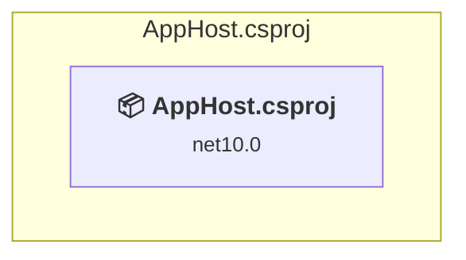

### API Compatibility

| Category | Count | Impact |
| :--- | :---: | :--- |
| 🔴 Binary Incompatible | 0 | High - Require code changes |
| 🟡 Source Incompatible | 0 | Medium - Needs re-compilation and potential conflicting API error fixing |
| 🔵 Behavioral change | 0 | Low - Behavioral changes that may require testing at runtime |
| ✅ Compatible | 0 |  |
| ***Total APIs Analyzed*** | ***0*** |  |

<a id="bitwarden_licensesrccommercialcorecommercialcorecsproj"></a>
### bitwarden_license\src\Commercial.Core\Commercial.Core.csproj

#### Project Info

- **Current Target Framework:** net10.0✅
- **SDK-style**: True
- **Project Kind:** ClassLibrary
- **Dependencies**: 1
- **Dependants**: 9
- **Number of Files**: 45
- **Lines of Code**: 4759
- **Estimated LOC to modify**: 0+ (at least 0.0% of the project)

#### Dependency Graph

Legend:
📦 SDK-style project
⚙️ Classic project

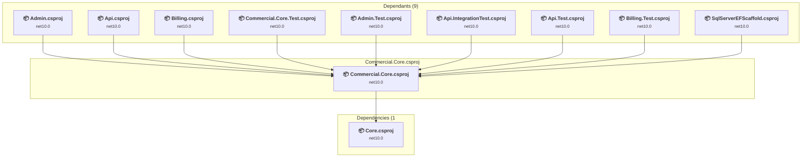

### API Compatibility

| Category | Count | Impact |
| :--- | :---: | :--- |
| 🔴 Binary Incompatible | 0 | High - Require code changes |
| 🟡 Source Incompatible | 0 | Medium - Needs re-compilation and potential conflicting API error fixing |
| 🔵 Behavioral change | 0 | Low - Behavioral changes that may require testing at runtime |
| ✅ Compatible | 0 |  |
| ***Total APIs Analyzed*** | ***0*** |  |

<a id="bitwarden_licensesrccommercialinfrastructureentityframeworkcommercialinfrastructureentityframeworkcsproj"></a>
### bitwarden_license\src\Commercial.Infrastructure.EntityFramework\Commercial.Infrastructure.EntityFramework.csproj

#### Project Info

- **Current Target Framework:** net10.0✅
- **SDK-style**: True
- **Project Kind:** ClassLibrary
- **Dependencies**: 2
- **Dependants**: 6
- **Number of Files**: 6
- **Lines of Code**: 2004
- **Estimated LOC to modify**: 0+ (at least 0.0% of the project)

#### Dependency Graph

Legend:
📦 SDK-style project
⚙️ Classic project

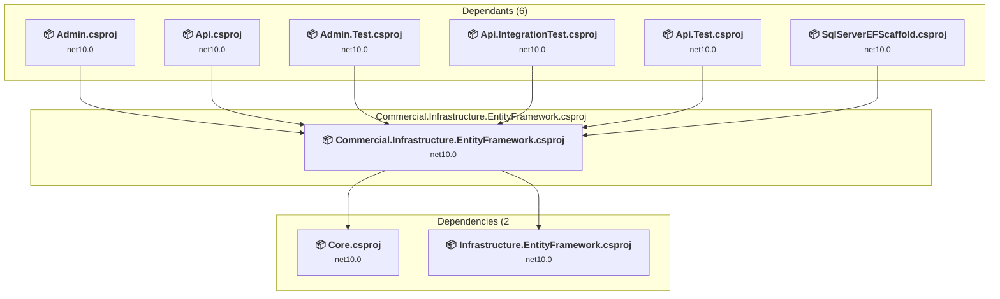

### API Compatibility

| Category | Count | Impact |
| :--- | :---: | :--- |
| 🔴 Binary Incompatible | 0 | High - Require code changes |
| 🟡 Source Incompatible | 0 | Medium - Needs re-compilation and potential conflicting API error fixing |
| 🔵 Behavioral change | 0 | Low - Behavioral changes that may require testing at runtime |
| ✅ Compatible | 0 |  |
| ***Total APIs Analyzed*** | ***0*** |  |

<a id="bitwarden_licensesrcscimscimcsproj"></a>
### bitwarden_license\src\Scim\Scim.csproj

#### Project Info

- **Current Target Framework:** net10.0✅
- **SDK-style**: True
- **Project Kind:** AspNetCore
- **Dependencies**: 4
- **Dependants**: 2
- **Number of Files**: 47
- **Lines of Code**: 2297
- **Estimated LOC to modify**: 0+ (at least 0.0% of the project)

#### Dependency Graph

Legend:
📦 SDK-style project
⚙️ Classic project

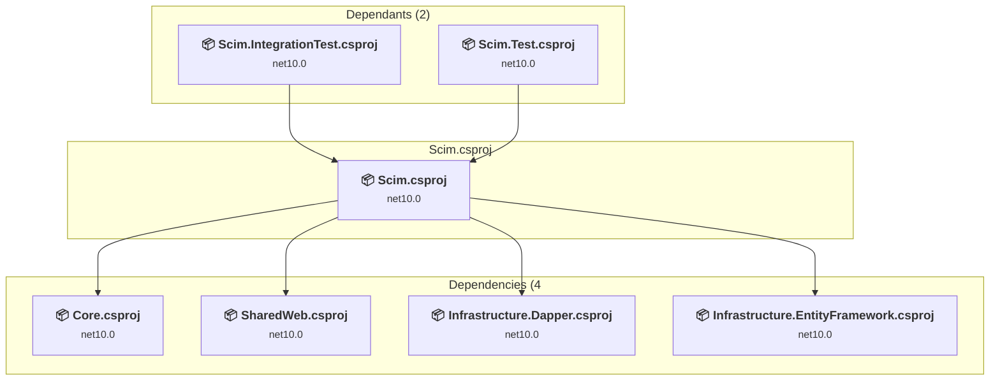

### API Compatibility

| Category | Count | Impact |
| :--- | :---: | :--- |
| 🔴 Binary Incompatible | 0 | High - Require code changes |
| 🟡 Source Incompatible | 0 | Medium - Needs re-compilation and potential conflicting API error fixing |
| 🔵 Behavioral change | 0 | Low - Behavioral changes that may require testing at runtime |
| ✅ Compatible | 0 |  |
| ***Total APIs Analyzed*** | ***0*** |  |

<a id="bitwarden_licensesrcssossocsproj"></a>
### bitwarden_license\src\Sso\Sso.csproj

#### Project Info

- **Current Target Framework:** net10.0✅
- **SDK-style**: True
- **Project Kind:** AspNetCore
- **Dependencies**: 4
- **Dependants**: 2
- **Number of Files**: 43
- **Lines of Code**: 3029
- **Estimated LOC to modify**: 0+ (at least 0.0% of the project)

#### Dependency Graph

Legend:
📦 SDK-style project
⚙️ Classic project

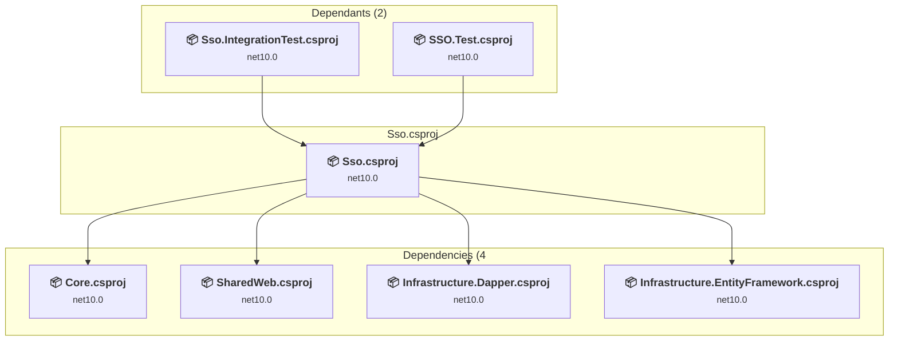

### API Compatibility

| Category | Count | Impact |
| :--- | :---: | :--- |
| 🔴 Binary Incompatible | 0 | High - Require code changes |
| 🟡 Source Incompatible | 0 | Medium - Needs re-compilation and potential conflicting API error fixing |
| 🔵 Behavioral change | 0 | Low - Behavioral changes that may require testing at runtime |
| ✅ Compatible | 0 |  |
| ***Total APIs Analyzed*** | ***0*** |  |

<a id="bitwarden_licensetestcommercialcoretestcommercialcoretestcsproj"></a>
### bitwarden_license\test\Commercial.Core.Test\Commercial.Core.Test.csproj

#### Project Info

- **Current Target Framework:** net10.0✅
- **SDK-style**: True
- **Project Kind:** DotNetCoreApp
- **Dependencies**: 4
- **Dependants**: 0
- **Number of Files**: 47
- **Lines of Code**: 11576
- **Estimated LOC to modify**: 0+ (at least 0.0% of the project)

#### Dependency Graph

Legend:
📦 SDK-style project
⚙️ Classic project

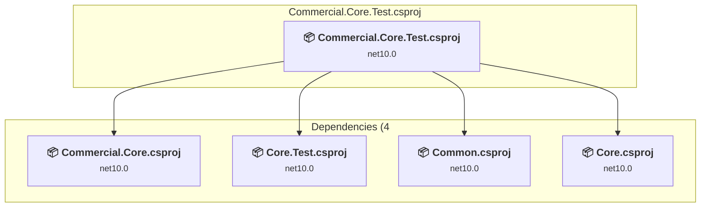

### API Compatibility

| Category | Count | Impact |
| :--- | :---: | :--- |
| 🔴 Binary Incompatible | 0 | High - Require code changes |
| 🟡 Source Incompatible | 0 | Medium - Needs re-compilation and potential conflicting API error fixing |
| 🔵 Behavioral change | 0 | Low - Behavioral changes that may require testing at runtime |
| ✅ Compatible | 0 |  |
| ***Total APIs Analyzed*** | ***0*** |  |

<a id="bitwarden_licensetestscimintegrationtestscimintegrationtestcsproj"></a>
### bitwarden_license\test\Scim.IntegrationTest\Scim.IntegrationTest.csproj

#### Project Info

- **Current Target Framework:** net10.0✅
- **SDK-style**: True
- **Project Kind:** AspNetCore
- **Dependencies**: 11
- **Dependants**: 0
- **Number of Files**: 7
- **Lines of Code**: 1820
- **Estimated LOC to modify**: 0+ (at least 0.0% of the project)

#### Dependency Graph

Legend:
📦 SDK-style project
⚙️ Classic project

```mermaid
flowchart TB
    subgraph current["Scim.IntegrationTest.csproj"]
        MAIN["<b>📦&nbsp;Scim.IntegrationTest.csproj</b><br/><small>net10.0</small>"]
        click MAIN "#bitwarden_licensetestscimintegrationtestscimintegrationtestcsproj"
    end
    subgraph downstream["Dependencies (11"]
        P17["<b>📦&nbsp;Scim.csproj</b><br/><small>net10.0</small>"]
        P28["<b>📦&nbsp;Common.csproj</b><br/><small>net10.0</small>"]
        P40["<b>📦&nbsp;IntegrationTestCommon.csproj</b><br/><small>net10.0</small>"]
        P6["<b>📦&nbsp;Core.csproj</b><br/><small>net10.0</small>"]
        P10["<b>📦&nbsp;Identity.csproj</b><br/><small>net10.0</small>"]
        P11["<b>📦&nbsp;Infrastructure.Dapper.csproj</b><br/><small>net10.0</small>"]
        P12["<b>📦&nbsp;Infrastructure.EntityFramework.csproj</b><br/><small>net10.0</small>"]
        P46["<b>📦&nbsp;Migrator.csproj</b><br/><small>net10.0</small>"]
        P50["<b>📦&nbsp;RustSdk.csproj</b><br/><small>net10.0</small>"]
        P51["<b>📦&nbsp;Seeder.csproj</b><br/><small>net10.0</small>"]
        P14["<b>📦&nbsp;SharedWeb.csproj</b><br/><small>net10.0</small>"]
        click P17 "#bitwarden_licensesrcscimscimcsproj"
        click P28 "#testcommoncommoncsproj"
        click P40 "#testintegrationtestcommonintegrationtestcommoncsproj"
        click P6 "#srccorecorecsproj"
        click P10 "#srcidentityidentitycsproj"
        click P11 "#srcinfrastructuredapperinfrastructuredappercsproj"
        click P12 "#srcinfrastructureentityframeworkinfrastructureentityframeworkcsproj"
        click P46 "#utilmigratormigratorcsproj"
        click P50 "#utilrustsdkrustsdkcsproj"
        click P51 "#utilseederseedercsproj"
        click P14 "#srcsharedwebsharedwebcsproj"
    end
    MAIN --> P17
    MAIN --> P28
    MAIN --> P40
    MAIN --> P6
    MAIN --> P10
    MAIN --> P11
    MAIN --> P12
    MAIN --> P46
    MAIN --> P50
    MAIN --> P51
    MAIN --> P14

```

### API Compatibility

| Category | Count | Impact |
| :--- | :---: | :--- |
| 🔴 Binary Incompatible | 0 | High - Require code changes |
| 🟡 Source Incompatible | 0 | Medium - Needs re-compilation and potential conflicting API error fixing |
| 🔵 Behavioral change | 0 | Low - Behavioral changes that may require testing at runtime |
| ✅ Compatible | 0 |  |
| ***Total APIs Analyzed*** | ***0*** |  |

<a id="bitwarden_licensetestscimtestscimtestcsproj"></a>
### bitwarden_license\test\Scim.Test\Scim.Test.csproj

#### Project Info

- **Current Target Framework:** net10.0✅
- **SDK-style**: True
- **Project Kind:** DotNetCoreApp
- **Dependencies**: 6
- **Dependants**: 0
- **Number of Files**: 9
- **Lines of Code**: 1916
- **Estimated LOC to modify**: 0+ (at least 0.0% of the project)

#### Dependency Graph

Legend:
📦 SDK-style project
⚙️ Classic project

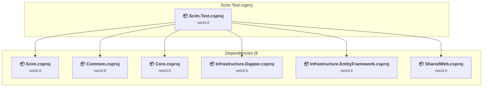

### API Compatibility

| Category | Count | Impact |
| :--- | :---: | :--- |
| 🔴 Binary Incompatible | 0 | High - Require code changes |
| 🟡 Source Incompatible | 0 | Medium - Needs re-compilation and potential conflicting API error fixing |
| 🔵 Behavioral change | 0 | Low - Behavioral changes that may require testing at runtime |
| ✅ Compatible | 0 |  |
| ***Total APIs Analyzed*** | ***0*** |  |

<a id="bitwarden_licensetestssointegrationtestssointegrationtestcsproj"></a>
### bitwarden_license\test\Sso.IntegrationTest\Sso.IntegrationTest.csproj

#### Project Info

- **Current Target Framework:** net10.0✅
- **SDK-style**: True
- **Project Kind:** AspNetCore
- **Dependencies**: 11
- **Dependants**: 0
- **Number of Files**: 8
- **Lines of Code**: 1291
- **Estimated LOC to modify**: 0+ (at least 0.0% of the project)

#### Dependency Graph

Legend:
📦 SDK-style project
⚙️ Classic project

```mermaid
flowchart TB
    subgraph current["Sso.IntegrationTest.csproj"]
        MAIN["<b>📦&nbsp;Sso.IntegrationTest.csproj</b><br/><small>net10.0</small>"]
        click MAIN "#bitwarden_licensetestssointegrationtestssointegrationtestcsproj"
    end
    subgraph downstream["Dependencies (11"]
        P18["<b>📦&nbsp;Sso.csproj</b><br/><small>net10.0</small>"]
        P28["<b>📦&nbsp;Common.csproj</b><br/><small>net10.0</small>"]
        P40["<b>📦&nbsp;IntegrationTestCommon.csproj</b><br/><small>net10.0</small>"]
        P6["<b>📦&nbsp;Core.csproj</b><br/><small>net10.0</small>"]
        P10["<b>📦&nbsp;Identity.csproj</b><br/><small>net10.0</small>"]
        P11["<b>📦&nbsp;Infrastructure.Dapper.csproj</b><br/><small>net10.0</small>"]
        P12["<b>📦&nbsp;Infrastructure.EntityFramework.csproj</b><br/><small>net10.0</small>"]
        P46["<b>📦&nbsp;Migrator.csproj</b><br/><small>net10.0</small>"]
        P50["<b>📦&nbsp;RustSdk.csproj</b><br/><small>net10.0</small>"]
        P51["<b>📦&nbsp;Seeder.csproj</b><br/><small>net10.0</small>"]
        P14["<b>📦&nbsp;SharedWeb.csproj</b><br/><small>net10.0</small>"]
        click P18 "#bitwarden_licensesrcssossocsproj"
        click P28 "#testcommoncommoncsproj"
        click P40 "#testintegrationtestcommonintegrationtestcommoncsproj"
        click P6 "#srccorecorecsproj"
        click P10 "#srcidentityidentitycsproj"
        click P11 "#srcinfrastructuredapperinfrastructuredappercsproj"
        click P12 "#srcinfrastructureentityframeworkinfrastructureentityframeworkcsproj"
        click P46 "#utilmigratormigratorcsproj"
        click P50 "#utilrustsdkrustsdkcsproj"
        click P51 "#utilseederseedercsproj"
        click P14 "#srcsharedwebsharedwebcsproj"
    end
    MAIN --> P18
    MAIN --> P28
    MAIN --> P40
    MAIN --> P6
    MAIN --> P10
    MAIN --> P11
    MAIN --> P12
    MAIN --> P46
    MAIN --> P50
    MAIN --> P51
    MAIN --> P14

```

### API Compatibility

| Category | Count | Impact |
| :--- | :---: | :--- |
| 🔴 Binary Incompatible | 0 | High - Require code changes |
| 🟡 Source Incompatible | 0 | Medium - Needs re-compilation and potential conflicting API error fixing |
| 🔵 Behavioral change | 0 | Low - Behavioral changes that may require testing at runtime |
| ✅ Compatible | 0 |  |
| ***Total APIs Analyzed*** | ***0*** |  |

<a id="bitwarden_licensetestssotestssotestcsproj"></a>
### bitwarden_license\test\SSO.Test\SSO.Test.csproj

#### Project Info

- **Current Target Framework:** net10.0✅
- **SDK-style**: True
- **Project Kind:** DotNetCoreApp
- **Dependencies**: 6
- **Dependants**: 0
- **Number of Files**: 4
- **Lines of Code**: 1048
- **Estimated LOC to modify**: 0+ (at least 0.0% of the project)

#### Dependency Graph

Legend:
📦 SDK-style project
⚙️ Classic project

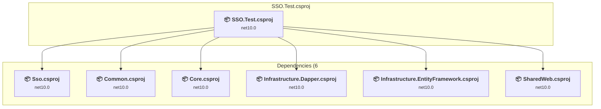

### API Compatibility

| Category | Count | Impact |
| :--- | :---: | :--- |
| 🔴 Binary Incompatible | 0 | High - Require code changes |
| 🟡 Source Incompatible | 0 | Medium - Needs re-compilation and potential conflicting API error fixing |
| 🔵 Behavioral change | 0 | Low - Behavioral changes that may require testing at runtime |
| ✅ Compatible | 0 |  |
| ***Total APIs Analyzed*** | ***0*** |  |

<a id="perfmicrobenchmarksmicrobenchmarkscsproj"></a>
### perf\MicroBenchmarks\MicroBenchmarks.csproj

#### Project Info

- **Current Target Framework:** net10.0✅
- **SDK-style**: True
- **Project Kind:** DotNetCoreApp
- **Dependencies**: 5
- **Dependants**: 0
- **Number of Files**: 4
- **Lines of Code**: 149
- **Estimated LOC to modify**: 0+ (at least 0.0% of the project)

#### Dependency Graph

Legend:
📦 SDK-style project
⚙️ Classic project

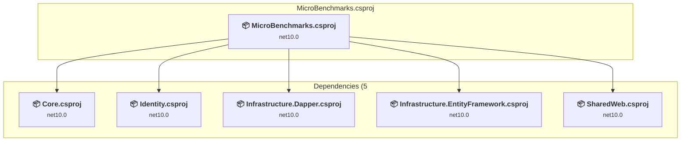

### API Compatibility

| Category | Count | Impact |
| :--- | :---: | :--- |
| 🔴 Binary Incompatible | 0 | High - Require code changes |
| 🟡 Source Incompatible | 0 | Medium - Needs re-compilation and potential conflicting API error fixing |
| 🔵 Behavioral change | 0 | Low - Behavioral changes that may require testing at runtime |
| ✅ Compatible | 0 |  |
| ***Total APIs Analyzed*** | ***0*** |  |

<a id="srcadminadmincsproj"></a>
### src\Admin\Admin.csproj

#### Project Info

- **Current Target Framework:** net10.0✅
- **SDK-style**: True
- **Project Kind:** AspNetCore
- **Dependencies**: 10
- **Dependants**: 1
- **Number of Files**: 156
- **Lines of Code**: 11376
- **Estimated LOC to modify**: 0+ (at least 0.0% of the project)

#### Dependency Graph

Legend:
📦 SDK-style project
⚙️ Classic project

```mermaid
flowchart TB
    subgraph upstream["Dependants (1)"]
        P24["<b>📦&nbsp;Admin.Test.csproj</b><br/><small>net10.0</small>"]
        click P24 "#testadmintestadmintestcsproj"
    end
    subgraph current["Admin.csproj"]
        MAIN["<b>📦&nbsp;Admin.csproj</b><br/><small>net10.0</small>"]
        click MAIN "#srcadminadmincsproj"
    end
    subgraph downstream["Dependencies (10"]
        P48["<b>📦&nbsp;MySqlMigrations.csproj</b><br/><small>net10.0</small>"]
        P49["<b>📦&nbsp;PostgresMigrations.csproj</b><br/><small>net10.0</small>"]
        P14["<b>📦&nbsp;SharedWeb.csproj</b><br/><small>net10.0</small>"]
        P46["<b>📦&nbsp;Migrator.csproj</b><br/><small>net10.0</small>"]
        P6["<b>📦&nbsp;Core.csproj</b><br/><small>net10.0</small>"]
        P56["<b>📦&nbsp;SqliteMigrations.csproj</b><br/><small>net10.0</small>"]
        P15["<b>📦&nbsp;Commercial.Core.csproj</b><br/><small>net10.0</small>"]
        P16["<b>📦&nbsp;Commercial.Infrastructure.EntityFramework.csproj</b><br/><small>net10.0</small>"]
        P11["<b>📦&nbsp;Infrastructure.Dapper.csproj</b><br/><small>net10.0</small>"]
        P12["<b>📦&nbsp;Infrastructure.EntityFramework.csproj</b><br/><small>net10.0</small>"]
        click P48 "#utilmysqlmigrationsmysqlmigrationscsproj"
        click P49 "#utilpostgresmigrationspostgresmigrationscsproj"
        click P14 "#srcsharedwebsharedwebcsproj"
        click P46 "#utilmigratormigratorcsproj"
        click P6 "#srccorecorecsproj"
        click P56 "#utilsqlitemigrationssqlitemigrationscsproj"
        click P15 "#bitwarden_licensesrccommercialcorecommercialcorecsproj"
        click P16 "#bitwarden_licensesrccommercialinfrastructureentityframeworkcommercialinfrastructureentityframeworkcsproj"
        click P11 "#srcinfrastructuredapperinfrastructuredappercsproj"
        click P12 "#srcinfrastructureentityframeworkinfrastructureentityframeworkcsproj"
    end
    P24 --> MAIN
    MAIN --> P48
    MAIN --> P49
    MAIN --> P14
    MAIN --> P46
    MAIN --> P6
    MAIN --> P56
    MAIN --> P15
    MAIN --> P16
    MAIN --> P11
    MAIN --> P12

```

### API Compatibility

| Category | Count | Impact |
| :--- | :---: | :--- |
| 🔴 Binary Incompatible | 0 | High - Require code changes |
| 🟡 Source Incompatible | 0 | Medium - Needs re-compilation and potential conflicting API error fixing |
| 🔵 Behavioral change | 0 | Low - Behavioral changes that may require testing at runtime |
| ✅ Compatible | 0 |  |
| ***Total APIs Analyzed*** | ***0*** |  |

<a id="srcapiapicsproj"></a>
### src\Api\Api.csproj

#### Project Info

- **Current Target Framework:** net10.0✅
- **SDK-style**: True
- **Project Kind:** AspNetCore
- **Dependencies**: 6
- **Dependants**: 3
- **Number of Files**: 476
- **Lines of Code**: 34895
- **Estimated LOC to modify**: 0+ (at least 0.0% of the project)

#### Dependency Graph

Legend:
📦 SDK-style project
⚙️ Classic project

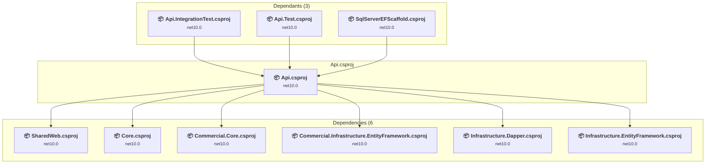

### API Compatibility

| Category | Count | Impact |
| :--- | :---: | :--- |
| 🔴 Binary Incompatible | 0 | High - Require code changes |
| 🟡 Source Incompatible | 0 | Medium - Needs re-compilation and potential conflicting API error fixing |
| 🔵 Behavioral change | 0 | Low - Behavioral changes that may require testing at runtime |
| ✅ Compatible | 0 |  |
| ***Total APIs Analyzed*** | ***0*** |  |

<a id="srcbillingbillingcsproj"></a>
### src\Billing\Billing.csproj

#### Project Info

- **Current Target Framework:** net10.0✅
- **SDK-style**: True
- **Project Kind:** AspNetCore
- **Dependencies**: 5
- **Dependants**: 1
- **Number of Files**: 58
- **Lines of Code**: 6394
- **Estimated LOC to modify**: 0+ (at least 0.0% of the project)

#### Dependency Graph

Legend:
📦 SDK-style project
⚙️ Classic project

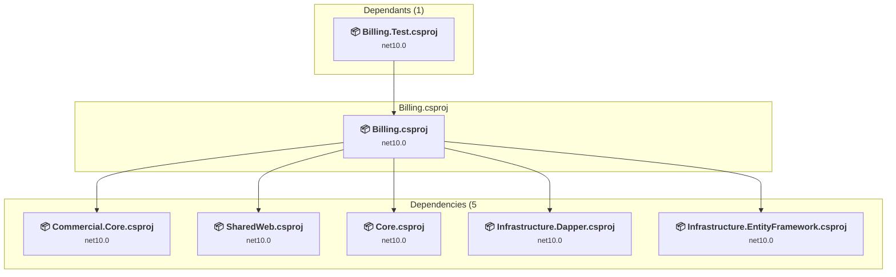

### API Compatibility

| Category | Count | Impact |
| :--- | :---: | :--- |
| 🔴 Binary Incompatible | 0 | High - Require code changes |
| 🟡 Source Incompatible | 0 | Medium - Needs re-compilation and potential conflicting API error fixing |
| 🔵 Behavioral change | 0 | Low - Behavioral changes that may require testing at runtime |
| ✅ Compatible | 0 |  |
| ***Total APIs Analyzed*** | ***0*** |  |

<a id="srccorecorecsproj"></a>
### src\Core\Core.csproj

#### Project Info

- **Current Target Framework:** net10.0✅
- **SDK-style**: True
- **Project Kind:** ClassLibrary
- **Dependencies**: 0
- **Dependants**: 52
- **Number of Files**: 1764
- **Lines of Code**: 89295
- **Estimated LOC to modify**: 0+ (at least 0.0% of the project)

#### Dependency Graph

Legend:
📦 SDK-style project
⚙️ Classic project

```mermaid
flowchart TB
    subgraph upstream["Dependants (52)"]
        P2["<b>📦&nbsp;MicroBenchmarks.csproj</b><br/><small>net10.0</small>"]
        P3["<b>📦&nbsp;Admin.csproj</b><br/><small>net10.0</small>"]
        P4["<b>📦&nbsp;Api.csproj</b><br/><small>net10.0</small>"]
        P5["<b>📦&nbsp;Billing.csproj</b><br/><small>net10.0</small>"]
        P7["<b>📦&nbsp;Events.csproj</b><br/><small>net10.0</small>"]
        P8["<b>📦&nbsp;EventsProcessor.csproj</b><br/><small>net10.0</small>"]
        P9["<b>📦&nbsp;Icons.csproj</b><br/><small>net10.0</small>"]
        P10["<b>📦&nbsp;Identity.csproj</b><br/><small>net10.0</small>"]
        P11["<b>📦&nbsp;Infrastructure.Dapper.csproj</b><br/><small>net10.0</small>"]
        P12["<b>📦&nbsp;Infrastructure.EntityFramework.csproj</b><br/><small>net10.0</small>"]
        P13["<b>📦&nbsp;Notifications.csproj</b><br/><small>net10.0</small>"]
        P14["<b>📦&nbsp;SharedWeb.csproj</b><br/><small>net10.0</small>"]
        P15["<b>📦&nbsp;Commercial.Core.csproj</b><br/><small>net10.0</small>"]
        P16["<b>📦&nbsp;Commercial.Infrastructure.EntityFramework.csproj</b><br/><small>net10.0</small>"]
        P17["<b>📦&nbsp;Scim.csproj</b><br/><small>net10.0</small>"]
        P18["<b>📦&nbsp;Sso.csproj</b><br/><small>net10.0</small>"]
        P19["<b>📦&nbsp;Commercial.Core.Test.csproj</b><br/><small>net10.0</small>"]
        P20["<b>📦&nbsp;Scim.IntegrationTest.csproj</b><br/><small>net10.0</small>"]
        P21["<b>📦&nbsp;Scim.Test.csproj</b><br/><small>net10.0</small>"]
        P22["<b>📦&nbsp;Sso.IntegrationTest.csproj</b><br/><small>net10.0</small>"]
        P23["<b>📦&nbsp;SSO.Test.csproj</b><br/><small>net10.0</small>"]
        P24["<b>📦&nbsp;Admin.Test.csproj</b><br/><small>net10.0</small>"]
        P25["<b>📦&nbsp;Api.IntegrationTest.csproj</b><br/><small>net10.0</small>"]
        P26["<b>📦&nbsp;Api.Test.csproj</b><br/><small>net10.0</small>"]
        P27["<b>📦&nbsp;Billing.Test.csproj</b><br/><small>net10.0</small>"]
        P28["<b>📦&nbsp;Common.csproj</b><br/><small>net10.0</small>"]
        P29["<b>📦&nbsp;Core.IntegrationTest.csproj</b><br/><small>net10.0</small>"]
        P30["<b>📦&nbsp;Core.Test.csproj</b><br/><small>net10.0</small>"]
        P31["<b>📦&nbsp;Events.IntegrationTest.csproj</b><br/><small>net10.0</small>"]
        P32["<b>📦&nbsp;Events.Test.csproj</b><br/><small>net10.0</small>"]
        P33["<b>📦&nbsp;EventsProcessor.Test.csproj</b><br/><small>net10.0</small>"]
        P34["<b>📦&nbsp;Icons.Test.csproj</b><br/><small>net10.0</small>"]
        P35["<b>📦&nbsp;Identity.IntegrationTest.csproj</b><br/><small>net10.0</small>"]
        P36["<b>📦&nbsp;Identity.Test.csproj</b><br/><small>net10.0</small>"]
        P37["<b>📦&nbsp;Infrastructure.Dapper.Test.csproj</b><br/><small>net10.0</small>"]
        P38["<b>📦&nbsp;Infrastructure.EFIntegration.Test.csproj</b><br/><small>net10.0</small>"]
        P39["<b>📦&nbsp;Infrastructure.IntegrationTest.csproj</b><br/><small>net10.0</small>"]
        P40["<b>📦&nbsp;IntegrationTestCommon.csproj</b><br/><small>net10.0</small>"]
        P41["<b>📦&nbsp;Notifications.Test.csproj</b><br/><small>net10.0</small>"]
        P42["<b>📦&nbsp;SeederApi.IntegrationTest.csproj</b><br/><small>net10.0</small>"]
        P44["<b>📦&nbsp;Setup.Test.csproj</b><br/><small>net10.0</small>"]
        P45["<b>📦&nbsp;SharedWeb.Test.csproj</b><br/><small>net10.0</small>"]
        P46["<b>📦&nbsp;Migrator.csproj</b><br/><small>net10.0</small>"]
        P47["<b>📦&nbsp;MsSqlMigratorUtility.csproj</b><br/><small>net10.0</small>"]
        P48["<b>📦&nbsp;MySqlMigrations.csproj</b><br/><small>net10.0</small>"]
        P49["<b>📦&nbsp;PostgresMigrations.csproj</b><br/><small>net10.0</small>"]
        P51["<b>📦&nbsp;Seeder.csproj</b><br/><small>net10.0</small>"]
        P52["<b>📦&nbsp;SeederApi.csproj</b><br/><small>net10.0</small>"]
        P53["<b>📦&nbsp;SeederUtility.csproj</b><br/><small>net10.0</small>"]
        P55["<b>📦&nbsp;Setup.csproj</b><br/><small>net10.0</small>"]
        P56["<b>📦&nbsp;SqliteMigrations.csproj</b><br/><small>net10.0</small>"]
        P57["<b>📦&nbsp;SqlServerEFScaffold.csproj</b><br/><small>net10.0</small>"]
        click P2 "#perfmicrobenchmarksmicrobenchmarkscsproj"
        click P3 "#srcadminadmincsproj"
        click P4 "#srcapiapicsproj"
        click P5 "#srcbillingbillingcsproj"
        click P7 "#srceventseventscsproj"
        click P8 "#srceventsprocessoreventsprocessorcsproj"
        click P9 "#srciconsiconscsproj"
        click P10 "#srcidentityidentitycsproj"
        click P11 "#srcinfrastructuredapperinfrastructuredappercsproj"
        click P12 "#srcinfrastructureentityframeworkinfrastructureentityframeworkcsproj"
        click P13 "#srcnotificationsnotificationscsproj"
        click P14 "#srcsharedwebsharedwebcsproj"
        click P15 "#bitwarden_licensesrccommercialcorecommercialcorecsproj"
        click P16 "#bitwarden_licensesrccommercialinfrastructureentityframeworkcommercialinfrastructureentityframeworkcsproj"
        click P17 "#bitwarden_licensesrcscimscimcsproj"
        click P18 "#bitwarden_licensesrcssossocsproj"
        click P19 "#bitwarden_licensetestcommercialcoretestcommercialcoretestcsproj"
        click P20 "#bitwarden_licensetestscimintegrationtestscimintegrationtestcsproj"
        click P21 "#bitwarden_licensetestscimtestscimtestcsproj"
        click P22 "#bitwarden_licensetestssointegrationtestssointegrationtestcsproj"
        click P23 "#bitwarden_licensetestssotestssotestcsproj"
        click P24 "#testadmintestadmintestcsproj"
        click P25 "#testapiintegrationtestapiintegrationtestcsproj"
        click P26 "#testapitestapitestcsproj"
        click P27 "#testbillingtestbillingtestcsproj"
        click P28 "#testcommoncommoncsproj"
        click P29 "#testcoreintegrationtestcoreintegrationtestcsproj"
        click P30 "#testcoretestcoretestcsproj"
        click P31 "#testeventsintegrationtesteventsintegrationtestcsproj"
        click P32 "#testeventstesteventstestcsproj"
        click P33 "#testeventsprocessortesteventsprocessortestcsproj"
        click P34 "#testiconstesticonstestcsproj"
        click P35 "#testidentityintegrationtestidentityintegrationtestcsproj"
        click P36 "#testidentitytestidentitytestcsproj"
        click P37 "#testinfrastructuredappertestinfrastructuredappertestcsproj"
        click P38 "#testinfrastructureefintegrationtestinfrastructureefintegrationtestcsproj"
        click P39 "#testinfrastructureintegrationtestinfrastructureintegrationtestcsproj"
        click P40 "#testintegrationtestcommonintegrationtestcommoncsproj"
        click P41 "#testnotificationstestnotificationstestcsproj"
        click P42 "#testseederapiintegrationtestseederapiintegrationtestcsproj"
        click P44 "#testsetuptestsetuptestcsproj"
        click P45 "#testsharedwebtestsharedwebtestcsproj"
        click P46 "#utilmigratormigratorcsproj"
        click P47 "#utilmssqlmigratorutilitymssqlmigratorutilitycsproj"
        click P48 "#utilmysqlmigrationsmysqlmigrationscsproj"
        click P49 "#utilpostgresmigrationspostgresmigrationscsproj"
        click P51 "#utilseederseedercsproj"
        click P52 "#utilseederapiseederapicsproj"
        click P53 "#utilseederutilityseederutilitycsproj"
        click P55 "#utilsetupsetupcsproj"
        click P56 "#utilsqlitemigrationssqlitemigrationscsproj"
        click P57 "#utilsqlserverefscaffoldsqlserverefscaffoldcsproj"
    end
    subgraph current["Core.csproj"]
        MAIN["<b>📦&nbsp;Core.csproj</b><br/><small>net10.0</small>"]
        click MAIN "#srccorecorecsproj"
    end
    P2 --> MAIN
    P3 --> MAIN
    P4 --> MAIN
    P5 --> MAIN
    P7 --> MAIN
    P8 --> MAIN
    P9 --> MAIN
    P10 --> MAIN
    P11 --> MAIN
    P12 --> MAIN
    P13 --> MAIN
    P14 --> MAIN
    P15 --> MAIN
    P16 --> MAIN
    P17 --> MAIN
    P18 --> MAIN
    P19 --> MAIN
    P20 --> MAIN
    P21 --> MAIN
    P22 --> MAIN
    P23 --> MAIN
    P24 --> MAIN
    P25 --> MAIN
    P26 --> MAIN
    P27 --> MAIN
    P28 --> MAIN
    P29 --> MAIN
    P30 --> MAIN
    P31 --> MAIN
    P32 --> MAIN
    P33 --> MAIN
    P34 --> MAIN
    P35 --> MAIN
    P36 --> MAIN
    P37 --> MAIN
    P38 --> MAIN
    P39 --> MAIN
    P40 --> MAIN
    P41 --> MAIN
    P42 --> MAIN
    P44 --> MAIN
    P45 --> MAIN
    P46 --> MAIN
    P47 --> MAIN
    P48 --> MAIN
    P49 --> MAIN
    P51 --> MAIN
    P52 --> MAIN
    P53 --> MAIN
    P55 --> MAIN
    P56 --> MAIN
    P57 --> MAIN

```

### API Compatibility

| Category | Count | Impact |
| :--- | :---: | :--- |
| 🔴 Binary Incompatible | 0 | High - Require code changes |
| 🟡 Source Incompatible | 0 | Medium - Needs re-compilation and potential conflicting API error fixing |
| 🔵 Behavioral change | 0 | Low - Behavioral changes that may require testing at runtime |
| ✅ Compatible | 0 |  |
| ***Total APIs Analyzed*** | ***0*** |  |

<a id="srceventseventscsproj"></a>
### src\Events\Events.csproj

#### Project Info

- **Current Target Framework:** net10.0✅
- **SDK-style**: True
- **Project Kind:** AspNetCore
- **Dependencies**: 4
- **Dependants**: 2
- **Number of Files**: 12
- **Lines of Code**: 665
- **Estimated LOC to modify**: 0+ (at least 0.0% of the project)

#### Dependency Graph

Legend:
📦 SDK-style project
⚙️ Classic project

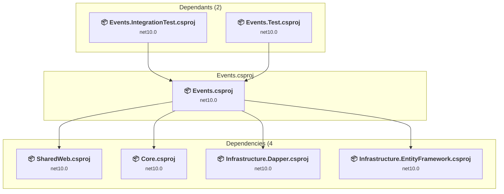

### API Compatibility

| Category | Count | Impact |
| :--- | :---: | :--- |
| 🔴 Binary Incompatible | 0 | High - Require code changes |
| 🟡 Source Incompatible | 0 | Medium - Needs re-compilation and potential conflicting API error fixing |
| 🔵 Behavioral change | 0 | Low - Behavioral changes that may require testing at runtime |
| ✅ Compatible | 0 |  |
| ***Total APIs Analyzed*** | ***0*** |  |

<a id="srceventsprocessoreventsprocessorcsproj"></a>
### src\EventsProcessor\EventsProcessor.csproj

#### Project Info

- **Current Target Framework:** net10.0✅
- **SDK-style**: True
- **Project Kind:** AspNetCore
- **Dependencies**: 4
- **Dependants**: 1
- **Number of Files**: 9
- **Lines of Code**: 510
- **Estimated LOC to modify**: 0+ (at least 0.0% of the project)

#### Dependency Graph

Legend:
📦 SDK-style project
⚙️ Classic project

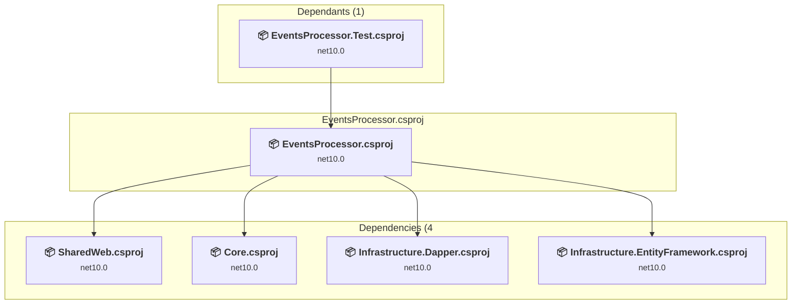

### API Compatibility

| Category | Count | Impact |
| :--- | :---: | :--- |
| 🔴 Binary Incompatible | 0 | High - Require code changes |
| 🟡 Source Incompatible | 0 | Medium - Needs re-compilation and potential conflicting API error fixing |
| 🔵 Behavioral change | 0 | Low - Behavioral changes that may require testing at runtime |
| ✅ Compatible | 0 |  |
| ***Total APIs Analyzed*** | ***0*** |  |

<a id="srciconsiconscsproj"></a>
### src\Icons\Icons.csproj

#### Project Info

- **Current Target Framework:** net10.0✅
- **SDK-style**: True
- **Project Kind:** AspNetCore
- **Dependencies**: 4
- **Dependants**: 1
- **Number of Files**: 35
- **Lines of Code**: 2118
- **Estimated LOC to modify**: 0+ (at least 0.0% of the project)

#### Dependency Graph

Legend:
📦 SDK-style project
⚙️ Classic project

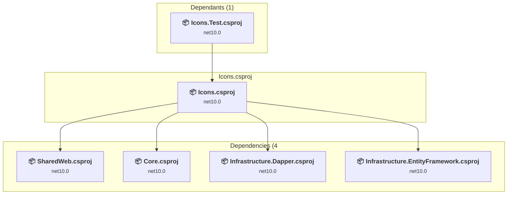

### API Compatibility

| Category | Count | Impact |
| :--- | :---: | :--- |
| 🔴 Binary Incompatible | 0 | High - Require code changes |
| 🟡 Source Incompatible | 0 | Medium - Needs re-compilation and potential conflicting API error fixing |
| 🔵 Behavioral change | 0 | Low - Behavioral changes that may require testing at runtime |
| ✅ Compatible | 0 |  |
| ***Total APIs Analyzed*** | ***0*** |  |

<a id="srcidentityidentitycsproj"></a>
### src\Identity\Identity.csproj

#### Project Info

- **Current Target Framework:** net10.0✅
- **SDK-style**: True
- **Project Kind:** AspNetCore
- **Dependencies**: 4
- **Dependants**: 9
- **Number of Files**: 59
- **Lines of Code**: 5348
- **Estimated LOC to modify**: 0+ (at least 0.0% of the project)

#### Dependency Graph

Legend:
📦 SDK-style project
⚙️ Classic project

```mermaid
flowchart TB
    subgraph upstream["Dependants (9)"]
        P2["<b>📦&nbsp;MicroBenchmarks.csproj</b><br/><small>net10.0</small>"]
        P20["<b>📦&nbsp;Scim.IntegrationTest.csproj</b><br/><small>net10.0</small>"]
        P22["<b>📦&nbsp;Sso.IntegrationTest.csproj</b><br/><small>net10.0</small>"]
        P25["<b>📦&nbsp;Api.IntegrationTest.csproj</b><br/><small>net10.0</small>"]
        P31["<b>📦&nbsp;Events.IntegrationTest.csproj</b><br/><small>net10.0</small>"]
        P35["<b>📦&nbsp;Identity.IntegrationTest.csproj</b><br/><small>net10.0</small>"]
        P36["<b>📦&nbsp;Identity.Test.csproj</b><br/><small>net10.0</small>"]
        P40["<b>📦&nbsp;IntegrationTestCommon.csproj</b><br/><small>net10.0</small>"]
        P42["<b>📦&nbsp;SeederApi.IntegrationTest.csproj</b><br/><small>net10.0</small>"]
        click P2 "#perfmicrobenchmarksmicrobenchmarkscsproj"
        click P20 "#bitwarden_licensetestscimintegrationtestscimintegrationtestcsproj"
        click P22 "#bitwarden_licensetestssointegrationtestssointegrationtestcsproj"
        click P25 "#testapiintegrationtestapiintegrationtestcsproj"
        click P31 "#testeventsintegrationtesteventsintegrationtestcsproj"
        click P35 "#testidentityintegrationtestidentityintegrationtestcsproj"
        click P36 "#testidentitytestidentitytestcsproj"
        click P40 "#testintegrationtestcommonintegrationtestcommoncsproj"
        click P42 "#testseederapiintegrationtestseederapiintegrationtestcsproj"
    end
    subgraph current["Identity.csproj"]
        MAIN["<b>📦&nbsp;Identity.csproj</b><br/><small>net10.0</small>"]
        click MAIN "#srcidentityidentitycsproj"
    end
    subgraph downstream["Dependencies (4"]
        P14["<b>📦&nbsp;SharedWeb.csproj</b><br/><small>net10.0</small>"]
        P6["<b>📦&nbsp;Core.csproj</b><br/><small>net10.0</small>"]
        P11["<b>📦&nbsp;Infrastructure.Dapper.csproj</b><br/><small>net10.0</small>"]
        P12["<b>📦&nbsp;Infrastructure.EntityFramework.csproj</b><br/><small>net10.0</small>"]
        click P14 "#srcsharedwebsharedwebcsproj"
        click P6 "#srccorecorecsproj"
        click P11 "#srcinfrastructuredapperinfrastructuredappercsproj"
        click P12 "#srcinfrastructureentityframeworkinfrastructureentityframeworkcsproj"
    end
    P2 --> MAIN
    P20 --> MAIN
    P22 --> MAIN
    P25 --> MAIN
    P31 --> MAIN
    P35 --> MAIN
    P36 --> MAIN
    P40 --> MAIN
    P42 --> MAIN
    MAIN --> P14
    MAIN --> P6
    MAIN --> P11
    MAIN --> P12

```

### API Compatibility

| Category | Count | Impact |
| :--- | :---: | :--- |
| 🔴 Binary Incompatible | 0 | High - Require code changes |
| 🟡 Source Incompatible | 0 | Medium - Needs re-compilation and potential conflicting API error fixing |
| 🔵 Behavioral change | 0 | Low - Behavioral changes that may require testing at runtime |
| ✅ Compatible | 0 |  |
| ***Total APIs Analyzed*** | ***0*** |  |

<a id="srcinfrastructuredapperinfrastructuredappercsproj"></a>
### src\Infrastructure.Dapper\Infrastructure.Dapper.csproj

#### Project Info

- **Current Target Framework:** net10.0✅
- **SDK-style**: True
- **Project Kind:** ClassLibrary
- **Dependencies**: 1
- **Dependants**: 37
- **Number of Files**: 61
- **Lines of Code**: 8573
- **Estimated LOC to modify**: 0+ (at least 0.0% of the project)

#### Dependency Graph

Legend:
📦 SDK-style project
⚙️ Classic project

```mermaid
flowchart TB
    subgraph upstream["Dependants (37)"]
        P2["<b>📦&nbsp;MicroBenchmarks.csproj</b><br/><small>net10.0</small>"]
        P3["<b>📦&nbsp;Admin.csproj</b><br/><small>net10.0</small>"]
        P4["<b>📦&nbsp;Api.csproj</b><br/><small>net10.0</small>"]
        P5["<b>📦&nbsp;Billing.csproj</b><br/><small>net10.0</small>"]
        P7["<b>📦&nbsp;Events.csproj</b><br/><small>net10.0</small>"]
        P8["<b>📦&nbsp;EventsProcessor.csproj</b><br/><small>net10.0</small>"]
        P9["<b>📦&nbsp;Icons.csproj</b><br/><small>net10.0</small>"]
        P10["<b>📦&nbsp;Identity.csproj</b><br/><small>net10.0</small>"]
        P13["<b>📦&nbsp;Notifications.csproj</b><br/><small>net10.0</small>"]
        P14["<b>📦&nbsp;SharedWeb.csproj</b><br/><small>net10.0</small>"]
        P17["<b>📦&nbsp;Scim.csproj</b><br/><small>net10.0</small>"]
        P18["<b>📦&nbsp;Sso.csproj</b><br/><small>net10.0</small>"]
        P20["<b>📦&nbsp;Scim.IntegrationTest.csproj</b><br/><small>net10.0</small>"]
        P21["<b>📦&nbsp;Scim.Test.csproj</b><br/><small>net10.0</small>"]
        P22["<b>📦&nbsp;Sso.IntegrationTest.csproj</b><br/><small>net10.0</small>"]
        P23["<b>📦&nbsp;SSO.Test.csproj</b><br/><small>net10.0</small>"]
        P24["<b>📦&nbsp;Admin.Test.csproj</b><br/><small>net10.0</small>"]
        P25["<b>📦&nbsp;Api.IntegrationTest.csproj</b><br/><small>net10.0</small>"]
        P26["<b>📦&nbsp;Api.Test.csproj</b><br/><small>net10.0</small>"]
        P27["<b>📦&nbsp;Billing.Test.csproj</b><br/><small>net10.0</small>"]
        P31["<b>📦&nbsp;Events.IntegrationTest.csproj</b><br/><small>net10.0</small>"]
        P32["<b>📦&nbsp;Events.Test.csproj</b><br/><small>net10.0</small>"]
        P33["<b>📦&nbsp;EventsProcessor.Test.csproj</b><br/><small>net10.0</small>"]
        P34["<b>📦&nbsp;Icons.Test.csproj</b><br/><small>net10.0</small>"]
        P35["<b>📦&nbsp;Identity.IntegrationTest.csproj</b><br/><small>net10.0</small>"]
        P36["<b>📦&nbsp;Identity.Test.csproj</b><br/><small>net10.0</small>"]
        P37["<b>📦&nbsp;Infrastructure.Dapper.Test.csproj</b><br/><small>net10.0</small>"]
        P38["<b>📦&nbsp;Infrastructure.EFIntegration.Test.csproj</b><br/><small>net10.0</small>"]
        P39["<b>📦&nbsp;Infrastructure.IntegrationTest.csproj</b><br/><small>net10.0</small>"]
        P40["<b>📦&nbsp;IntegrationTestCommon.csproj</b><br/><small>net10.0</small>"]
        P41["<b>📦&nbsp;Notifications.Test.csproj</b><br/><small>net10.0</small>"]
        P42["<b>📦&nbsp;SeederApi.IntegrationTest.csproj</b><br/><small>net10.0</small>"]
        P45["<b>📦&nbsp;SharedWeb.Test.csproj</b><br/><small>net10.0</small>"]
        P51["<b>📦&nbsp;Seeder.csproj</b><br/><small>net10.0</small>"]
        P52["<b>📦&nbsp;SeederApi.csproj</b><br/><small>net10.0</small>"]
        P53["<b>📦&nbsp;SeederUtility.csproj</b><br/><small>net10.0</small>"]
        P57["<b>📦&nbsp;SqlServerEFScaffold.csproj</b><br/><small>net10.0</small>"]
        click P2 "#perfmicrobenchmarksmicrobenchmarkscsproj"
        click P3 "#srcadminadmincsproj"
        click P4 "#srcapiapicsproj"
        click P5 "#srcbillingbillingcsproj"
        click P7 "#srceventseventscsproj"
        click P8 "#srceventsprocessoreventsprocessorcsproj"
        click P9 "#srciconsiconscsproj"
        click P10 "#srcidentityidentitycsproj"
        click P13 "#srcnotificationsnotificationscsproj"
        click P14 "#srcsharedwebsharedwebcsproj"
        click P17 "#bitwarden_licensesrcscimscimcsproj"
        click P18 "#bitwarden_licensesrcssossocsproj"
        click P20 "#bitwarden_licensetestscimintegrationtestscimintegrationtestcsproj"
        click P21 "#bitwarden_licensetestscimtestscimtestcsproj"
        click P22 "#bitwarden_licensetestssointegrationtestssointegrationtestcsproj"
        click P23 "#bitwarden_licensetestssotestssotestcsproj"
        click P24 "#testadmintestadmintestcsproj"
        click P25 "#testapiintegrationtestapiintegrationtestcsproj"
        click P26 "#testapitestapitestcsproj"
        click P27 "#testbillingtestbillingtestcsproj"
        click P31 "#testeventsintegrationtesteventsintegrationtestcsproj"
        click P32 "#testeventstesteventstestcsproj"
        click P33 "#testeventsprocessortesteventsprocessortestcsproj"
        click P34 "#testiconstesticonstestcsproj"
        click P35 "#testidentityintegrationtestidentityintegrationtestcsproj"
        click P36 "#testidentitytestidentitytestcsproj"
        click P37 "#testinfrastructuredappertestinfrastructuredappertestcsproj"
        click P38 "#testinfrastructureefintegrationtestinfrastructureefintegrationtestcsproj"
        click P39 "#testinfrastructureintegrationtestinfrastructureintegrationtestcsproj"
        click P40 "#testintegrationtestcommonintegrationtestcommoncsproj"
        click P41 "#testnotificationstestnotificationstestcsproj"
        click P42 "#testseederapiintegrationtestseederapiintegrationtestcsproj"
        click P45 "#testsharedwebtestsharedwebtestcsproj"
        click P51 "#utilseederseedercsproj"
        click P52 "#utilseederapiseederapicsproj"
        click P53 "#utilseederutilityseederutilitycsproj"
        click P57 "#utilsqlserverefscaffoldsqlserverefscaffoldcsproj"
    end
    subgraph current["Infrastructure.Dapper.csproj"]
        MAIN["<b>📦&nbsp;Infrastructure.Dapper.csproj</b><br/><small>net10.0</small>"]
        click MAIN "#srcinfrastructuredapperinfrastructuredappercsproj"
    end
    subgraph downstream["Dependencies (1"]
        P6["<b>📦&nbsp;Core.csproj</b><br/><small>net10.0</small>"]
        click P6 "#srccorecorecsproj"
    end
    P2 --> MAIN
    P3 --> MAIN
    P4 --> MAIN
    P5 --> MAIN
    P7 --> MAIN
    P8 --> MAIN
    P9 --> MAIN
    P10 --> MAIN
    P13 --> MAIN
    P14 --> MAIN
    P17 --> MAIN
    P18 --> MAIN
    P20 --> MAIN
    P21 --> MAIN
    P22 --> MAIN
    P23 --> MAIN
    P24 --> MAIN
    P25 --> MAIN
    P26 --> MAIN
    P27 --> MAIN
    P31 --> MAIN
    P32 --> MAIN
    P33 --> MAIN
    P34 --> MAIN
    P35 --> MAIN
    P36 --> MAIN
    P37 --> MAIN
    P38 --> MAIN
    P39 --> MAIN
    P40 --> MAIN
    P41 --> MAIN
    P42 --> MAIN
    P45 --> MAIN
    P51 --> MAIN
    P52 --> MAIN
    P53 --> MAIN
    P57 --> MAIN
    MAIN --> P6

```

### API Compatibility

| Category | Count | Impact |
| :--- | :---: | :--- |
| 🔴 Binary Incompatible | 0 | High - Require code changes |
| 🟡 Source Incompatible | 0 | Medium - Needs re-compilation and potential conflicting API error fixing |
| 🔵 Behavioral change | 0 | Low - Behavioral changes that may require testing at runtime |
| ✅ Compatible | 0 |  |
| ***Total APIs Analyzed*** | ***0*** |  |

<a id="srcinfrastructureentityframeworkinfrastructureentityframeworkcsproj"></a>
### src\Infrastructure.EntityFramework\Infrastructure.EntityFramework.csproj

#### Project Info

- **Current Target Framework:** net10.0✅
- **SDK-style**: True
- **Project Kind:** ClassLibrary
- **Dependencies**: 1
- **Dependants**: 40
- **Number of Files**: 207
- **Lines of Code**: 15153
- **Estimated LOC to modify**: 0+ (at least 0.0% of the project)

#### Dependency Graph

Legend:
📦 SDK-style project
⚙️ Classic project

```mermaid
flowchart TB
    subgraph upstream["Dependants (40)"]
        P2["<b>📦&nbsp;MicroBenchmarks.csproj</b><br/><small>net10.0</small>"]
        P3["<b>📦&nbsp;Admin.csproj</b><br/><small>net10.0</small>"]
        P4["<b>📦&nbsp;Api.csproj</b><br/><small>net10.0</small>"]
        P5["<b>📦&nbsp;Billing.csproj</b><br/><small>net10.0</small>"]
        P7["<b>📦&nbsp;Events.csproj</b><br/><small>net10.0</small>"]
        P8["<b>📦&nbsp;EventsProcessor.csproj</b><br/><small>net10.0</small>"]
        P9["<b>📦&nbsp;Icons.csproj</b><br/><small>net10.0</small>"]
        P10["<b>📦&nbsp;Identity.csproj</b><br/><small>net10.0</small>"]
        P13["<b>📦&nbsp;Notifications.csproj</b><br/><small>net10.0</small>"]
        P14["<b>📦&nbsp;SharedWeb.csproj</b><br/><small>net10.0</small>"]
        P16["<b>📦&nbsp;Commercial.Infrastructure.EntityFramework.csproj</b><br/><small>net10.0</small>"]
        P17["<b>📦&nbsp;Scim.csproj</b><br/><small>net10.0</small>"]
        P18["<b>📦&nbsp;Sso.csproj</b><br/><small>net10.0</small>"]
        P20["<b>📦&nbsp;Scim.IntegrationTest.csproj</b><br/><small>net10.0</small>"]
        P21["<b>📦&nbsp;Scim.Test.csproj</b><br/><small>net10.0</small>"]
        P22["<b>📦&nbsp;Sso.IntegrationTest.csproj</b><br/><small>net10.0</small>"]
        P23["<b>📦&nbsp;SSO.Test.csproj</b><br/><small>net10.0</small>"]
        P24["<b>📦&nbsp;Admin.Test.csproj</b><br/><small>net10.0</small>"]
        P25["<b>📦&nbsp;Api.IntegrationTest.csproj</b><br/><small>net10.0</small>"]
        P26["<b>📦&nbsp;Api.Test.csproj</b><br/><small>net10.0</small>"]
        P27["<b>📦&nbsp;Billing.Test.csproj</b><br/><small>net10.0</small>"]
        P31["<b>📦&nbsp;Events.IntegrationTest.csproj</b><br/><small>net10.0</small>"]
        P32["<b>📦&nbsp;Events.Test.csproj</b><br/><small>net10.0</small>"]
        P33["<b>📦&nbsp;EventsProcessor.Test.csproj</b><br/><small>net10.0</small>"]
        P34["<b>📦&nbsp;Icons.Test.csproj</b><br/><small>net10.0</small>"]
        P35["<b>📦&nbsp;Identity.IntegrationTest.csproj</b><br/><small>net10.0</small>"]
        P36["<b>📦&nbsp;Identity.Test.csproj</b><br/><small>net10.0</small>"]
        P38["<b>📦&nbsp;Infrastructure.EFIntegration.Test.csproj</b><br/><small>net10.0</small>"]
        P39["<b>📦&nbsp;Infrastructure.IntegrationTest.csproj</b><br/><small>net10.0</small>"]
        P40["<b>📦&nbsp;IntegrationTestCommon.csproj</b><br/><small>net10.0</small>"]
        P41["<b>📦&nbsp;Notifications.Test.csproj</b><br/><small>net10.0</small>"]
        P42["<b>📦&nbsp;SeederApi.IntegrationTest.csproj</b><br/><small>net10.0</small>"]
        P45["<b>📦&nbsp;SharedWeb.Test.csproj</b><br/><small>net10.0</small>"]
        P48["<b>📦&nbsp;MySqlMigrations.csproj</b><br/><small>net10.0</small>"]
        P49["<b>📦&nbsp;PostgresMigrations.csproj</b><br/><small>net10.0</small>"]
        P51["<b>📦&nbsp;Seeder.csproj</b><br/><small>net10.0</small>"]
        P52["<b>📦&nbsp;SeederApi.csproj</b><br/><small>net10.0</small>"]
        P53["<b>📦&nbsp;SeederUtility.csproj</b><br/><small>net10.0</small>"]
        P56["<b>📦&nbsp;SqliteMigrations.csproj</b><br/><small>net10.0</small>"]
        P57["<b>📦&nbsp;SqlServerEFScaffold.csproj</b><br/><small>net10.0</small>"]
        click P2 "#perfmicrobenchmarksmicrobenchmarkscsproj"
        click P3 "#srcadminadmincsproj"
        click P4 "#srcapiapicsproj"
        click P5 "#srcbillingbillingcsproj"
        click P7 "#srceventseventscsproj"
        click P8 "#srceventsprocessoreventsprocessorcsproj"
        click P9 "#srciconsiconscsproj"
        click P10 "#srcidentityidentitycsproj"
        click P13 "#srcnotificationsnotificationscsproj"
        click P14 "#srcsharedwebsharedwebcsproj"
        click P16 "#bitwarden_licensesrccommercialinfrastructureentityframeworkcommercialinfrastructureentityframeworkcsproj"
        click P17 "#bitwarden_licensesrcscimscimcsproj"
        click P18 "#bitwarden_licensesrcssossocsproj"
        click P20 "#bitwarden_licensetestscimintegrationtestscimintegrationtestcsproj"
        click P21 "#bitwarden_licensetestscimtestscimtestcsproj"
        click P22 "#bitwarden_licensetestssointegrationtestssointegrationtestcsproj"
        click P23 "#bitwarden_licensetestssotestssotestcsproj"
        click P24 "#testadmintestadmintestcsproj"
        click P25 "#testapiintegrationtestapiintegrationtestcsproj"
        click P26 "#testapitestapitestcsproj"
        click P27 "#testbillingtestbillingtestcsproj"
        click P31 "#testeventsintegrationtesteventsintegrationtestcsproj"
        click P32 "#testeventstesteventstestcsproj"
        click P33 "#testeventsprocessortesteventsprocessortestcsproj"
        click P34 "#testiconstesticonstestcsproj"
        click P35 "#testidentityintegrationtestidentityintegrationtestcsproj"
        click P36 "#testidentitytestidentitytestcsproj"
        click P38 "#testinfrastructureefintegrationtestinfrastructureefintegrationtestcsproj"
        click P39 "#testinfrastructureintegrationtestinfrastructureintegrationtestcsproj"
        click P40 "#testintegrationtestcommonintegrationtestcommoncsproj"
        click P41 "#testnotificationstestnotificationstestcsproj"
        click P42 "#testseederapiintegrationtestseederapiintegrationtestcsproj"
        click P45 "#testsharedwebtestsharedwebtestcsproj"
        click P48 "#utilmysqlmigrationsmysqlmigrationscsproj"
        click P49 "#utilpostgresmigrationspostgresmigrationscsproj"
        click P51 "#utilseederseedercsproj"
        click P52 "#utilseederapiseederapicsproj"
        click P53 "#utilseederutilityseederutilitycsproj"
        click P56 "#utilsqlitemigrationssqlitemigrationscsproj"
        click P57 "#utilsqlserverefscaffoldsqlserverefscaffoldcsproj"
    end
    subgraph current["Infrastructure.EntityFramework.csproj"]
        MAIN["<b>📦&nbsp;Infrastructure.EntityFramework.csproj</b><br/><small>net10.0</small>"]
        click MAIN "#srcinfrastructureentityframeworkinfrastructureentityframeworkcsproj"
    end
    subgraph downstream["Dependencies (1"]
        P6["<b>📦&nbsp;Core.csproj</b><br/><small>net10.0</small>"]
        click P6 "#srccorecorecsproj"
    end
    P2 --> MAIN
    P3 --> MAIN
    P4 --> MAIN
    P5 --> MAIN
    P7 --> MAIN
    P8 --> MAIN
    P9 --> MAIN
    P10 --> MAIN
    P13 --> MAIN
    P14 --> MAIN
    P16 --> MAIN
    P17 --> MAIN
    P18 --> MAIN
    P20 --> MAIN
    P21 --> MAIN
    P22 --> MAIN
    P23 --> MAIN
    P24 --> MAIN
    P25 --> MAIN
    P26 --> MAIN
    P27 --> MAIN
    P31 --> MAIN
    P32 --> MAIN
    P33 --> MAIN
    P34 --> MAIN
    P35 --> MAIN
    P36 --> MAIN
    P38 --> MAIN
    P39 --> MAIN
    P40 --> MAIN
    P41 --> MAIN
    P42 --> MAIN
    P45 --> MAIN
    P48 --> MAIN
    P49 --> MAIN
    P51 --> MAIN
    P52 --> MAIN
    P53 --> MAIN
    P56 --> MAIN
    P57 --> MAIN
    MAIN --> P6

```

### API Compatibility

| Category | Count | Impact |
| :--- | :---: | :--- |
| 🔴 Binary Incompatible | 0 | High - Require code changes |
| 🟡 Source Incompatible | 0 | Medium - Needs re-compilation and potential conflicting API error fixing |
| 🔵 Behavioral change | 0 | Low - Behavioral changes that may require testing at runtime |
| ✅ Compatible | 0 |  |
| ***Total APIs Analyzed*** | ***0*** |  |

<a id="srcnotificationsnotificationscsproj"></a>
### src\Notifications\Notifications.csproj

#### Project Info

- **Current Target Framework:** net10.0✅
- **SDK-style**: True
- **Project Kind:** AspNetCore
- **Dependencies**: 4
- **Dependants**: 1
- **Number of Files**: 21
- **Lines of Code**: 1170
- **Estimated LOC to modify**: 0+ (at least 0.0% of the project)

#### Dependency Graph

Legend:
📦 SDK-style project
⚙️ Classic project

```mermaid
flowchart TB
    subgraph upstream["Dependants (1)"]
        P41["<b>📦&nbsp;Notifications.Test.csproj</b><br/><small>net10.0</small>"]
        click P41 "#testnotificationstestnotificationstestcsproj"
    end
    subgraph current["Notifications.csproj"]
        MAIN["<b>📦&nbsp;Notifications.csproj</b><br/><small>net10.0</small>"]
        click MAIN "#srcnotificationsnotificationscsproj"
    end
    subgraph downstream["Dependencies (4"]
        P6["<b>📦&nbsp;Core.csproj</b><br/><small>net10.0</small>"]
        P14["<b>📦&nbsp;SharedWeb.csproj</b><br/><small>net10.0</small>"]
        P11["<b>📦&nbsp;Infrastructure.Dapper.csproj</b><br/><small>net10.0</small>"]
        P12["<b>📦&nbsp;Infrastructure.EntityFramework.csproj</b><br/><small>net10.0</small>"]
        click P6 "#srccorecorecsproj"
        click P14 "#srcsharedwebsharedwebcsproj"
        click P11 "#srcinfrastructuredapperinfrastructuredappercsproj"
        click P12 "#srcinfrastructureentityframeworkinfrastructureentityframeworkcsproj"
    end
    P41 --> MAIN
    MAIN --> P6
    MAIN --> P14
    MAIN --> P11
    MAIN --> P12

```

### API Compatibility

| Category | Count | Impact |
| :--- | :---: | :--- |
| 🔴 Binary Incompatible | 0 | High - Require code changes |
| 🟡 Source Incompatible | 0 | Medium - Needs re-compilation and potential conflicting API error fixing |
| 🔵 Behavioral change | 0 | Low - Behavioral changes that may require testing at runtime |
| ✅ Compatible | 0 |  |
| ***Total APIs Analyzed*** | ***0*** |  |

<a id="srcsharedwebsharedwebcsproj"></a>
### src\SharedWeb\SharedWeb.csproj

#### Project Info

- **Current Target Framework:** net10.0✅
- **SDK-style**: True
- **Project Kind:** ClassLibrary
- **Dependencies**: 3
- **Dependants**: 33
- **Number of Files**: 22
- **Lines of Code**: 1958
- **Estimated LOC to modify**: 0+ (at least 0.0% of the project)

#### Dependency Graph

Legend:
📦 SDK-style project
⚙️ Classic project

```mermaid
flowchart TB
    subgraph upstream["Dependants (33)"]
        P2["<b>📦&nbsp;MicroBenchmarks.csproj</b><br/><small>net10.0</small>"]
        P3["<b>📦&nbsp;Admin.csproj</b><br/><small>net10.0</small>"]
        P4["<b>📦&nbsp;Api.csproj</b><br/><small>net10.0</small>"]
        P5["<b>📦&nbsp;Billing.csproj</b><br/><small>net10.0</small>"]
        P7["<b>📦&nbsp;Events.csproj</b><br/><small>net10.0</small>"]
        P8["<b>📦&nbsp;EventsProcessor.csproj</b><br/><small>net10.0</small>"]
        P9["<b>📦&nbsp;Icons.csproj</b><br/><small>net10.0</small>"]
        P10["<b>📦&nbsp;Identity.csproj</b><br/><small>net10.0</small>"]
        P13["<b>📦&nbsp;Notifications.csproj</b><br/><small>net10.0</small>"]
        P17["<b>📦&nbsp;Scim.csproj</b><br/><small>net10.0</small>"]
        P18["<b>📦&nbsp;Sso.csproj</b><br/><small>net10.0</small>"]
        P20["<b>📦&nbsp;Scim.IntegrationTest.csproj</b><br/><small>net10.0</small>"]
        P21["<b>📦&nbsp;Scim.Test.csproj</b><br/><small>net10.0</small>"]
        P22["<b>📦&nbsp;Sso.IntegrationTest.csproj</b><br/><small>net10.0</small>"]
        P23["<b>📦&nbsp;SSO.Test.csproj</b><br/><small>net10.0</small>"]
        P24["<b>📦&nbsp;Admin.Test.csproj</b><br/><small>net10.0</small>"]
        P25["<b>📦&nbsp;Api.IntegrationTest.csproj</b><br/><small>net10.0</small>"]
        P26["<b>📦&nbsp;Api.Test.csproj</b><br/><small>net10.0</small>"]
        P27["<b>📦&nbsp;Billing.Test.csproj</b><br/><small>net10.0</small>"]
        P31["<b>📦&nbsp;Events.IntegrationTest.csproj</b><br/><small>net10.0</small>"]
        P32["<b>📦&nbsp;Events.Test.csproj</b><br/><small>net10.0</small>"]
        P33["<b>📦&nbsp;EventsProcessor.Test.csproj</b><br/><small>net10.0</small>"]
        P34["<b>📦&nbsp;Icons.Test.csproj</b><br/><small>net10.0</small>"]
        P35["<b>📦&nbsp;Identity.IntegrationTest.csproj</b><br/><small>net10.0</small>"]
        P36["<b>📦&nbsp;Identity.Test.csproj</b><br/><small>net10.0</small>"]
        P40["<b>📦&nbsp;IntegrationTestCommon.csproj</b><br/><small>net10.0</small>"]
        P41["<b>📦&nbsp;Notifications.Test.csproj</b><br/><small>net10.0</small>"]
        P42["<b>📦&nbsp;SeederApi.IntegrationTest.csproj</b><br/><small>net10.0</small>"]
        P45["<b>📦&nbsp;SharedWeb.Test.csproj</b><br/><small>net10.0</small>"]
        P51["<b>📦&nbsp;Seeder.csproj</b><br/><small>net10.0</small>"]
        P52["<b>📦&nbsp;SeederApi.csproj</b><br/><small>net10.0</small>"]
        P53["<b>📦&nbsp;SeederUtility.csproj</b><br/><small>net10.0</small>"]
        P57["<b>📦&nbsp;SqlServerEFScaffold.csproj</b><br/><small>net10.0</small>"]
        click P2 "#perfmicrobenchmarksmicrobenchmarkscsproj"
        click P3 "#srcadminadmincsproj"
        click P4 "#srcapiapicsproj"
        click P5 "#srcbillingbillingcsproj"
        click P7 "#srceventseventscsproj"
        click P8 "#srceventsprocessoreventsprocessorcsproj"
        click P9 "#srciconsiconscsproj"
        click P10 "#srcidentityidentitycsproj"
        click P13 "#srcnotificationsnotificationscsproj"
        click P17 "#bitwarden_licensesrcscimscimcsproj"
        click P18 "#bitwarden_licensesrcssossocsproj"
        click P20 "#bitwarden_licensetestscimintegrationtestscimintegrationtestcsproj"
        click P21 "#bitwarden_licensetestscimtestscimtestcsproj"
        click P22 "#bitwarden_licensetestssointegrationtestssointegrationtestcsproj"
        click P23 "#bitwarden_licensetestssotestssotestcsproj"
        click P24 "#testadmintestadmintestcsproj"
        click P25 "#testapiintegrationtestapiintegrationtestcsproj"
        click P26 "#testapitestapitestcsproj"
        click P27 "#testbillingtestbillingtestcsproj"
        click P31 "#testeventsintegrationtesteventsintegrationtestcsproj"
        click P32 "#testeventstesteventstestcsproj"
        click P33 "#testeventsprocessortesteventsprocessortestcsproj"
        click P34 "#testiconstesticonstestcsproj"
        click P35 "#testidentityintegrationtestidentityintegrationtestcsproj"
        click P36 "#testidentitytestidentitytestcsproj"
        click P40 "#testintegrationtestcommonintegrationtestcommoncsproj"
        click P41 "#testnotificationstestnotificationstestcsproj"
        click P42 "#testseederapiintegrationtestseederapiintegrationtestcsproj"
        click P45 "#testsharedwebtestsharedwebtestcsproj"
        click P51 "#utilseederseedercsproj"
        click P52 "#utilseederapiseederapicsproj"
        click P53 "#utilseederutilityseederutilitycsproj"
        click P57 "#utilsqlserverefscaffoldsqlserverefscaffoldcsproj"
    end
    subgraph current["SharedWeb.csproj"]
        MAIN["<b>📦&nbsp;SharedWeb.csproj</b><br/><small>net10.0</small>"]
        click MAIN "#srcsharedwebsharedwebcsproj"
    end
    subgraph downstream["Dependencies (3"]
        P11["<b>📦&nbsp;Infrastructure.Dapper.csproj</b><br/><small>net10.0</small>"]
        P6["<b>📦&nbsp;Core.csproj</b><br/><small>net10.0</small>"]
        P12["<b>📦&nbsp;Infrastructure.EntityFramework.csproj</b><br/><small>net10.0</small>"]
        click P11 "#srcinfrastructuredapperinfrastructuredappercsproj"
        click P6 "#srccorecorecsproj"
        click P12 "#srcinfrastructureentityframeworkinfrastructureentityframeworkcsproj"
    end
    P2 --> MAIN
    P3 --> MAIN
    P4 --> MAIN
    P5 --> MAIN
    P7 --> MAIN
    P8 --> MAIN
    P9 --> MAIN
    P10 --> MAIN
    P13 --> MAIN
    P17 --> MAIN
    P18 --> MAIN
    P20 --> MAIN
    P21 --> MAIN
    P22 --> MAIN
    P23 --> MAIN
    P24 --> MAIN
    P25 --> MAIN
    P26 --> MAIN
    P27 --> MAIN
    P31 --> MAIN
    P32 --> MAIN
    P33 --> MAIN
    P34 --> MAIN
    P35 --> MAIN
    P36 --> MAIN
    P40 --> MAIN
    P41 --> MAIN
    P42 --> MAIN
    P45 --> MAIN
    P51 --> MAIN
    P52 --> MAIN
    P53 --> MAIN
    P57 --> MAIN
    MAIN --> P11
    MAIN --> P6
    MAIN --> P12

```

### API Compatibility

| Category | Count | Impact |
| :--- | :---: | :--- |
| 🔴 Binary Incompatible | 0 | High - Require code changes |
| 🟡 Source Incompatible | 0 | Medium - Needs re-compilation and potential conflicting API error fixing |
| 🔵 Behavioral change | 0 | Low - Behavioral changes that may require testing at runtime |
| ✅ Compatible | 0 |  |
| ***Total APIs Analyzed*** | ***0*** |  |

<a id="testadmintestadmintestcsproj"></a>
### test\Admin.Test\Admin.Test.csproj

#### Project Info

- **Current Target Framework:** net10.0✅
- **SDK-style**: True
- **Project Kind:** DotNetCoreApp
- **Dependencies**: 12
- **Dependants**: 0
- **Number of Files**: 15
- **Lines of Code**: 3978
- **Estimated LOC to modify**: 0+ (at least 0.0% of the project)

#### Dependency Graph

Legend:
📦 SDK-style project
⚙️ Classic project

```mermaid
flowchart TB
    subgraph current["Admin.Test.csproj"]
        MAIN["<b>📦&nbsp;Admin.Test.csproj</b><br/><small>net10.0</small>"]
        click MAIN "#testadmintestadmintestcsproj"
    end
    subgraph downstream["Dependencies (12"]
        P3["<b>📦&nbsp;Admin.csproj</b><br/><small>net10.0</small>"]
        P28["<b>📦&nbsp;Common.csproj</b><br/><small>net10.0</small>"]
        P15["<b>📦&nbsp;Commercial.Core.csproj</b><br/><small>net10.0</small>"]
        P16["<b>📦&nbsp;Commercial.Infrastructure.EntityFramework.csproj</b><br/><small>net10.0</small>"]
        P6["<b>📦&nbsp;Core.csproj</b><br/><small>net10.0</small>"]
        P11["<b>📦&nbsp;Infrastructure.Dapper.csproj</b><br/><small>net10.0</small>"]
        P12["<b>📦&nbsp;Infrastructure.EntityFramework.csproj</b><br/><small>net10.0</small>"]
        P46["<b>📦&nbsp;Migrator.csproj</b><br/><small>net10.0</small>"]
        P48["<b>📦&nbsp;MySqlMigrations.csproj</b><br/><small>net10.0</small>"]
        P49["<b>📦&nbsp;PostgresMigrations.csproj</b><br/><small>net10.0</small>"]
        P14["<b>📦&nbsp;SharedWeb.csproj</b><br/><small>net10.0</small>"]
        P56["<b>📦&nbsp;SqliteMigrations.csproj</b><br/><small>net10.0</small>"]
        click P3 "#srcadminadmincsproj"
        click P28 "#testcommoncommoncsproj"
        click P15 "#bitwarden_licensesrccommercialcorecommercialcorecsproj"
        click P16 "#bitwarden_licensesrccommercialinfrastructureentityframeworkcommercialinfrastructureentityframeworkcsproj"
        click P6 "#srccorecorecsproj"
        click P11 "#srcinfrastructuredapperinfrastructuredappercsproj"
        click P12 "#srcinfrastructureentityframeworkinfrastructureentityframeworkcsproj"
        click P46 "#utilmigratormigratorcsproj"
        click P48 "#utilmysqlmigrationsmysqlmigrationscsproj"
        click P49 "#utilpostgresmigrationspostgresmigrationscsproj"
        click P14 "#srcsharedwebsharedwebcsproj"
        click P56 "#utilsqlitemigrationssqlitemigrationscsproj"
    end
    MAIN --> P3
    MAIN --> P28
    MAIN --> P15
    MAIN --> P16
    MAIN --> P6
    MAIN --> P11
    MAIN --> P12
    MAIN --> P46
    MAIN --> P48
    MAIN --> P49
    MAIN --> P14
    MAIN --> P56

```

### API Compatibility

| Category | Count | Impact |
| :--- | :---: | :--- |
| 🔴 Binary Incompatible | 0 | High - Require code changes |
| 🟡 Source Incompatible | 0 | Medium - Needs re-compilation and potential conflicting API error fixing |
| 🔵 Behavioral change | 0 | Low - Behavioral changes that may require testing at runtime |
| ✅ Compatible | 0 |  |
| ***Total APIs Analyzed*** | ***0*** |  |

<a id="testapiintegrationtestapiintegrationtestcsproj"></a>
### test\Api.IntegrationTest\Api.IntegrationTest.csproj

#### Project Info

- **Current Target Framework:** net10.0✅
- **SDK-style**: True
- **Project Kind:** AspNetCore
- **Dependencies**: 13
- **Dependants**: 0
- **Number of Files**: 62
- **Lines of Code**: 18479
- **Estimated LOC to modify**: 0+ (at least 0.0% of the project)

#### Dependency Graph

Legend:
📦 SDK-style project
⚙️ Classic project

```mermaid
flowchart TB
    subgraph current["Api.IntegrationTest.csproj"]
        MAIN["<b>📦&nbsp;Api.IntegrationTest.csproj</b><br/><small>net10.0</small>"]
        click MAIN "#testapiintegrationtestapiintegrationtestcsproj"
    end
    subgraph downstream["Dependencies (13"]
        P4["<b>📦&nbsp;Api.csproj</b><br/><small>net10.0</small>"]
        P51["<b>📦&nbsp;Seeder.csproj</b><br/><small>net10.0</small>"]
        P40["<b>📦&nbsp;IntegrationTestCommon.csproj</b><br/><small>net10.0</small>"]
        P15["<b>📦&nbsp;Commercial.Core.csproj</b><br/><small>net10.0</small>"]
        P16["<b>📦&nbsp;Commercial.Infrastructure.EntityFramework.csproj</b><br/><small>net10.0</small>"]
        P28["<b>📦&nbsp;Common.csproj</b><br/><small>net10.0</small>"]
        P6["<b>📦&nbsp;Core.csproj</b><br/><small>net10.0</small>"]
        P10["<b>📦&nbsp;Identity.csproj</b><br/><small>net10.0</small>"]
        P11["<b>📦&nbsp;Infrastructure.Dapper.csproj</b><br/><small>net10.0</small>"]
        P12["<b>📦&nbsp;Infrastructure.EntityFramework.csproj</b><br/><small>net10.0</small>"]
        P46["<b>📦&nbsp;Migrator.csproj</b><br/><small>net10.0</small>"]
        P50["<b>📦&nbsp;RustSdk.csproj</b><br/><small>net10.0</small>"]
        P14["<b>📦&nbsp;SharedWeb.csproj</b><br/><small>net10.0</small>"]
        click P4 "#srcapiapicsproj"
        click P51 "#utilseederseedercsproj"
        click P40 "#testintegrationtestcommonintegrationtestcommoncsproj"
        click P15 "#bitwarden_licensesrccommercialcorecommercialcorecsproj"
        click P16 "#bitwarden_licensesrccommercialinfrastructureentityframeworkcommercialinfrastructureentityframeworkcsproj"
        click P28 "#testcommoncommoncsproj"
        click P6 "#srccorecorecsproj"
        click P10 "#srcidentityidentitycsproj"
        click P11 "#srcinfrastructuredapperinfrastructuredappercsproj"
        click P12 "#srcinfrastructureentityframeworkinfrastructureentityframeworkcsproj"
        click P46 "#utilmigratormigratorcsproj"
        click P50 "#utilrustsdkrustsdkcsproj"
        click P14 "#srcsharedwebsharedwebcsproj"
    end
    MAIN --> P4
    MAIN --> P51
    MAIN --> P40
    MAIN --> P15
    MAIN --> P16
    MAIN --> P28
    MAIN --> P6
    MAIN --> P10
    MAIN --> P11
    MAIN --> P12
    MAIN --> P46
    MAIN --> P50
    MAIN --> P14

```

### API Compatibility

| Category | Count | Impact |
| :--- | :---: | :--- |
| 🔴 Binary Incompatible | 0 | High - Require code changes |
| 🟡 Source Incompatible | 0 | Medium - Needs re-compilation and potential conflicting API error fixing |
| 🔵 Behavioral change | 0 | Low - Behavioral changes that may require testing at runtime |
| ✅ Compatible | 0 |  |
| ***Total APIs Analyzed*** | ***0*** |  |

<a id="testapitestapitestcsproj"></a>
### test\Api.Test\Api.Test.csproj

#### Project Info

- **Current Target Framework:** net10.0✅
- **SDK-style**: True
- **Project Kind:** DotNetCoreApp
- **Dependencies**: 9
- **Dependants**: 0
- **Number of Files**: 150
- **Lines of Code**: 38363
- **Estimated LOC to modify**: 0+ (at least 0.0% of the project)

#### Dependency Graph

Legend:
📦 SDK-style project
⚙️ Classic project

```mermaid
flowchart TB
    subgraph current["Api.Test.csproj"]
        MAIN["<b>📦&nbsp;Api.Test.csproj</b><br/><small>net10.0</small>"]
        click MAIN "#testapitestapitestcsproj"
    end
    subgraph downstream["Dependencies (9"]
        P4["<b>📦&nbsp;Api.csproj</b><br/><small>net10.0</small>"]
        P6["<b>📦&nbsp;Core.csproj</b><br/><small>net10.0</small>"]
        P28["<b>📦&nbsp;Common.csproj</b><br/><small>net10.0</small>"]
        P30["<b>📦&nbsp;Core.Test.csproj</b><br/><small>net10.0</small>"]
        P15["<b>📦&nbsp;Commercial.Core.csproj</b><br/><small>net10.0</small>"]
        P16["<b>📦&nbsp;Commercial.Infrastructure.EntityFramework.csproj</b><br/><small>net10.0</small>"]
        P11["<b>📦&nbsp;Infrastructure.Dapper.csproj</b><br/><small>net10.0</small>"]
        P12["<b>📦&nbsp;Infrastructure.EntityFramework.csproj</b><br/><small>net10.0</small>"]
        P14["<b>📦&nbsp;SharedWeb.csproj</b><br/><small>net10.0</small>"]
        click P4 "#srcapiapicsproj"
        click P6 "#srccorecorecsproj"
        click P28 "#testcommoncommoncsproj"
        click P30 "#testcoretestcoretestcsproj"
        click P15 "#bitwarden_licensesrccommercialcorecommercialcorecsproj"
        click P16 "#bitwarden_licensesrccommercialinfrastructureentityframeworkcommercialinfrastructureentityframeworkcsproj"
        click P11 "#srcinfrastructuredapperinfrastructuredappercsproj"
        click P12 "#srcinfrastructureentityframeworkinfrastructureentityframeworkcsproj"
        click P14 "#srcsharedwebsharedwebcsproj"
    end
    MAIN --> P4
    MAIN --> P6
    MAIN --> P28
    MAIN --> P30
    MAIN --> P15
    MAIN --> P16
    MAIN --> P11
    MAIN --> P12
    MAIN --> P14

```

### API Compatibility

| Category | Count | Impact |
| :--- | :---: | :--- |
| 🔴 Binary Incompatible | 0 | High - Require code changes |
| 🟡 Source Incompatible | 0 | Medium - Needs re-compilation and potential conflicting API error fixing |
| 🔵 Behavioral change | 0 | Low - Behavioral changes that may require testing at runtime |
| ✅ Compatible | 0 |  |
| ***Total APIs Analyzed*** | ***0*** |  |

<a id="testbillingtestbillingtestcsproj"></a>
### test\Billing.Test\Billing.Test.csproj

#### Project Info

- **Current Target Framework:** net10.0✅
- **SDK-style**: True
- **Project Kind:** DotNetCoreApp
- **Dependencies**: 8
- **Dependants**: 0
- **Number of Files**: 27
- **Lines of Code**: 14638
- **Estimated LOC to modify**: 0+ (at least 0.0% of the project)

#### Dependency Graph

Legend:
📦 SDK-style project
⚙️ Classic project

```mermaid
flowchart TB
    subgraph current["Billing.Test.csproj"]
        MAIN["<b>📦&nbsp;Billing.Test.csproj</b><br/><small>net10.0</small>"]
        click MAIN "#testbillingtestbillingtestcsproj"
    end
    subgraph downstream["Dependencies (8"]
        P5["<b>📦&nbsp;Billing.csproj</b><br/><small>net10.0</small>"]
        P28["<b>📦&nbsp;Common.csproj</b><br/><small>net10.0</small>"]
        P30["<b>📦&nbsp;Core.Test.csproj</b><br/><small>net10.0</small>"]
        P15["<b>📦&nbsp;Commercial.Core.csproj</b><br/><small>net10.0</small>"]
        P6["<b>📦&nbsp;Core.csproj</b><br/><small>net10.0</small>"]
        P11["<b>📦&nbsp;Infrastructure.Dapper.csproj</b><br/><small>net10.0</small>"]
        P12["<b>📦&nbsp;Infrastructure.EntityFramework.csproj</b><br/><small>net10.0</small>"]
        P14["<b>📦&nbsp;SharedWeb.csproj</b><br/><small>net10.0</small>"]
        click P5 "#srcbillingbillingcsproj"
        click P28 "#testcommoncommoncsproj"
        click P30 "#testcoretestcoretestcsproj"
        click P15 "#bitwarden_licensesrccommercialcorecommercialcorecsproj"
        click P6 "#srccorecorecsproj"
        click P11 "#srcinfrastructuredapperinfrastructuredappercsproj"
        click P12 "#srcinfrastructureentityframeworkinfrastructureentityframeworkcsproj"
        click P14 "#srcsharedwebsharedwebcsproj"
    end
    MAIN --> P5
    MAIN --> P28
    MAIN --> P30
    MAIN --> P15
    MAIN --> P6
    MAIN --> P11
    MAIN --> P12
    MAIN --> P14

```

### API Compatibility

| Category | Count | Impact |
| :--- | :---: | :--- |
| 🔴 Binary Incompatible | 0 | High - Require code changes |
| 🟡 Source Incompatible | 0 | Medium - Needs re-compilation and potential conflicting API error fixing |
| 🔵 Behavioral change | 0 | Low - Behavioral changes that may require testing at runtime |
| ✅ Compatible | 0 |  |
| ***Total APIs Analyzed*** | ***0*** |  |

<a id="testcommoncommoncsproj"></a>
### test\Common\Common.csproj

#### Project Info

- **Current Target Framework:** net10.0✅
- **SDK-style**: True
- **Project Kind:** DotNetCoreApp
- **Dependencies**: 1
- **Dependants**: 19
- **Number of Files**: 37
- **Lines of Code**: 2128
- **Estimated LOC to modify**: 0+ (at least 0.0% of the project)

#### Dependency Graph

Legend:
📦 SDK-style project
⚙️ Classic project

```mermaid
flowchart TB
    subgraph upstream["Dependants (19)"]
        P19["<b>📦&nbsp;Commercial.Core.Test.csproj</b><br/><small>net10.0</small>"]
        P20["<b>📦&nbsp;Scim.IntegrationTest.csproj</b><br/><small>net10.0</small>"]
        P21["<b>📦&nbsp;Scim.Test.csproj</b><br/><small>net10.0</small>"]
        P22["<b>📦&nbsp;Sso.IntegrationTest.csproj</b><br/><small>net10.0</small>"]
        P23["<b>📦&nbsp;SSO.Test.csproj</b><br/><small>net10.0</small>"]
        P24["<b>📦&nbsp;Admin.Test.csproj</b><br/><small>net10.0</small>"]
        P25["<b>📦&nbsp;Api.IntegrationTest.csproj</b><br/><small>net10.0</small>"]
        P26["<b>📦&nbsp;Api.Test.csproj</b><br/><small>net10.0</small>"]
        P27["<b>📦&nbsp;Billing.Test.csproj</b><br/><small>net10.0</small>"]
        P30["<b>📦&nbsp;Core.Test.csproj</b><br/><small>net10.0</small>"]
        P31["<b>📦&nbsp;Events.IntegrationTest.csproj</b><br/><small>net10.0</small>"]
        P32["<b>📦&nbsp;Events.Test.csproj</b><br/><small>net10.0</small>"]
        P34["<b>📦&nbsp;Icons.Test.csproj</b><br/><small>net10.0</small>"]
        P35["<b>📦&nbsp;Identity.IntegrationTest.csproj</b><br/><small>net10.0</small>"]
        P36["<b>📦&nbsp;Identity.Test.csproj</b><br/><small>net10.0</small>"]
        P38["<b>📦&nbsp;Infrastructure.EFIntegration.Test.csproj</b><br/><small>net10.0</small>"]
        P40["<b>📦&nbsp;IntegrationTestCommon.csproj</b><br/><small>net10.0</small>"]
        P41["<b>📦&nbsp;Notifications.Test.csproj</b><br/><small>net10.0</small>"]
        P42["<b>📦&nbsp;SeederApi.IntegrationTest.csproj</b><br/><small>net10.0</small>"]
        click P19 "#bitwarden_licensetestcommercialcoretestcommercialcoretestcsproj"
        click P20 "#bitwarden_licensetestscimintegrationtestscimintegrationtestcsproj"
        click P21 "#bitwarden_licensetestscimtestscimtestcsproj"
        click P22 "#bitwarden_licensetestssointegrationtestssointegrationtestcsproj"
        click P23 "#bitwarden_licensetestssotestssotestcsproj"
        click P24 "#testadmintestadmintestcsproj"
        click P25 "#testapiintegrationtestapiintegrationtestcsproj"
        click P26 "#testapitestapitestcsproj"
        click P27 "#testbillingtestbillingtestcsproj"
        click P30 "#testcoretestcoretestcsproj"
        click P31 "#testeventsintegrationtesteventsintegrationtestcsproj"
        click P32 "#testeventstesteventstestcsproj"
        click P34 "#testiconstesticonstestcsproj"
        click P35 "#testidentityintegrationtestidentityintegrationtestcsproj"
        click P36 "#testidentitytestidentitytestcsproj"
        click P38 "#testinfrastructureefintegrationtestinfrastructureefintegrationtestcsproj"
        click P40 "#testintegrationtestcommonintegrationtestcommoncsproj"
        click P41 "#testnotificationstestnotificationstestcsproj"
        click P42 "#testseederapiintegrationtestseederapiintegrationtestcsproj"
    end
    subgraph current["Common.csproj"]
        MAIN["<b>📦&nbsp;Common.csproj</b><br/><small>net10.0</small>"]
        click MAIN "#testcommoncommoncsproj"
    end
    subgraph downstream["Dependencies (1"]
        P6["<b>📦&nbsp;Core.csproj</b><br/><small>net10.0</small>"]
        click P6 "#srccorecorecsproj"
    end
    P19 --> MAIN
    P20 --> MAIN
    P21 --> MAIN
    P22 --> MAIN
    P23 --> MAIN
    P24 --> MAIN
    P25 --> MAIN
    P26 --> MAIN
    P27 --> MAIN
    P30 --> MAIN
    P31 --> MAIN
    P32 --> MAIN
    P34 --> MAIN
    P35 --> MAIN
    P36 --> MAIN
    P38 --> MAIN
    P40 --> MAIN
    P41 --> MAIN
    P42 --> MAIN
    MAIN --> P6

```

### API Compatibility

| Category | Count | Impact |
| :--- | :---: | :--- |
| 🔴 Binary Incompatible | 0 | High - Require code changes |
| 🟡 Source Incompatible | 0 | Medium - Needs re-compilation and potential conflicting API error fixing |
| 🔵 Behavioral change | 0 | Low - Behavioral changes that may require testing at runtime |
| ✅ Compatible | 0 |  |
| ***Total APIs Analyzed*** | ***0*** |  |

<a id="testcoreintegrationtestcoreintegrationtestcsproj"></a>
### test\Core.IntegrationTest\Core.IntegrationTest.csproj

#### Project Info

- **Current Target Framework:** net10.0✅
- **SDK-style**: True
- **Project Kind:** DotNetCoreApp
- **Dependencies**: 1
- **Dependants**: 0
- **Number of Files**: 3
- **Lines of Code**: 311
- **Estimated LOC to modify**: 0+ (at least 0.0% of the project)

#### Dependency Graph

Legend:
📦 SDK-style project
⚙️ Classic project

```mermaid
flowchart TB
    subgraph current["Core.IntegrationTest.csproj"]
        MAIN["<b>📦&nbsp;Core.IntegrationTest.csproj</b><br/><small>net10.0</small>"]
        click MAIN "#testcoreintegrationtestcoreintegrationtestcsproj"
    end
    subgraph downstream["Dependencies (1"]
        P6["<b>📦&nbsp;Core.csproj</b><br/><small>net10.0</small>"]
        click P6 "#srccorecorecsproj"
    end
    MAIN --> P6

```

### API Compatibility

| Category | Count | Impact |
| :--- | :---: | :--- |
| 🔴 Binary Incompatible | 0 | High - Require code changes |
| 🟡 Source Incompatible | 0 | Medium - Needs re-compilation and potential conflicting API error fixing |
| 🔵 Behavioral change | 0 | Low - Behavioral changes that may require testing at runtime |
| ✅ Compatible | 0 |  |
| ***Total APIs Analyzed*** | ***0*** |  |

<a id="testcoretestcoretestcsproj"></a>
### test\Core.Test\Core.Test.csproj

#### Project Info

- **Current Target Framework:** net10.0✅
- **SDK-style**: True
- **Project Kind:** DotNetCoreApp
- **Dependencies**: 2
- **Dependants**: 6
- **Number of Files**: 522
- **Lines of Code**: 127323
- **Estimated LOC to modify**: 0+ (at least 0.0% of the project)

#### Dependency Graph

Legend:
📦 SDK-style project
⚙️ Classic project

```mermaid
flowchart TB
    subgraph upstream["Dependants (6)"]
        P19["<b>📦&nbsp;Commercial.Core.Test.csproj</b><br/><small>net10.0</small>"]
        P26["<b>📦&nbsp;Api.Test.csproj</b><br/><small>net10.0</small>"]
        P27["<b>📦&nbsp;Billing.Test.csproj</b><br/><small>net10.0</small>"]
        P35["<b>📦&nbsp;Identity.IntegrationTest.csproj</b><br/><small>net10.0</small>"]
        P38["<b>📦&nbsp;Infrastructure.EFIntegration.Test.csproj</b><br/><small>net10.0</small>"]
        P41["<b>📦&nbsp;Notifications.Test.csproj</b><br/><small>net10.0</small>"]
        click P19 "#bitwarden_licensetestcommercialcoretestcommercialcoretestcsproj"
        click P26 "#testapitestapitestcsproj"
        click P27 "#testbillingtestbillingtestcsproj"
        click P35 "#testidentityintegrationtestidentityintegrationtestcsproj"
        click P38 "#testinfrastructureefintegrationtestinfrastructureefintegrationtestcsproj"
        click P41 "#testnotificationstestnotificationstestcsproj"
    end
    subgraph current["Core.Test.csproj"]
        MAIN["<b>📦&nbsp;Core.Test.csproj</b><br/><small>net10.0</small>"]
        click MAIN "#testcoretestcoretestcsproj"
    end
    subgraph downstream["Dependencies (2"]
        P6["<b>📦&nbsp;Core.csproj</b><br/><small>net10.0</small>"]
        P28["<b>📦&nbsp;Common.csproj</b><br/><small>net10.0</small>"]
        click P6 "#srccorecorecsproj"
        click P28 "#testcommoncommoncsproj"
    end
    P19 --> MAIN
    P26 --> MAIN
    P27 --> MAIN
    P35 --> MAIN
    P38 --> MAIN
    P41 --> MAIN
    MAIN --> P6
    MAIN --> P28

```

### API Compatibility

| Category | Count | Impact |
| :--- | :---: | :--- |
| 🔴 Binary Incompatible | 0 | High - Require code changes |
| 🟡 Source Incompatible | 0 | Medium - Needs re-compilation and potential conflicting API error fixing |
| 🔵 Behavioral change | 0 | Low - Behavioral changes that may require testing at runtime |
| ✅ Compatible | 0 |  |
| ***Total APIs Analyzed*** | ***0*** |  |

<a id="testeventsintegrationtesteventsintegrationtestcsproj"></a>
### test\Events.IntegrationTest\Events.IntegrationTest.csproj

#### Project Info

- **Current Target Framework:** net10.0✅
- **SDK-style**: True
- **Project Kind:** DotNetCoreApp
- **Dependencies**: 11
- **Dependants**: 0
- **Number of Files**: 5
- **Lines of Code**: 563
- **Estimated LOC to modify**: 0+ (at least 0.0% of the project)

#### Dependency Graph

Legend:
📦 SDK-style project
⚙️ Classic project

```mermaid
flowchart TB
    subgraph current["Events.IntegrationTest.csproj"]
        MAIN["<b>📦&nbsp;Events.IntegrationTest.csproj</b><br/><small>net10.0</small>"]
        click MAIN "#testeventsintegrationtesteventsintegrationtestcsproj"
    end
    subgraph downstream["Dependencies (11"]
        P7["<b>📦&nbsp;Events.csproj</b><br/><small>net10.0</small>"]
        P40["<b>📦&nbsp;IntegrationTestCommon.csproj</b><br/><small>net10.0</small>"]
        P28["<b>📦&nbsp;Common.csproj</b><br/><small>net10.0</small>"]
        P6["<b>📦&nbsp;Core.csproj</b><br/><small>net10.0</small>"]
        P10["<b>📦&nbsp;Identity.csproj</b><br/><small>net10.0</small>"]
        P11["<b>📦&nbsp;Infrastructure.Dapper.csproj</b><br/><small>net10.0</small>"]
        P12["<b>📦&nbsp;Infrastructure.EntityFramework.csproj</b><br/><small>net10.0</small>"]
        P46["<b>📦&nbsp;Migrator.csproj</b><br/><small>net10.0</small>"]
        P50["<b>📦&nbsp;RustSdk.csproj</b><br/><small>net10.0</small>"]
        P51["<b>📦&nbsp;Seeder.csproj</b><br/><small>net10.0</small>"]
        P14["<b>📦&nbsp;SharedWeb.csproj</b><br/><small>net10.0</small>"]
        click P7 "#srceventseventscsproj"
        click P40 "#testintegrationtestcommonintegrationtestcommoncsproj"
        click P28 "#testcommoncommoncsproj"
        click P6 "#srccorecorecsproj"
        click P10 "#srcidentityidentitycsproj"
        click P11 "#srcinfrastructuredapperinfrastructuredappercsproj"
        click P12 "#srcinfrastructureentityframeworkinfrastructureentityframeworkcsproj"
        click P46 "#utilmigratormigratorcsproj"
        click P50 "#utilrustsdkrustsdkcsproj"
        click P51 "#utilseederseedercsproj"
        click P14 "#srcsharedwebsharedwebcsproj"
    end
    MAIN --> P7
    MAIN --> P40
    MAIN --> P28
    MAIN --> P6
    MAIN --> P10
    MAIN --> P11
    MAIN --> P12
    MAIN --> P46
    MAIN --> P50
    MAIN --> P51
    MAIN --> P14

```

### API Compatibility

| Category | Count | Impact |
| :--- | :---: | :--- |
| 🔴 Binary Incompatible | 0 | High - Require code changes |
| 🟡 Source Incompatible | 0 | Medium - Needs re-compilation and potential conflicting API error fixing |
| 🔵 Behavioral change | 0 | Low - Behavioral changes that may require testing at runtime |
| ✅ Compatible | 0 |  |
| ***Total APIs Analyzed*** | ***0*** |  |

<a id="testeventstesteventstestcsproj"></a>
### test\Events.Test\Events.Test.csproj

#### Project Info

- **Current Target Framework:** net10.0✅
- **SDK-style**: True
- **Project Kind:** DotNetCoreApp
- **Dependencies**: 6
- **Dependants**: 0
- **Number of Files**: 4
- **Lines of Code**: 990
- **Estimated LOC to modify**: 0+ (at least 0.0% of the project)

#### Dependency Graph

Legend:
📦 SDK-style project
⚙️ Classic project

```mermaid
flowchart TB
    subgraph current["Events.Test.csproj"]
        MAIN["<b>📦&nbsp;Events.Test.csproj</b><br/><small>net10.0</small>"]
        click MAIN "#testeventstesteventstestcsproj"
    end
    subgraph downstream["Dependencies (6"]
        P7["<b>📦&nbsp;Events.csproj</b><br/><small>net10.0</small>"]
        P6["<b>📦&nbsp;Core.csproj</b><br/><small>net10.0</small>"]
        P28["<b>📦&nbsp;Common.csproj</b><br/><small>net10.0</small>"]
        P11["<b>📦&nbsp;Infrastructure.Dapper.csproj</b><br/><small>net10.0</small>"]
        P12["<b>📦&nbsp;Infrastructure.EntityFramework.csproj</b><br/><small>net10.0</small>"]
        P14["<b>📦&nbsp;SharedWeb.csproj</b><br/><small>net10.0</small>"]
        click P7 "#srceventseventscsproj"
        click P6 "#srccorecorecsproj"
        click P28 "#testcommoncommoncsproj"
        click P11 "#srcinfrastructuredapperinfrastructuredappercsproj"
        click P12 "#srcinfrastructureentityframeworkinfrastructureentityframeworkcsproj"
        click P14 "#srcsharedwebsharedwebcsproj"
    end
    MAIN --> P7
    MAIN --> P6
    MAIN --> P28
    MAIN --> P11
    MAIN --> P12
    MAIN --> P14

```

### API Compatibility

| Category | Count | Impact |
| :--- | :---: | :--- |
| 🔴 Binary Incompatible | 0 | High - Require code changes |
| 🟡 Source Incompatible | 0 | Medium - Needs re-compilation and potential conflicting API error fixing |
| 🔵 Behavioral change | 0 | Low - Behavioral changes that may require testing at runtime |
| ✅ Compatible | 0 |  |
| ***Total APIs Analyzed*** | ***0*** |  |

<a id="testeventsprocessortesteventsprocessortestcsproj"></a>
### test\EventsProcessor.Test\EventsProcessor.Test.csproj

#### Project Info

- **Current Target Framework:** net10.0✅
- **SDK-style**: True
- **Project Kind:** DotNetCoreApp
- **Dependencies**: 5
- **Dependants**: 0
- **Number of Files**: 4
- **Lines of Code**: 11
- **Estimated LOC to modify**: 0+ (at least 0.0% of the project)

#### Dependency Graph

Legend:
📦 SDK-style project
⚙️ Classic project

```mermaid
flowchart TB
    subgraph current["EventsProcessor.Test.csproj"]
        MAIN["<b>📦&nbsp;EventsProcessor.Test.csproj</b><br/><small>net10.0</small>"]
        click MAIN "#testeventsprocessortesteventsprocessortestcsproj"
    end
    subgraph downstream["Dependencies (5"]
        P8["<b>📦&nbsp;EventsProcessor.csproj</b><br/><small>net10.0</small>"]
        P6["<b>📦&nbsp;Core.csproj</b><br/><small>net10.0</small>"]
        P11["<b>📦&nbsp;Infrastructure.Dapper.csproj</b><br/><small>net10.0</small>"]
        P12["<b>📦&nbsp;Infrastructure.EntityFramework.csproj</b><br/><small>net10.0</small>"]
        P14["<b>📦&nbsp;SharedWeb.csproj</b><br/><small>net10.0</small>"]
        click P8 "#srceventsprocessoreventsprocessorcsproj"
        click P6 "#srccorecorecsproj"
        click P11 "#srcinfrastructuredapperinfrastructuredappercsproj"
        click P12 "#srcinfrastructureentityframeworkinfrastructureentityframeworkcsproj"
        click P14 "#srcsharedwebsharedwebcsproj"
    end
    MAIN --> P8
    MAIN --> P6
    MAIN --> P11
    MAIN --> P12
    MAIN --> P14

```

### API Compatibility

| Category | Count | Impact |
| :--- | :---: | :--- |
| 🔴 Binary Incompatible | 0 | High - Require code changes |
| 🟡 Source Incompatible | 0 | Medium - Needs re-compilation and potential conflicting API error fixing |
| 🔵 Behavioral change | 0 | Low - Behavioral changes that may require testing at runtime |
| ✅ Compatible | 0 |  |
| ***Total APIs Analyzed*** | ***0*** |  |

<a id="testiconstesticonstestcsproj"></a>
### test\Icons.Test\Icons.Test.csproj

#### Project Info

- **Current Target Framework:** net10.0✅
- **SDK-style**: True
- **Project Kind:** DotNetCoreApp
- **Dependencies**: 6
- **Dependants**: 0
- **Number of Files**: 10
- **Lines of Code**: 681
- **Estimated LOC to modify**: 0+ (at least 0.0% of the project)

#### Dependency Graph

Legend:
📦 SDK-style project
⚙️ Classic project

```mermaid
flowchart TB
    subgraph current["Icons.Test.csproj"]
        MAIN["<b>📦&nbsp;Icons.Test.csproj</b><br/><small>net10.0</small>"]
        click MAIN "#testiconstesticonstestcsproj"
    end
    subgraph downstream["Dependencies (6"]
        P9["<b>📦&nbsp;Icons.csproj</b><br/><small>net10.0</small>"]
        P28["<b>📦&nbsp;Common.csproj</b><br/><small>net10.0</small>"]
        P6["<b>📦&nbsp;Core.csproj</b><br/><small>net10.0</small>"]
        P11["<b>📦&nbsp;Infrastructure.Dapper.csproj</b><br/><small>net10.0</small>"]
        P12["<b>📦&nbsp;Infrastructure.EntityFramework.csproj</b><br/><small>net10.0</small>"]
        P14["<b>📦&nbsp;SharedWeb.csproj</b><br/><small>net10.0</small>"]
        click P9 "#srciconsiconscsproj"
        click P28 "#testcommoncommoncsproj"
        click P6 "#srccorecorecsproj"
        click P11 "#srcinfrastructuredapperinfrastructuredappercsproj"
        click P12 "#srcinfrastructureentityframeworkinfrastructureentityframeworkcsproj"
        click P14 "#srcsharedwebsharedwebcsproj"
    end
    MAIN --> P9
    MAIN --> P28
    MAIN --> P6
    MAIN --> P11
    MAIN --> P12
    MAIN --> P14

```

### API Compatibility

| Category | Count | Impact |
| :--- | :---: | :--- |
| 🔴 Binary Incompatible | 0 | High - Require code changes |
| 🟡 Source Incompatible | 0 | Medium - Needs re-compilation and potential conflicting API error fixing |
| 🔵 Behavioral change | 0 | Low - Behavioral changes that may require testing at runtime |
| ✅ Compatible | 0 |  |
| ***Total APIs Analyzed*** | ***0*** |  |

<a id="testidentityintegrationtestidentityintegrationtestcsproj"></a>
### test\Identity.IntegrationTest\Identity.IntegrationTest.csproj

#### Project Info

- **Current Target Framework:** net10.0✅
- **SDK-style**: True
- **Project Kind:** AspNetCore
- **Dependencies**: 11
- **Dependants**: 0
- **Number of Files**: 18
- **Lines of Code**: 4827
- **Estimated LOC to modify**: 0+ (at least 0.0% of the project)

#### Dependency Graph

Legend:
📦 SDK-style project
⚙️ Classic project

```mermaid
flowchart TB
    subgraph current["Identity.IntegrationTest.csproj"]
        MAIN["<b>📦&nbsp;Identity.IntegrationTest.csproj</b><br/><small>net10.0</small>"]
        click MAIN "#testidentityintegrationtestidentityintegrationtestcsproj"
    end
    subgraph downstream["Dependencies (11"]
        P10["<b>📦&nbsp;Identity.csproj</b><br/><small>net10.0</small>"]
        P28["<b>📦&nbsp;Common.csproj</b><br/><small>net10.0</small>"]
        P30["<b>📦&nbsp;Core.Test.csproj</b><br/><small>net10.0</small>"]
        P40["<b>📦&nbsp;IntegrationTestCommon.csproj</b><br/><small>net10.0</small>"]
        P6["<b>📦&nbsp;Core.csproj</b><br/><small>net10.0</small>"]
        P11["<b>📦&nbsp;Infrastructure.Dapper.csproj</b><br/><small>net10.0</small>"]
        P12["<b>📦&nbsp;Infrastructure.EntityFramework.csproj</b><br/><small>net10.0</small>"]
        P46["<b>📦&nbsp;Migrator.csproj</b><br/><small>net10.0</small>"]
        P50["<b>📦&nbsp;RustSdk.csproj</b><br/><small>net10.0</small>"]
        P51["<b>📦&nbsp;Seeder.csproj</b><br/><small>net10.0</small>"]
        P14["<b>📦&nbsp;SharedWeb.csproj</b><br/><small>net10.0</small>"]
        click P10 "#srcidentityidentitycsproj"
        click P28 "#testcommoncommoncsproj"
        click P30 "#testcoretestcoretestcsproj"
        click P40 "#testintegrationtestcommonintegrationtestcommoncsproj"
        click P6 "#srccorecorecsproj"
        click P11 "#srcinfrastructuredapperinfrastructuredappercsproj"
        click P12 "#srcinfrastructureentityframeworkinfrastructureentityframeworkcsproj"
        click P46 "#utilmigratormigratorcsproj"
        click P50 "#utilrustsdkrustsdkcsproj"
        click P51 "#utilseederseedercsproj"
        click P14 "#srcsharedwebsharedwebcsproj"
    end
    MAIN --> P10
    MAIN --> P28
    MAIN --> P30
    MAIN --> P40
    MAIN --> P6
    MAIN --> P11
    MAIN --> P12
    MAIN --> P46
    MAIN --> P50
    MAIN --> P51
    MAIN --> P14

```

### API Compatibility

| Category | Count | Impact |
| :--- | :---: | :--- |
| 🔴 Binary Incompatible | 0 | High - Require code changes |
| 🟡 Source Incompatible | 0 | Medium - Needs re-compilation and potential conflicting API error fixing |
| 🔵 Behavioral change | 0 | Low - Behavioral changes that may require testing at runtime |
| ✅ Compatible | 0 |  |
| ***Total APIs Analyzed*** | ***0*** |  |

<a id="testidentitytestidentitytestcsproj"></a>
### test\Identity.Test\Identity.Test.csproj

#### Project Info

- **Current Target Framework:** net10.0✅
- **SDK-style**: True
- **Project Kind:** DotNetCoreApp
- **Dependencies**: 6
- **Dependants**: 0
- **Number of Files**: 28
- **Lines of Code**: 8939
- **Estimated LOC to modify**: 0+ (at least 0.0% of the project)

#### Dependency Graph

Legend:
📦 SDK-style project
⚙️ Classic project

```mermaid
flowchart TB
    subgraph current["Identity.Test.csproj"]
        MAIN["<b>📦&nbsp;Identity.Test.csproj</b><br/><small>net10.0</small>"]
        click MAIN "#testidentitytestidentitytestcsproj"
    end
    subgraph downstream["Dependencies (6"]
        P6["<b>📦&nbsp;Core.csproj</b><br/><small>net10.0</small>"]
        P10["<b>📦&nbsp;Identity.csproj</b><br/><small>net10.0</small>"]
        P28["<b>📦&nbsp;Common.csproj</b><br/><small>net10.0</small>"]
        P11["<b>📦&nbsp;Infrastructure.Dapper.csproj</b><br/><small>net10.0</small>"]
        P12["<b>📦&nbsp;Infrastructure.EntityFramework.csproj</b><br/><small>net10.0</small>"]
        P14["<b>📦&nbsp;SharedWeb.csproj</b><br/><small>net10.0</small>"]
        click P6 "#srccorecorecsproj"
        click P10 "#srcidentityidentitycsproj"
        click P28 "#testcommoncommoncsproj"
        click P11 "#srcinfrastructuredapperinfrastructuredappercsproj"
        click P12 "#srcinfrastructureentityframeworkinfrastructureentityframeworkcsproj"
        click P14 "#srcsharedwebsharedwebcsproj"
    end
    MAIN --> P6
    MAIN --> P10
    MAIN --> P28
    MAIN --> P11
    MAIN --> P12
    MAIN --> P14

```

### API Compatibility

| Category | Count | Impact |
| :--- | :---: | :--- |
| 🔴 Binary Incompatible | 0 | High - Require code changes |
| 🟡 Source Incompatible | 0 | Medium - Needs re-compilation and potential conflicting API error fixing |
| 🔵 Behavioral change | 0 | Low - Behavioral changes that may require testing at runtime |
| ✅ Compatible | 0 |  |
| ***Total APIs Analyzed*** | ***0*** |  |

<a id="testinfrastructuredappertestinfrastructuredappertestcsproj"></a>
### test\Infrastructure.Dapper.Test\Infrastructure.Dapper.Test.csproj

#### Project Info

- **Current Target Framework:** net10.0✅
- **SDK-style**: True
- **Project Kind:** DotNetCoreApp
- **Dependencies**: 2
- **Dependants**: 0
- **Number of Files**: 4
- **Lines of Code**: 181
- **Estimated LOC to modify**: 0+ (at least 0.0% of the project)

#### Dependency Graph

Legend:
📦 SDK-style project
⚙️ Classic project

```mermaid
flowchart TB
    subgraph current["Infrastructure.Dapper.Test.csproj"]
        MAIN["<b>📦&nbsp;Infrastructure.Dapper.Test.csproj</b><br/><small>net10.0</small>"]
        click MAIN "#testinfrastructuredappertestinfrastructuredappertestcsproj"
    end
    subgraph downstream["Dependencies (2"]
        P11["<b>📦&nbsp;Infrastructure.Dapper.csproj</b><br/><small>net10.0</small>"]
        P6["<b>📦&nbsp;Core.csproj</b><br/><small>net10.0</small>"]
        click P11 "#srcinfrastructuredapperinfrastructuredappercsproj"
        click P6 "#srccorecorecsproj"
    end
    MAIN --> P11
    MAIN --> P6

```

### API Compatibility

| Category | Count | Impact |
| :--- | :---: | :--- |
| 🔴 Binary Incompatible | 0 | High - Require code changes |
| 🟡 Source Incompatible | 0 | Medium - Needs re-compilation and potential conflicting API error fixing |
| 🔵 Behavioral change | 0 | Low - Behavioral changes that may require testing at runtime |
| ✅ Compatible | 0 |  |
| ***Total APIs Analyzed*** | ***0*** |  |

<a id="testinfrastructureefintegrationtestinfrastructureefintegrationtestcsproj"></a>
### test\Infrastructure.EFIntegration.Test\Infrastructure.EFIntegration.Test.csproj

#### Project Info

- **Current Target Framework:** net10.0✅
- **SDK-style**: True
- **Project Kind:** DotNetCoreApp
- **Dependencies**: 8
- **Dependants**: 0
- **Number of Files**: 64
- **Lines of Code**: 5130
- **Estimated LOC to modify**: 0+ (at least 0.0% of the project)

#### Dependency Graph

Legend:
📦 SDK-style project
⚙️ Classic project

```mermaid
flowchart TB
    subgraph current["Infrastructure.EFIntegration.Test.csproj"]
        MAIN["<b>📦&nbsp;Infrastructure.EFIntegration.Test.csproj</b><br/><small>net10.0</small>"]
        click MAIN "#testinfrastructureefintegrationtestinfrastructureefintegrationtestcsproj"
    end
    subgraph downstream["Dependencies (8"]
        P11["<b>📦&nbsp;Infrastructure.Dapper.csproj</b><br/><small>net10.0</small>"]
        P12["<b>📦&nbsp;Infrastructure.EntityFramework.csproj</b><br/><small>net10.0</small>"]
        P48["<b>📦&nbsp;MySqlMigrations.csproj</b><br/><small>net10.0</small>"]
        P49["<b>📦&nbsp;PostgresMigrations.csproj</b><br/><small>net10.0</small>"]
        P56["<b>📦&nbsp;SqliteMigrations.csproj</b><br/><small>net10.0</small>"]
        P28["<b>📦&nbsp;Common.csproj</b><br/><small>net10.0</small>"]
        P30["<b>📦&nbsp;Core.Test.csproj</b><br/><small>net10.0</small>"]
        P6["<b>📦&nbsp;Core.csproj</b><br/><small>net10.0</small>"]
        click P11 "#srcinfrastructuredapperinfrastructuredappercsproj"
        click P12 "#srcinfrastructureentityframeworkinfrastructureentityframeworkcsproj"
        click P48 "#utilmysqlmigrationsmysqlmigrationscsproj"
        click P49 "#utilpostgresmigrationspostgresmigrationscsproj"
        click P56 "#utilsqlitemigrationssqlitemigrationscsproj"
        click P28 "#testcommoncommoncsproj"
        click P30 "#testcoretestcoretestcsproj"
        click P6 "#srccorecorecsproj"
    end
    MAIN --> P11
    MAIN --> P12
    MAIN --> P48
    MAIN --> P49
    MAIN --> P56
    MAIN --> P28
    MAIN --> P30
    MAIN --> P6

```

### API Compatibility

| Category | Count | Impact |
| :--- | :---: | :--- |
| 🔴 Binary Incompatible | 0 | High - Require code changes |
| 🟡 Source Incompatible | 0 | Medium - Needs re-compilation and potential conflicting API error fixing |
| 🔵 Behavioral change | 0 | Low - Behavioral changes that may require testing at runtime |
| ✅ Compatible | 0 |  |
| ***Total APIs Analyzed*** | ***0*** |  |

<a id="testinfrastructureintegrationtestinfrastructureintegrationtestcsproj"></a>
### test\Infrastructure.IntegrationTest\Infrastructure.IntegrationTest.csproj

#### Project Info

- **Current Target Framework:** net10.0✅
- **SDK-style**: True
- **Project Kind:** DotNetCoreApp
- **Dependencies**: 7
- **Dependants**: 0
- **Number of Files**: 47
- **Lines of Code**: 14389
- **Estimated LOC to modify**: 0+ (at least 0.0% of the project)

#### Dependency Graph

Legend:
📦 SDK-style project
⚙️ Classic project

```mermaid
flowchart TB
    subgraph current["Infrastructure.IntegrationTest.csproj"]
        MAIN["<b>📦&nbsp;Infrastructure.IntegrationTest.csproj</b><br/><small>net10.0</small>"]
        click MAIN "#testinfrastructureintegrationtestinfrastructureintegrationtestcsproj"
    end
    subgraph downstream["Dependencies (7"]
        P11["<b>📦&nbsp;Infrastructure.Dapper.csproj</b><br/><small>net10.0</small>"]
        P12["<b>📦&nbsp;Infrastructure.EntityFramework.csproj</b><br/><small>net10.0</small>"]
        P46["<b>📦&nbsp;Migrator.csproj</b><br/><small>net10.0</small>"]
        P48["<b>📦&nbsp;MySqlMigrations.csproj</b><br/><small>net10.0</small>"]
        P49["<b>📦&nbsp;PostgresMigrations.csproj</b><br/><small>net10.0</small>"]
        P56["<b>📦&nbsp;SqliteMigrations.csproj</b><br/><small>net10.0</small>"]
        P6["<b>📦&nbsp;Core.csproj</b><br/><small>net10.0</small>"]
        click P11 "#srcinfrastructuredapperinfrastructuredappercsproj"
        click P12 "#srcinfrastructureentityframeworkinfrastructureentityframeworkcsproj"
        click P46 "#utilmigratormigratorcsproj"
        click P48 "#utilmysqlmigrationsmysqlmigrationscsproj"
        click P49 "#utilpostgresmigrationspostgresmigrationscsproj"
        click P56 "#utilsqlitemigrationssqlitemigrationscsproj"
        click P6 "#srccorecorecsproj"
    end
    MAIN --> P11
    MAIN --> P12
    MAIN --> P46
    MAIN --> P48
    MAIN --> P49
    MAIN --> P56
    MAIN --> P6

```

### API Compatibility

| Category | Count | Impact |
| :--- | :---: | :--- |
| 🔴 Binary Incompatible | 0 | High - Require code changes |
| 🟡 Source Incompatible | 0 | Medium - Needs re-compilation and potential conflicting API error fixing |
| 🔵 Behavioral change | 0 | Low - Behavioral changes that may require testing at runtime |
| ✅ Compatible | 0 |  |
| ***Total APIs Analyzed*** | ***0*** |  |

<a id="testintegrationtestcommonintegrationtestcommoncsproj"></a>
### test\IntegrationTestCommon\IntegrationTestCommon.csproj

#### Project Info

- **Current Target Framework:** net10.0✅
- **SDK-style**: True
- **Project Kind:** ClassLibrary
- **Dependencies**: 9
- **Dependants**: 6
- **Number of Files**: 7
- **Lines of Code**: 966
- **Estimated LOC to modify**: 0+ (at least 0.0% of the project)

#### Dependency Graph

Legend:
📦 SDK-style project
⚙️ Classic project

```mermaid
flowchart TB
    subgraph upstream["Dependants (6)"]
        P20["<b>📦&nbsp;Scim.IntegrationTest.csproj</b><br/><small>net10.0</small>"]
        P22["<b>📦&nbsp;Sso.IntegrationTest.csproj</b><br/><small>net10.0</small>"]
        P25["<b>📦&nbsp;Api.IntegrationTest.csproj</b><br/><small>net10.0</small>"]
        P31["<b>📦&nbsp;Events.IntegrationTest.csproj</b><br/><small>net10.0</small>"]
        P35["<b>📦&nbsp;Identity.IntegrationTest.csproj</b><br/><small>net10.0</small>"]
        P42["<b>📦&nbsp;SeederApi.IntegrationTest.csproj</b><br/><small>net10.0</small>"]
        click P20 "#bitwarden_licensetestscimintegrationtestscimintegrationtestcsproj"
        click P22 "#bitwarden_licensetestssointegrationtestssointegrationtestcsproj"
        click P25 "#testapiintegrationtestapiintegrationtestcsproj"
        click P31 "#testeventsintegrationtesteventsintegrationtestcsproj"
        click P35 "#testidentityintegrationtestidentityintegrationtestcsproj"
        click P42 "#testseederapiintegrationtestseederapiintegrationtestcsproj"
    end
    subgraph current["IntegrationTestCommon.csproj"]
        MAIN["<b>📦&nbsp;IntegrationTestCommon.csproj</b><br/><small>net10.0</small>"]
        click MAIN "#testintegrationtestcommonintegrationtestcommoncsproj"
    end
    subgraph downstream["Dependencies (9"]
        P10["<b>📦&nbsp;Identity.csproj</b><br/><small>net10.0</small>"]
        P46["<b>📦&nbsp;Migrator.csproj</b><br/><small>net10.0</small>"]
        P51["<b>📦&nbsp;Seeder.csproj</b><br/><small>net10.0</small>"]
        P28["<b>📦&nbsp;Common.csproj</b><br/><small>net10.0</small>"]
        P6["<b>📦&nbsp;Core.csproj</b><br/><small>net10.0</small>"]
        P11["<b>📦&nbsp;Infrastructure.Dapper.csproj</b><br/><small>net10.0</small>"]
        P12["<b>📦&nbsp;Infrastructure.EntityFramework.csproj</b><br/><small>net10.0</small>"]
        P50["<b>📦&nbsp;RustSdk.csproj</b><br/><small>net10.0</small>"]
        P14["<b>📦&nbsp;SharedWeb.csproj</b><br/><small>net10.0</small>"]
        click P10 "#srcidentityidentitycsproj"
        click P46 "#utilmigratormigratorcsproj"
        click P51 "#utilseederseedercsproj"
        click P28 "#testcommoncommoncsproj"
        click P6 "#srccorecorecsproj"
        click P11 "#srcinfrastructuredapperinfrastructuredappercsproj"
        click P12 "#srcinfrastructureentityframeworkinfrastructureentityframeworkcsproj"
        click P50 "#utilrustsdkrustsdkcsproj"
        click P14 "#srcsharedwebsharedwebcsproj"
    end
    P20 --> MAIN
    P22 --> MAIN
    P25 --> MAIN
    P31 --> MAIN
    P35 --> MAIN
    P42 --> MAIN
    MAIN --> P10
    MAIN --> P46
    MAIN --> P51
    MAIN --> P28
    MAIN --> P6
    MAIN --> P11
    MAIN --> P12
    MAIN --> P50
    MAIN --> P14

```

### API Compatibility

| Category | Count | Impact |
| :--- | :---: | :--- |
| 🔴 Binary Incompatible | 0 | High - Require code changes |
| 🟡 Source Incompatible | 0 | Medium - Needs re-compilation and potential conflicting API error fixing |
| 🔵 Behavioral change | 0 | Low - Behavioral changes that may require testing at runtime |
| ✅ Compatible | 0 |  |
| ***Total APIs Analyzed*** | ***0*** |  |

<a id="testnotificationstestnotificationstestcsproj"></a>
### test\Notifications.Test\Notifications.Test.csproj

#### Project Info

- **Current Target Framework:** net10.0✅
- **SDK-style**: True
- **Project Kind:** DotNetCoreApp
- **Dependencies**: 7
- **Dependants**: 0
- **Number of Files**: 5
- **Lines of Code**: 340
- **Estimated LOC to modify**: 0+ (at least 0.0% of the project)

#### Dependency Graph

Legend:
📦 SDK-style project
⚙️ Classic project

```mermaid
flowchart TB
    subgraph current["Notifications.Test.csproj"]
        MAIN["<b>📦&nbsp;Notifications.Test.csproj</b><br/><small>net10.0</small>"]
        click MAIN "#testnotificationstestnotificationstestcsproj"
    end
    subgraph downstream["Dependencies (7"]
        P13["<b>📦&nbsp;Notifications.csproj</b><br/><small>net10.0</small>"]
        P28["<b>📦&nbsp;Common.csproj</b><br/><small>net10.0</small>"]
        P30["<b>📦&nbsp;Core.Test.csproj</b><br/><small>net10.0</small>"]
        P6["<b>📦&nbsp;Core.csproj</b><br/><small>net10.0</small>"]
        P11["<b>📦&nbsp;Infrastructure.Dapper.csproj</b><br/><small>net10.0</small>"]
        P12["<b>📦&nbsp;Infrastructure.EntityFramework.csproj</b><br/><small>net10.0</small>"]
        P14["<b>📦&nbsp;SharedWeb.csproj</b><br/><small>net10.0</small>"]
        click P13 "#srcnotificationsnotificationscsproj"
        click P28 "#testcommoncommoncsproj"
        click P30 "#testcoretestcoretestcsproj"
        click P6 "#srccorecorecsproj"
        click P11 "#srcinfrastructuredapperinfrastructuredappercsproj"
        click P12 "#srcinfrastructureentityframeworkinfrastructureentityframeworkcsproj"
        click P14 "#srcsharedwebsharedwebcsproj"
    end
    MAIN --> P13
    MAIN --> P28
    MAIN --> P30
    MAIN --> P6
    MAIN --> P11
    MAIN --> P12
    MAIN --> P14

```

### API Compatibility

| Category | Count | Impact |
| :--- | :---: | :--- |
| 🔴 Binary Incompatible | 0 | High - Require code changes |
| 🟡 Source Incompatible | 0 | Medium - Needs re-compilation and potential conflicting API error fixing |
| 🔵 Behavioral change | 0 | Low - Behavioral changes that may require testing at runtime |
| ✅ Compatible | 0 |  |
| ***Total APIs Analyzed*** | ***0*** |  |

<a id="testseederapiintegrationtestseederapiintegrationtestcsproj"></a>
### test\SeederApi.IntegrationTest\SeederApi.IntegrationTest.csproj

#### Project Info

- **Current Target Framework:** net10.0✅
- **SDK-style**: True
- **Project Kind:** AspNetCore
- **Dependencies**: 11
- **Dependants**: 0
- **Number of Files**: 17
- **Lines of Code**: 2544
- **Estimated LOC to modify**: 0+ (at least 0.0% of the project)

#### Dependency Graph

Legend:
📦 SDK-style project
⚙️ Classic project

```mermaid
flowchart TB
    subgraph current["SeederApi.IntegrationTest.csproj"]
        MAIN["<b>📦&nbsp;SeederApi.IntegrationTest.csproj</b><br/><small>net10.0</small>"]
        click MAIN "#testseederapiintegrationtestseederapiintegrationtestcsproj"
    end
    subgraph downstream["Dependencies (11"]
        P52["<b>📦&nbsp;SeederApi.csproj</b><br/><small>net10.0</small>"]
        P51["<b>📦&nbsp;Seeder.csproj</b><br/><small>net10.0</small>"]
        P40["<b>📦&nbsp;IntegrationTestCommon.csproj</b><br/><small>net10.0</small>"]
        P28["<b>📦&nbsp;Common.csproj</b><br/><small>net10.0</small>"]
        P6["<b>📦&nbsp;Core.csproj</b><br/><small>net10.0</small>"]
        P10["<b>📦&nbsp;Identity.csproj</b><br/><small>net10.0</small>"]
        P11["<b>📦&nbsp;Infrastructure.Dapper.csproj</b><br/><small>net10.0</small>"]
        P12["<b>📦&nbsp;Infrastructure.EntityFramework.csproj</b><br/><small>net10.0</small>"]
        P46["<b>📦&nbsp;Migrator.csproj</b><br/><small>net10.0</small>"]
        P50["<b>📦&nbsp;RustSdk.csproj</b><br/><small>net10.0</small>"]
        P14["<b>📦&nbsp;SharedWeb.csproj</b><br/><small>net10.0</small>"]
        click P52 "#utilseederapiseederapicsproj"
        click P51 "#utilseederseedercsproj"
        click P40 "#testintegrationtestcommonintegrationtestcommoncsproj"
        click P28 "#testcommoncommoncsproj"
        click P6 "#srccorecorecsproj"
        click P10 "#srcidentityidentitycsproj"
        click P11 "#srcinfrastructuredapperinfrastructuredappercsproj"
        click P12 "#srcinfrastructureentityframeworkinfrastructureentityframeworkcsproj"
        click P46 "#utilmigratormigratorcsproj"
        click P50 "#utilrustsdkrustsdkcsproj"
        click P14 "#srcsharedwebsharedwebcsproj"
    end
    MAIN --> P52
    MAIN --> P51
    MAIN --> P40
    MAIN --> P28
    MAIN --> P6
    MAIN --> P10
    MAIN --> P11
    MAIN --> P12
    MAIN --> P46
    MAIN --> P50
    MAIN --> P14

```

### API Compatibility

| Category | Count | Impact |
| :--- | :---: | :--- |
| 🔴 Binary Incompatible | 0 | High - Require code changes |
| 🟡 Source Incompatible | 0 | Medium - Needs re-compilation and potential conflicting API error fixing |
| 🔵 Behavioral change | 0 | Low - Behavioral changes that may require testing at runtime |
| ✅ Compatible | 0 |  |
| ***Total APIs Analyzed*** | ***0*** |  |

<a id="testserverintegrationtestserverintegrationtestcsproj"></a>
### test\Server.IntegrationTest\Server.IntegrationTest.csproj

#### Project Info

- **Current Target Framework:** net10.0✅
- **SDK-style**: True
- **Project Kind:** DotNetCoreApp
- **Dependencies**: 1
- **Dependants**: 0
- **Number of Files**: 5
- **Lines of Code**: 141
- **Estimated LOC to modify**: 0+ (at least 0.0% of the project)

#### Dependency Graph

Legend:
📦 SDK-style project
⚙️ Classic project

```mermaid
flowchart TB
    subgraph current["Server.IntegrationTest.csproj"]
        MAIN["<b>📦&nbsp;Server.IntegrationTest.csproj</b><br/><small>net10.0</small>"]
        click MAIN "#testserverintegrationtestserverintegrationtestcsproj"
    end
    subgraph downstream["Dependencies (1"]
        P54["<b>📦&nbsp;Server.csproj</b><br/><small>net10.0</small>"]
        click P54 "#utilserverservercsproj"
    end
    MAIN --> P54

```

### API Compatibility

| Category | Count | Impact |
| :--- | :---: | :--- |
| 🔴 Binary Incompatible | 0 | High - Require code changes |
| 🟡 Source Incompatible | 0 | Medium - Needs re-compilation and potential conflicting API error fixing |
| 🔵 Behavioral change | 0 | Low - Behavioral changes that may require testing at runtime |
| ✅ Compatible | 0 |  |
| ***Total APIs Analyzed*** | ***0*** |  |

<a id="testsetuptestsetuptestcsproj"></a>
### test\Setup.Test\Setup.Test.csproj

#### Project Info

- **Current Target Framework:** net10.0✅
- **SDK-style**: True
- **Project Kind:** DotNetCoreApp
- **Dependencies**: 3
- **Dependants**: 0
- **Number of Files**: 4
- **Lines of Code**: 132
- **Estimated LOC to modify**: 0+ (at least 0.0% of the project)

#### Dependency Graph

Legend:
📦 SDK-style project
⚙️ Classic project

```mermaid
flowchart TB
    subgraph current["Setup.Test.csproj"]
        MAIN["<b>📦&nbsp;Setup.Test.csproj</b><br/><small>net10.0</small>"]
        click MAIN "#testsetuptestsetuptestcsproj"
    end
    subgraph downstream["Dependencies (3"]
        P55["<b>📦&nbsp;Setup.csproj</b><br/><small>net10.0</small>"]
        P6["<b>📦&nbsp;Core.csproj</b><br/><small>net10.0</small>"]
        P46["<b>📦&nbsp;Migrator.csproj</b><br/><small>net10.0</small>"]
        click P55 "#utilsetupsetupcsproj"
        click P6 "#srccorecorecsproj"
        click P46 "#utilmigratormigratorcsproj"
    end
    MAIN --> P55
    MAIN --> P6
    MAIN --> P46

```

### API Compatibility

| Category | Count | Impact |
| :--- | :---: | :--- |
| 🔴 Binary Incompatible | 0 | High - Require code changes |
| 🟡 Source Incompatible | 0 | Medium - Needs re-compilation and potential conflicting API error fixing |
| 🔵 Behavioral change | 0 | Low - Behavioral changes that may require testing at runtime |
| ✅ Compatible | 0 |  |
| ***Total APIs Analyzed*** | ***0*** |  |

<a id="testsharedwebtestsharedwebtestcsproj"></a>
### test\SharedWeb.Test\SharedWeb.Test.csproj

#### Project Info

- **Current Target Framework:** net10.0✅
- **SDK-style**: True
- **Project Kind:** DotNetCoreApp
- **Dependencies**: 4
- **Dependants**: 0
- **Number of Files**: 13
- **Lines of Code**: 1073
- **Estimated LOC to modify**: 0+ (at least 0.0% of the project)

#### Dependency Graph

Legend:
📦 SDK-style project
⚙️ Classic project

```mermaid
flowchart TB
    subgraph current["SharedWeb.Test.csproj"]
        MAIN["<b>📦&nbsp;SharedWeb.Test.csproj</b><br/><small>net10.0</small>"]
        click MAIN "#testsharedwebtestsharedwebtestcsproj"
    end
    subgraph downstream["Dependencies (4"]
        P14["<b>📦&nbsp;SharedWeb.csproj</b><br/><small>net10.0</small>"]
        P6["<b>📦&nbsp;Core.csproj</b><br/><small>net10.0</small>"]
        P11["<b>📦&nbsp;Infrastructure.Dapper.csproj</b><br/><small>net10.0</small>"]
        P12["<b>📦&nbsp;Infrastructure.EntityFramework.csproj</b><br/><small>net10.0</small>"]
        click P14 "#srcsharedwebsharedwebcsproj"
        click P6 "#srccorecorecsproj"
        click P11 "#srcinfrastructuredapperinfrastructuredappercsproj"
        click P12 "#srcinfrastructureentityframeworkinfrastructureentityframeworkcsproj"
    end
    MAIN --> P14
    MAIN --> P6
    MAIN --> P11
    MAIN --> P12

```

### API Compatibility

| Category | Count | Impact |
| :--- | :---: | :--- |
| 🔴 Binary Incompatible | 0 | High - Require code changes |
| 🟡 Source Incompatible | 0 | Medium - Needs re-compilation and potential conflicting API error fixing |
| 🔵 Behavioral change | 0 | Low - Behavioral changes that may require testing at runtime |
| ✅ Compatible | 0 |  |
| ***Total APIs Analyzed*** | ***0*** |  |

<a id="utilmigratormigratorcsproj"></a>
### util\Migrator\Migrator.csproj

#### Project Info

- **Current Target Framework:** net10.0✅
- **SDK-style**: True
- **Project Kind:** ClassLibrary
- **Dependencies**: 1
- **Dependants**: 13
- **Number of Files**: 501
- **Lines of Code**: 281
- **Estimated LOC to modify**: 0+ (at least 0.0% of the project)

#### Dependency Graph

Legend:
📦 SDK-style project
⚙️ Classic project

```mermaid
flowchart TB
    subgraph upstream["Dependants (13)"]
        P3["<b>📦&nbsp;Admin.csproj</b><br/><small>net10.0</small>"]
        P20["<b>📦&nbsp;Scim.IntegrationTest.csproj</b><br/><small>net10.0</small>"]
        P22["<b>📦&nbsp;Sso.IntegrationTest.csproj</b><br/><small>net10.0</small>"]
        P24["<b>📦&nbsp;Admin.Test.csproj</b><br/><small>net10.0</small>"]
        P25["<b>📦&nbsp;Api.IntegrationTest.csproj</b><br/><small>net10.0</small>"]
        P31["<b>📦&nbsp;Events.IntegrationTest.csproj</b><br/><small>net10.0</small>"]
        P35["<b>📦&nbsp;Identity.IntegrationTest.csproj</b><br/><small>net10.0</small>"]
        P39["<b>📦&nbsp;Infrastructure.IntegrationTest.csproj</b><br/><small>net10.0</small>"]
        P40["<b>📦&nbsp;IntegrationTestCommon.csproj</b><br/><small>net10.0</small>"]
        P42["<b>📦&nbsp;SeederApi.IntegrationTest.csproj</b><br/><small>net10.0</small>"]
        P44["<b>📦&nbsp;Setup.Test.csproj</b><br/><small>net10.0</small>"]
        P47["<b>📦&nbsp;MsSqlMigratorUtility.csproj</b><br/><small>net10.0</small>"]
        P55["<b>📦&nbsp;Setup.csproj</b><br/><small>net10.0</small>"]
        click P3 "#srcadminadmincsproj"
        click P20 "#bitwarden_licensetestscimintegrationtestscimintegrationtestcsproj"
        click P22 "#bitwarden_licensetestssointegrationtestssointegrationtestcsproj"
        click P24 "#testadmintestadmintestcsproj"
        click P25 "#testapiintegrationtestapiintegrationtestcsproj"
        click P31 "#testeventsintegrationtesteventsintegrationtestcsproj"
        click P35 "#testidentityintegrationtestidentityintegrationtestcsproj"
        click P39 "#testinfrastructureintegrationtestinfrastructureintegrationtestcsproj"
        click P40 "#testintegrationtestcommonintegrationtestcommoncsproj"
        click P42 "#testseederapiintegrationtestseederapiintegrationtestcsproj"
        click P44 "#testsetuptestsetuptestcsproj"
        click P47 "#utilmssqlmigratorutilitymssqlmigratorutilitycsproj"
        click P55 "#utilsetupsetupcsproj"
    end
    subgraph current["Migrator.csproj"]
        MAIN["<b>📦&nbsp;Migrator.csproj</b><br/><small>net10.0</small>"]
        click MAIN "#utilmigratormigratorcsproj"
    end
    subgraph downstream["Dependencies (1"]
        P6["<b>📦&nbsp;Core.csproj</b><br/><small>net10.0</small>"]
        click P6 "#srccorecorecsproj"
    end
    P3 --> MAIN
    P20 --> MAIN
    P22 --> MAIN
    P24 --> MAIN
    P25 --> MAIN
    P31 --> MAIN
    P35 --> MAIN
    P39 --> MAIN
    P40 --> MAIN
    P42 --> MAIN
    P44 --> MAIN
    P47 --> MAIN
    P55 --> MAIN
    MAIN --> P6

```

### API Compatibility

| Category | Count | Impact |
| :--- | :---: | :--- |
| 🔴 Binary Incompatible | 0 | High - Require code changes |
| 🟡 Source Incompatible | 0 | Medium - Needs re-compilation and potential conflicting API error fixing |
| 🔵 Behavioral change | 0 | Low - Behavioral changes that may require testing at runtime |
| ✅ Compatible | 0 |  |
| ***Total APIs Analyzed*** | ***0*** |  |

<a id="utilmssqlmigratorutilitymssqlmigratorutilitycsproj"></a>
### util\MsSqlMigratorUtility\MsSqlMigratorUtility.csproj

#### Project Info

- **Current Target Framework:** net10.0✅
- **SDK-style**: True
- **Project Kind:** DotNetCoreApp
- **Dependencies**: 2
- **Dependants**: 0
- **Number of Files**: 1
- **Lines of Code**: 45
- **Estimated LOC to modify**: 0+ (at least 0.0% of the project)

#### Dependency Graph

Legend:
📦 SDK-style project
⚙️ Classic project

```mermaid
flowchart TB
    subgraph current["MsSqlMigratorUtility.csproj"]
        MAIN["<b>📦&nbsp;MsSqlMigratorUtility.csproj</b><br/><small>net10.0</small>"]
        click MAIN "#utilmssqlmigratorutilitymssqlmigratorutilitycsproj"
    end
    subgraph downstream["Dependencies (2"]
        P46["<b>📦&nbsp;Migrator.csproj</b><br/><small>net10.0</small>"]
        P6["<b>📦&nbsp;Core.csproj</b><br/><small>net10.0</small>"]
        click P46 "#utilmigratormigratorcsproj"
        click P6 "#srccorecorecsproj"
    end
    MAIN --> P46
    MAIN --> P6

```

### API Compatibility

| Category | Count | Impact |
| :--- | :---: | :--- |
| 🔴 Binary Incompatible | 0 | High - Require code changes |
| 🟡 Source Incompatible | 0 | Medium - Needs re-compilation and potential conflicting API error fixing |
| 🔵 Behavioral change | 0 | Low - Behavioral changes that may require testing at runtime |
| ✅ Compatible | 0 |  |
| ***Total APIs Analyzed*** | ***0*** |  |

<a id="utilmysqlmigrationsmysqlmigrationscsproj"></a>
### util\MySqlMigrations\MySqlMigrations.csproj

#### Project Info

- **Current Target Framework:** net10.0✅
- **SDK-style**: True
- **Project Kind:** ClassLibrary
- **Dependencies**: 2
- **Dependants**: 4
- **Number of Files**: 303
- **Lines of Code**: 403202
- **Estimated LOC to modify**: 0+ (at least 0.0% of the project)

#### Dependency Graph

Legend:
📦 SDK-style project
⚙️ Classic project

```mermaid
flowchart TB
    subgraph upstream["Dependants (4)"]
        P3["<b>📦&nbsp;Admin.csproj</b><br/><small>net10.0</small>"]
        P24["<b>📦&nbsp;Admin.Test.csproj</b><br/><small>net10.0</small>"]
        P38["<b>📦&nbsp;Infrastructure.EFIntegration.Test.csproj</b><br/><small>net10.0</small>"]
        P39["<b>📦&nbsp;Infrastructure.IntegrationTest.csproj</b><br/><small>net10.0</small>"]
        click P3 "#srcadminadmincsproj"
        click P24 "#testadmintestadmintestcsproj"
        click P38 "#testinfrastructureefintegrationtestinfrastructureefintegrationtestcsproj"
        click P39 "#testinfrastructureintegrationtestinfrastructureintegrationtestcsproj"
    end
    subgraph current["MySqlMigrations.csproj"]
        MAIN["<b>📦&nbsp;MySqlMigrations.csproj</b><br/><small>net10.0</small>"]
        click MAIN "#utilmysqlmigrationsmysqlmigrationscsproj"
    end
    subgraph downstream["Dependencies (2"]
        P6["<b>📦&nbsp;Core.csproj</b><br/><small>net10.0</small>"]
        P12["<b>📦&nbsp;Infrastructure.EntityFramework.csproj</b><br/><small>net10.0</small>"]
        click P6 "#srccorecorecsproj"
        click P12 "#srcinfrastructureentityframeworkinfrastructureentityframeworkcsproj"
    end
    P3 --> MAIN
    P24 --> MAIN
    P38 --> MAIN
    P39 --> MAIN
    MAIN --> P6
    MAIN --> P12

```

### API Compatibility

| Category | Count | Impact |
| :--- | :---: | :--- |
| 🔴 Binary Incompatible | 0 | High - Require code changes |
| 🟡 Source Incompatible | 0 | Medium - Needs re-compilation and potential conflicting API error fixing |
| 🔵 Behavioral change | 0 | Low - Behavioral changes that may require testing at runtime |
| ✅ Compatible | 0 |  |
| ***Total APIs Analyzed*** | ***0*** |  |

<a id="utilpostgresmigrationspostgresmigrationscsproj"></a>
### util\PostgresMigrations\PostgresMigrations.csproj

#### Project Info

- **Current Target Framework:** net10.0✅
- **SDK-style**: True
- **Project Kind:** ClassLibrary
- **Dependencies**: 2
- **Dependants**: 4
- **Number of Files**: 303
- **Lines of Code**: 405026
- **Estimated LOC to modify**: 0+ (at least 0.0% of the project)

#### Dependency Graph

Legend:
📦 SDK-style project
⚙️ Classic project

```mermaid
flowchart TB
    subgraph upstream["Dependants (4)"]
        P3["<b>📦&nbsp;Admin.csproj</b><br/><small>net10.0</small>"]
        P24["<b>📦&nbsp;Admin.Test.csproj</b><br/><small>net10.0</small>"]
        P38["<b>📦&nbsp;Infrastructure.EFIntegration.Test.csproj</b><br/><small>net10.0</small>"]
        P39["<b>📦&nbsp;Infrastructure.IntegrationTest.csproj</b><br/><small>net10.0</small>"]
        click P3 "#srcadminadmincsproj"
        click P24 "#testadmintestadmintestcsproj"
        click P38 "#testinfrastructureefintegrationtestinfrastructureefintegrationtestcsproj"
        click P39 "#testinfrastructureintegrationtestinfrastructureintegrationtestcsproj"
    end
    subgraph current["PostgresMigrations.csproj"]
        MAIN["<b>📦&nbsp;PostgresMigrations.csproj</b><br/><small>net10.0</small>"]
        click MAIN "#utilpostgresmigrationspostgresmigrationscsproj"
    end
    subgraph downstream["Dependencies (2"]
        P6["<b>📦&nbsp;Core.csproj</b><br/><small>net10.0</small>"]
        P12["<b>📦&nbsp;Infrastructure.EntityFramework.csproj</b><br/><small>net10.0</small>"]
        click P6 "#srccorecorecsproj"
        click P12 "#srcinfrastructureentityframeworkinfrastructureentityframeworkcsproj"
    end
    P3 --> MAIN
    P24 --> MAIN
    P38 --> MAIN
    P39 --> MAIN
    MAIN --> P6
    MAIN --> P12

```

### API Compatibility

| Category | Count | Impact |
| :--- | :---: | :--- |
| 🔴 Binary Incompatible | 0 | High - Require code changes |
| 🟡 Source Incompatible | 0 | Medium - Needs re-compilation and potential conflicting API error fixing |
| 🔵 Behavioral change | 0 | Low - Behavioral changes that may require testing at runtime |
| ✅ Compatible | 0 |  |
| ***Total APIs Analyzed*** | ***0*** |  |

<a id="utilrustsdkrustsdkcsproj"></a>
### util\RustSdk\RustSdk.csproj

#### Project Info

- **Current Target Framework:** net10.0✅
- **SDK-style**: True
- **Project Kind:** ClassLibrary
- **Dependencies**: 0
- **Dependants**: 10
- **Number of Files**: 5
- **Lines of Code**: 380
- **Estimated LOC to modify**: 0+ (at least 0.0% of the project)

#### Dependency Graph

Legend:
📦 SDK-style project
⚙️ Classic project

```mermaid
flowchart TB
    subgraph upstream["Dependants (10)"]
        P20["<b>📦&nbsp;Scim.IntegrationTest.csproj</b><br/><small>net10.0</small>"]
        P22["<b>📦&nbsp;Sso.IntegrationTest.csproj</b><br/><small>net10.0</small>"]
        P25["<b>📦&nbsp;Api.IntegrationTest.csproj</b><br/><small>net10.0</small>"]
        P31["<b>📦&nbsp;Events.IntegrationTest.csproj</b><br/><small>net10.0</small>"]
        P35["<b>📦&nbsp;Identity.IntegrationTest.csproj</b><br/><small>net10.0</small>"]
        P40["<b>📦&nbsp;IntegrationTestCommon.csproj</b><br/><small>net10.0</small>"]
        P42["<b>📦&nbsp;SeederApi.IntegrationTest.csproj</b><br/><small>net10.0</small>"]
        P51["<b>📦&nbsp;Seeder.csproj</b><br/><small>net10.0</small>"]
        P52["<b>📦&nbsp;SeederApi.csproj</b><br/><small>net10.0</small>"]
        P53["<b>📦&nbsp;SeederUtility.csproj</b><br/><small>net10.0</small>"]
        click P20 "#bitwarden_licensetestscimintegrationtestscimintegrationtestcsproj"
        click P22 "#bitwarden_licensetestssointegrationtestssointegrationtestcsproj"
        click P25 "#testapiintegrationtestapiintegrationtestcsproj"
        click P31 "#testeventsintegrationtesteventsintegrationtestcsproj"
        click P35 "#testidentityintegrationtestidentityintegrationtestcsproj"
        click P40 "#testintegrationtestcommonintegrationtestcommoncsproj"
        click P42 "#testseederapiintegrationtestseederapiintegrationtestcsproj"
        click P51 "#utilseederseedercsproj"
        click P52 "#utilseederapiseederapicsproj"
        click P53 "#utilseederutilityseederutilitycsproj"
    end
    subgraph current["RustSdk.csproj"]
        MAIN["<b>📦&nbsp;RustSdk.csproj</b><br/><small>net10.0</small>"]
        click MAIN "#utilrustsdkrustsdkcsproj"
    end
    P20 --> MAIN
    P22 --> MAIN
    P25 --> MAIN
    P31 --> MAIN
    P35 --> MAIN
    P40 --> MAIN
    P42 --> MAIN
    P51 --> MAIN
    P52 --> MAIN
    P53 --> MAIN

```

### API Compatibility

| Category | Count | Impact |
| :--- | :---: | :--- |
| 🔴 Binary Incompatible | 0 | High - Require code changes |
| 🟡 Source Incompatible | 0 | Medium - Needs re-compilation and potential conflicting API error fixing |
| 🔵 Behavioral change | 0 | Low - Behavioral changes that may require testing at runtime |
| ✅ Compatible | 0 |  |
| ***Total APIs Analyzed*** | ***0*** |  |

<a id="utilseederseedercsproj"></a>
### util\Seeder\Seeder.csproj

#### Project Info

- **Current Target Framework:** net10.0✅
- **SDK-style**: True
- **Project Kind:** ClassLibrary
- **Dependencies**: 5
- **Dependants**: 9
- **Number of Files**: 179
- **Lines of Code**: 11060
- **Estimated LOC to modify**: 0+ (at least 0.0% of the project)

#### Dependency Graph

Legend:
📦 SDK-style project
⚙️ Classic project

```mermaid
flowchart TB
    subgraph upstream["Dependants (9)"]
        P20["<b>📦&nbsp;Scim.IntegrationTest.csproj</b><br/><small>net10.0</small>"]
        P22["<b>📦&nbsp;Sso.IntegrationTest.csproj</b><br/><small>net10.0</small>"]
        P25["<b>📦&nbsp;Api.IntegrationTest.csproj</b><br/><small>net10.0</small>"]
        P31["<b>📦&nbsp;Events.IntegrationTest.csproj</b><br/><small>net10.0</small>"]
        P35["<b>📦&nbsp;Identity.IntegrationTest.csproj</b><br/><small>net10.0</small>"]
        P40["<b>📦&nbsp;IntegrationTestCommon.csproj</b><br/><small>net10.0</small>"]
        P42["<b>📦&nbsp;SeederApi.IntegrationTest.csproj</b><br/><small>net10.0</small>"]
        P52["<b>📦&nbsp;SeederApi.csproj</b><br/><small>net10.0</small>"]
        P53["<b>📦&nbsp;SeederUtility.csproj</b><br/><small>net10.0</small>"]
        click P20 "#bitwarden_licensetestscimintegrationtestscimintegrationtestcsproj"
        click P22 "#bitwarden_licensetestssointegrationtestssointegrationtestcsproj"
        click P25 "#testapiintegrationtestapiintegrationtestcsproj"
        click P31 "#testeventsintegrationtesteventsintegrationtestcsproj"
        click P35 "#testidentityintegrationtestidentityintegrationtestcsproj"
        click P40 "#testintegrationtestcommonintegrationtestcommoncsproj"
        click P42 "#testseederapiintegrationtestseederapiintegrationtestcsproj"
        click P52 "#utilseederapiseederapicsproj"
        click P53 "#utilseederutilityseederutilitycsproj"
    end
    subgraph current["Seeder.csproj"]
        MAIN["<b>📦&nbsp;Seeder.csproj</b><br/><small>net10.0</small>"]
        click MAIN "#utilseederseedercsproj"
    end
    subgraph downstream["Dependencies (5"]
        P6["<b>📦&nbsp;Core.csproj</b><br/><small>net10.0</small>"]
        P12["<b>📦&nbsp;Infrastructure.EntityFramework.csproj</b><br/><small>net10.0</small>"]
        P14["<b>📦&nbsp;SharedWeb.csproj</b><br/><small>net10.0</small>"]
        P50["<b>📦&nbsp;RustSdk.csproj</b><br/><small>net10.0</small>"]
        P11["<b>📦&nbsp;Infrastructure.Dapper.csproj</b><br/><small>net10.0</small>"]
        click P6 "#srccorecorecsproj"
        click P12 "#srcinfrastructureentityframeworkinfrastructureentityframeworkcsproj"
        click P14 "#srcsharedwebsharedwebcsproj"
        click P50 "#utilrustsdkrustsdkcsproj"
        click P11 "#srcinfrastructuredapperinfrastructuredappercsproj"
    end
    P20 --> MAIN
    P22 --> MAIN
    P25 --> MAIN
    P31 --> MAIN
    P35 --> MAIN
    P40 --> MAIN
    P42 --> MAIN
    P52 --> MAIN
    P53 --> MAIN
    MAIN --> P6
    MAIN --> P12
    MAIN --> P14
    MAIN --> P50
    MAIN --> P11

```

### API Compatibility

| Category | Count | Impact |
| :--- | :---: | :--- |
| 🔴 Binary Incompatible | 0 | High - Require code changes |
| 🟡 Source Incompatible | 0 | Medium - Needs re-compilation and potential conflicting API error fixing |
| 🔵 Behavioral change | 0 | Low - Behavioral changes that may require testing at runtime |
| ✅ Compatible | 0 |  |
| ***Total APIs Analyzed*** | ***0*** |  |

<a id="utilseederapiseederapicsproj"></a>
### util\SeederApi\SeederApi.csproj

#### Project Info

- **Current Target Framework:** net10.0✅
- **SDK-style**: True
- **Project Kind:** AspNetCore
- **Dependencies**: 6
- **Dependants**: 1
- **Number of Files**: 30
- **Lines of Code**: 1007
- **Estimated LOC to modify**: 0+ (at least 0.0% of the project)

#### Dependency Graph

Legend:
📦 SDK-style project
⚙️ Classic project

```mermaid
flowchart TB
    subgraph upstream["Dependants (1)"]
        P42["<b>📦&nbsp;SeederApi.IntegrationTest.csproj</b><br/><small>net10.0</small>"]
        click P42 "#testseederapiintegrationtestseederapiintegrationtestcsproj"
    end
    subgraph current["SeederApi.csproj"]
        MAIN["<b>📦&nbsp;SeederApi.csproj</b><br/><small>net10.0</small>"]
        click MAIN "#utilseederapiseederapicsproj"
    end
    subgraph downstream["Dependencies (6"]
        P6["<b>📦&nbsp;Core.csproj</b><br/><small>net10.0</small>"]
        P14["<b>📦&nbsp;SharedWeb.csproj</b><br/><small>net10.0</small>"]
        P51["<b>📦&nbsp;Seeder.csproj</b><br/><small>net10.0</small>"]
        P11["<b>📦&nbsp;Infrastructure.Dapper.csproj</b><br/><small>net10.0</small>"]
        P12["<b>📦&nbsp;Infrastructure.EntityFramework.csproj</b><br/><small>net10.0</small>"]
        P50["<b>📦&nbsp;RustSdk.csproj</b><br/><small>net10.0</small>"]
        click P6 "#srccorecorecsproj"
        click P14 "#srcsharedwebsharedwebcsproj"
        click P51 "#utilseederseedercsproj"
        click P11 "#srcinfrastructuredapperinfrastructuredappercsproj"
        click P12 "#srcinfrastructureentityframeworkinfrastructureentityframeworkcsproj"
        click P50 "#utilrustsdkrustsdkcsproj"
    end
    P42 --> MAIN
    MAIN --> P6
    MAIN --> P14
    MAIN --> P51
    MAIN --> P11
    MAIN --> P12
    MAIN --> P50

```

### API Compatibility

| Category | Count | Impact |
| :--- | :---: | :--- |
| 🔴 Binary Incompatible | 0 | High - Require code changes |
| 🟡 Source Incompatible | 0 | Medium - Needs re-compilation and potential conflicting API error fixing |
| 🔵 Behavioral change | 0 | Low - Behavioral changes that may require testing at runtime |
| ✅ Compatible | 0 |  |
| ***Total APIs Analyzed*** | ***0*** |  |

<a id="utilseederutilityseederutilitycsproj"></a>
### util\SeederUtility\SeederUtility.csproj

#### Project Info

- **Current Target Framework:** net10.0✅
- **SDK-style**: True
- **Project Kind:** DotNetCoreApp
- **Dependencies**: 6
- **Dependants**: 0
- **Number of Files**: 13
- **Lines of Code**: 936
- **Estimated LOC to modify**: 0+ (at least 0.0% of the project)

#### Dependency Graph

Legend:
📦 SDK-style project
⚙️ Classic project

```mermaid
flowchart TB
    subgraph current["SeederUtility.csproj"]
        MAIN["<b>📦&nbsp;SeederUtility.csproj</b><br/><small>net10.0</small>"]
        click MAIN "#utilseederutilityseederutilitycsproj"
    end
    subgraph downstream["Dependencies (6"]
        P51["<b>📦&nbsp;Seeder.csproj</b><br/><small>net10.0</small>"]
        P6["<b>📦&nbsp;Core.csproj</b><br/><small>net10.0</small>"]
        P11["<b>📦&nbsp;Infrastructure.Dapper.csproj</b><br/><small>net10.0</small>"]
        P12["<b>📦&nbsp;Infrastructure.EntityFramework.csproj</b><br/><small>net10.0</small>"]
        P50["<b>📦&nbsp;RustSdk.csproj</b><br/><small>net10.0</small>"]
        P14["<b>📦&nbsp;SharedWeb.csproj</b><br/><small>net10.0</small>"]
        click P51 "#utilseederseedercsproj"
        click P6 "#srccorecorecsproj"
        click P11 "#srcinfrastructuredapperinfrastructuredappercsproj"
        click P12 "#srcinfrastructureentityframeworkinfrastructureentityframeworkcsproj"
        click P50 "#utilrustsdkrustsdkcsproj"
        click P14 "#srcsharedwebsharedwebcsproj"
    end
    MAIN --> P51
    MAIN --> P6
    MAIN --> P11
    MAIN --> P12
    MAIN --> P50
    MAIN --> P14

```

### API Compatibility

| Category | Count | Impact |
| :--- | :---: | :--- |
| 🔴 Binary Incompatible | 0 | High - Require code changes |
| 🟡 Source Incompatible | 0 | Medium - Needs re-compilation and potential conflicting API error fixing |
| 🔵 Behavioral change | 0 | Low - Behavioral changes that may require testing at runtime |
| ✅ Compatible | 0 |  |
| ***Total APIs Analyzed*** | ***0*** |  |

<a id="utilserverservercsproj"></a>
### util\Server\Server.csproj

#### Project Info

- **Current Target Framework:** net10.0✅
- **SDK-style**: True
- **Project Kind:** AspNetCore
- **Dependencies**: 0
- **Dependants**: 1
- **Number of Files**: 2
- **Lines of Code**: 153
- **Estimated LOC to modify**: 0+ (at least 0.0% of the project)

#### Dependency Graph

Legend:
📦 SDK-style project
⚙️ Classic project

```mermaid
flowchart TB
    subgraph upstream["Dependants (1)"]
        P43["<b>📦&nbsp;Server.IntegrationTest.csproj</b><br/><small>net10.0</small>"]
        click P43 "#testserverintegrationtestserverintegrationtestcsproj"
    end
    subgraph current["Server.csproj"]
        MAIN["<b>📦&nbsp;Server.csproj</b><br/><small>net10.0</small>"]
        click MAIN "#utilserverservercsproj"
    end
    P43 --> MAIN

```

### API Compatibility

| Category | Count | Impact |
| :--- | :---: | :--- |
| 🔴 Binary Incompatible | 0 | High - Require code changes |
| 🟡 Source Incompatible | 0 | Medium - Needs re-compilation and potential conflicting API error fixing |
| 🔵 Behavioral change | 0 | Low - Behavioral changes that may require testing at runtime |
| ✅ Compatible | 0 |  |
| ***Total APIs Analyzed*** | ***0*** |  |

<a id="utilsetupsetupcsproj"></a>
### util\Setup\Setup.csproj

#### Project Info

- **Current Target Framework:** net10.0✅
- **SDK-style**: True
- **Project Kind:** DotNetCoreApp
- **Dependencies**: 2
- **Dependants**: 1
- **Number of Files**: 14
- **Lines of Code**: 1829
- **Estimated LOC to modify**: 0+ (at least 0.0% of the project)

#### Dependency Graph

Legend:
📦 SDK-style project
⚙️ Classic project

```mermaid
flowchart TB
    subgraph upstream["Dependants (1)"]
        P44["<b>📦&nbsp;Setup.Test.csproj</b><br/><small>net10.0</small>"]
        click P44 "#testsetuptestsetuptestcsproj"
    end
    subgraph current["Setup.csproj"]
        MAIN["<b>📦&nbsp;Setup.csproj</b><br/><small>net10.0</small>"]
        click MAIN "#utilsetupsetupcsproj"
    end
    subgraph downstream["Dependencies (2"]
        P6["<b>📦&nbsp;Core.csproj</b><br/><small>net10.0</small>"]
        P46["<b>📦&nbsp;Migrator.csproj</b><br/><small>net10.0</small>"]
        click P6 "#srccorecorecsproj"
        click P46 "#utilmigratormigratorcsproj"
    end
    P44 --> MAIN
    MAIN --> P6
    MAIN --> P46

```

### API Compatibility

| Category | Count | Impact |
| :--- | :---: | :--- |
| 🔴 Binary Incompatible | 0 | High - Require code changes |
| 🟡 Source Incompatible | 0 | Medium - Needs re-compilation and potential conflicting API error fixing |
| 🔵 Behavioral change | 0 | Low - Behavioral changes that may require testing at runtime |
| ✅ Compatible | 0 |  |
| ***Total APIs Analyzed*** | ***0*** |  |

<a id="utilsqlitemigrationssqlitemigrationscsproj"></a>
### util\SqliteMigrations\SqliteMigrations.csproj

#### Project Info

- **Current Target Framework:** net10.0✅
- **SDK-style**: True
- **Project Kind:** ClassLibrary
- **Dependencies**: 2
- **Dependants**: 4
- **Number of Files**: 257
- **Lines of Code**: 366601
- **Estimated LOC to modify**: 0+ (at least 0.0% of the project)

#### Dependency Graph

Legend:
📦 SDK-style project
⚙️ Classic project

```mermaid
flowchart TB
    subgraph upstream["Dependants (4)"]
        P3["<b>📦&nbsp;Admin.csproj</b><br/><small>net10.0</small>"]
        P24["<b>📦&nbsp;Admin.Test.csproj</b><br/><small>net10.0</small>"]
        P38["<b>📦&nbsp;Infrastructure.EFIntegration.Test.csproj</b><br/><small>net10.0</small>"]
        P39["<b>📦&nbsp;Infrastructure.IntegrationTest.csproj</b><br/><small>net10.0</small>"]
        click P3 "#srcadminadmincsproj"
        click P24 "#testadmintestadmintestcsproj"
        click P38 "#testinfrastructureefintegrationtestinfrastructureefintegrationtestcsproj"
        click P39 "#testinfrastructureintegrationtestinfrastructureintegrationtestcsproj"
    end
    subgraph current["SqliteMigrations.csproj"]
        MAIN["<b>📦&nbsp;SqliteMigrations.csproj</b><br/><small>net10.0</small>"]
        click MAIN "#utilsqlitemigrationssqlitemigrationscsproj"
    end
    subgraph downstream["Dependencies (2"]
        P6["<b>📦&nbsp;Core.csproj</b><br/><small>net10.0</small>"]
        P12["<b>📦&nbsp;Infrastructure.EntityFramework.csproj</b><br/><small>net10.0</small>"]
        click P6 "#srccorecorecsproj"
        click P12 "#srcinfrastructureentityframeworkinfrastructureentityframeworkcsproj"
    end
    P3 --> MAIN
    P24 --> MAIN
    P38 --> MAIN
    P39 --> MAIN
    MAIN --> P6
    MAIN --> P12

```

### API Compatibility

| Category | Count | Impact |
| :--- | :---: | :--- |
| 🔴 Binary Incompatible | 0 | High - Require code changes |
| 🟡 Source Incompatible | 0 | Medium - Needs re-compilation and potential conflicting API error fixing |
| 🔵 Behavioral change | 0 | Low - Behavioral changes that may require testing at runtime |
| ✅ Compatible | 0 |  |
| ***Total APIs Analyzed*** | ***0*** |  |

<a id="utilsqlserverefscaffoldsqlserverefscaffoldcsproj"></a>
### util\SqlServerEFScaffold\SqlServerEFScaffold.csproj

#### Project Info

- **Current Target Framework:** net10.0✅
- **SDK-style**: True
- **Project Kind:** ClassLibrary
- **Dependencies**: 7
- **Dependants**: 0
- **Number of Files**: 3
- **Lines of Code**: 1794
- **Estimated LOC to modify**: 0+ (at least 0.0% of the project)

#### Dependency Graph

Legend:
📦 SDK-style project
⚙️ Classic project

```mermaid
flowchart TB
    subgraph current["SqlServerEFScaffold.csproj"]
        MAIN["<b>📦&nbsp;SqlServerEFScaffold.csproj</b><br/><small>net10.0</small>"]
        click MAIN "#utilsqlserverefscaffoldsqlserverefscaffoldcsproj"
    end
    subgraph downstream["Dependencies (7"]
        P4["<b>📦&nbsp;Api.csproj</b><br/><small>net10.0</small>"]
        P6["<b>📦&nbsp;Core.csproj</b><br/><small>net10.0</small>"]
        P12["<b>📦&nbsp;Infrastructure.EntityFramework.csproj</b><br/><small>net10.0</small>"]
        P15["<b>📦&nbsp;Commercial.Core.csproj</b><br/><small>net10.0</small>"]
        P16["<b>📦&nbsp;Commercial.Infrastructure.EntityFramework.csproj</b><br/><small>net10.0</small>"]
        P11["<b>📦&nbsp;Infrastructure.Dapper.csproj</b><br/><small>net10.0</small>"]
        P14["<b>📦&nbsp;SharedWeb.csproj</b><br/><small>net10.0</small>"]
        click P4 "#srcapiapicsproj"
        click P6 "#srccorecorecsproj"
        click P12 "#srcinfrastructureentityframeworkinfrastructureentityframeworkcsproj"
        click P15 "#bitwarden_licensesrccommercialcorecommercialcorecsproj"
        click P16 "#bitwarden_licensesrccommercialinfrastructureentityframeworkcommercialinfrastructureentityframeworkcsproj"
        click P11 "#srcinfrastructuredapperinfrastructuredappercsproj"
        click P14 "#srcsharedwebsharedwebcsproj"
    end
    MAIN --> P4
    MAIN --> P6
    MAIN --> P12
    MAIN --> P15
    MAIN --> P16
    MAIN --> P11
    MAIN --> P14

```

### API Compatibility

| Category | Count | Impact |
| :--- | :---: | :--- |
| 🔴 Binary Incompatible | 0 | High - Require code changes |
| 🟡 Source Incompatible | 0 | Medium - Needs re-compilation and potential conflicting API error fixing |
| 🔵 Behavioral change | 0 | Low - Behavioral changes that may require testing at runtime |
| ✅ Compatible | 0 |  |
| ***Total APIs Analyzed*** | ***0*** |  |

